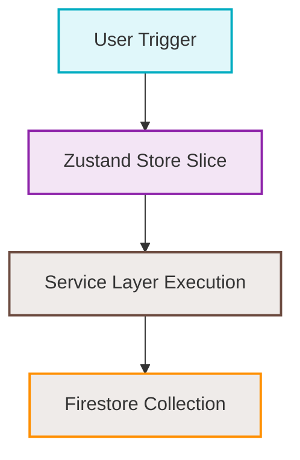

# /flowchart — Dynamic Architecture & Flow Visualizer

This workflow allows the agent to dynamically analyze the current active context (broad goals vs. specific technical components) and generate a beautifully structured, highly accurate Mermaid flowchart that maps system nodes, sequence paths, and data boundaries.

---

## Step 1 — Detect Workspace Scope

Analyze the current conversation state, active task (`task.md`), open files, recently modified code, and overall user intent to classify the flowchart's scope:

1. **High-Level Strategy Swarm (Broad Scope):**
   - **Trigger:** Active session is a fresh chat, a high-level strategic roadmap request, or a broad explanation of business features (e.g., Album release marketing, overall A2A Swarm coordination, or user onboarding).
   - **Target:** A macro flowchart depicting hub-and-spoke agent coordination, user UI interactions, and high-level sequence stages across multiple specialist departments (Road, Creative, Distribution, Marketing, etc.).

2. **Low-Level Code & State Logic (Deep/Technical Scope):**
   - **Trigger:** A specific feature is being modified, a file is open in the workspace, or a detailed technical implementation plan is active (e.g., Image Generation Pipeline, Billing Error Handling, or Tour Distance calculations).
   - **Target:** A micro flowchart mapping exact React component triggers, Zustand store slices, service layers, Firestore collection updates, and external API integrations with full data/parameter inputs.

---

## Step 2 — Map Nodes, System Layers, and Transitions

Before writing the diagram code, outline the functional layers to ensure complete accuracy. Every node should map to a real asset or mechanism:

- **User Action layer:** Input forms, buttons, chat commands.
- **UI Component layer:** TSX elements, hooks, custom React nodes.
- **State/Management layer:** Zustand slices, context providers, controllers.
- **Service/Logic layer:** Agent classes, utility classes, background jobs.
- **Database/Cloud layer:** Firestore collections, storage buckets, Cloud Functions.
- **External integration layer:** Gemini API, Stripe, DSPs, Google Maps.

---

## Step 3 — Construct the Mermaid Flowchart

Write a beautifully structured, syntactically perfect Mermaid diagram. Follow these critical guidelines to prevent syntax crashes:

1. **Syntax Integrity Rules:**
   - **Quotes are Mandatory:** Always quote node labels containing special characters, parentheses, brackets, or hex codes (e.g., `id["Label (Extra Info)"]` instead of `id[Label (Extra Info)]`).
   - **No HTML Tags:** Never use HTML tags in node labels (such as `<br>`, `<b>`, or `<span>`). Use text blocks instead.
   - **Unique Identifiers:** Ensure every node has a short, unique variable ID (e.g., `ConductorHub`, `StripeAPI`).

2. **Styling Best Practices:**
   - Use HSL-tailored, vibrant color palettes to make the diagram feel premium.
   - Apply `style` declarations or `classDef` blocks to color-code different structural components:
     - **UI/User Input:** Sleek sky-blue nodes (`#00D4FF`).
     - **Core logic & Services:** Electric purple/indigo nodes (`#8A2BE2`).
     - **Data/Database storage:** Harmonies orange/amber nodes (`#FF8C00`).
     - **AI & Cloud processes:** Emerald green/cyberpunk green nodes (`#39FF14`).
     - **Error states or gates:** Sleek neon red/pink nodes (`#FF00FF`).



---

## Step 4 — Detail the Transition Breakdown

Directly below the Mermaid block, provide a clear, numbered walkthrough of the flow transitions. Do not just restate the nodes; explain **how** the state moves, **what parameters** are passed, **where validations occur**, and how the **two-strike pivot protocol** or fallback logic triggers if an error is encountered.

---

## Step 5 — Verify Layout & Flow Logic

1. Confirm all connections are logical and represent the actual codebase files (e.g. `packages/renderer/src/services/...`).
2. Verify that any system dependencies (e.g., "Step B must complete before Step C is unblocked") are visually represented in the chart using distinct gate nodes.

---

## Step 6 — Save to Consolidated Flowcharts Folder

To maintain all visual architecture maps in a central, structured registry:

1. **Location:** Always write the generated flowchart to a new or existing Markdown file in the consolidated flowcharts directory:
   `/Volumes/X SSD 2025/Users/narrowchannel/Desktop/indii-music-founder/docs/flowcharts/`
2. **File Naming Convention:** Use a descriptive, lowercase, kebab-case filename labeled to express what the flowchart represents (e.g., `album-release-marketing.md`, `billing-error-handling.md`, `tour-distance-calculations.md`).
3. **File Format:** The saved file must include:
   - A clear H1 title (e.g., `# Album Release Marketing Flowchart`)
   - A short description/purpose block
   - The complete ` ```mermaid ` diagram block
   - The detailed step-by-step transition breakdown directly below it.
