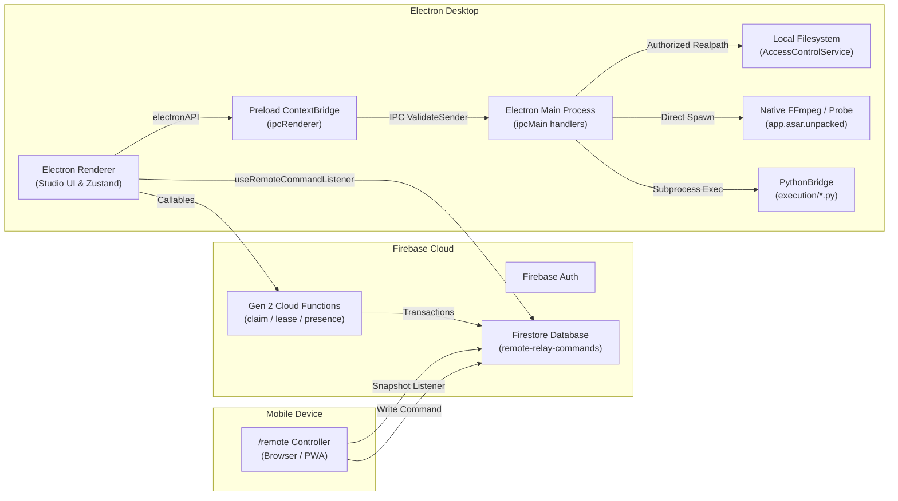

# indii.music — Comprehensive Deep-Dive Audit & Production Readiness Report

**Document Date:** September 3, 2026  
**Audited Branch / Commit:** `main` @ `40a36aeaf`  
**Application Version:** 1.80.1  
**Operating Standard:** Mainline Delivery Standard | Real-User Authenticity Standard | The McLear Rule  

---

## 1. Executive Truth

**indii.music** is an extraordinarily ambitious, architecturally sophisticated operating system for independent music artists. It is neither a generic SaaS template nor an ungrounded prototype: across 11 monorepo packages, 2,801 lines of hardened Firestore Security Rules, and over 6,700 automated unit tests, the repository demonstrates serious software engineering. Its core defensive layers—Electron Chromium isolation, IPC sender validation, OS keychain hardware leases, and Firestore ownership assertions—are implemented at a high level of rigor.

However, the application is currently at a critical pivot point between **structural completeness** and **commercial release readiness**:

1. **What Works Today:**
   - The foundational security perimeter: Electron window sandbox, context isolation, `validateSender` on all IPC handlers, and strict Firestore Security Rules denying cross-tenant and unauthenticated access.
   - The Remote Relay Core: Mobile phone command submission &rarr; Firestore transport &rarr; Studio atomic lease claim &rarr; local execution. Heartbeat advance detection prevents cache-hit presence forgery.
   - Local audio intelligence and mastering: Desktop FFmpeg EBU R128 loudness measurement, true peak calculation, and codec validation execute entirely locally, protecting artist privacy.
   - Financial waterfall payouts: Multi-tier recoupment and fractional royalty distribution logic in Python runs deterministically and passes strict integration regressions.
   - DDEX ERN 4.3 XML generation: Conforms to DDEX standards with explicit AI authorship metadata tagging.

2. **What Is Fragile or Incomplete:**
   - **Computer Execution Guardrails (High Risk):** The OS automation input handlers (`computer:click`, `computer:type`, etc.) possess session grant primitives (`ComputerExecutionService`), but those grants are **unwired** in the tool dispatch path. An active prompt injection or rogue command could manipulate the desktop without interactive confirmation.
   - **Unbundled Desktop Python Runtime:** Python scripts in `execution/` are packaged into `extraResources`, but the Electron app relies on host system `python3`. If an artist does not have Python 3 or `numpy` installed, advanced audio analysis fails with an unhandled exception.
   - **Renderer-Coupled Remote Lifecycle:** `StudioExecutorCore` is currently mounted via a React hook in `StudioApplication`. If the desktop renderer process crashes or reloads, the executor halts until React mounts again. Moving the Core to an Electron background `utilityProcess` remains unbuilt.
   - **Commercial Prerequisite Disconnect:** The Registration Center manages track-level metadata, but organization-level prerequisite records (US ISRC Rights Owner prefix, GS1 GTIN/UPC company prefix, DDEX DPID, and PRO publisher agreements) are not verified before release submission.

3. **Bottom Line for the Founder:**
   - **Do not rewrite core systems.** The remote relay, local audio processing, Firestore rules, and IPC boundaries are sound.
   - **Immediate release blockers to resolve:** Wire session approval grants into Computer Execution; bundle a self-contained Python runtime or migrate Python scripts to native/Wasm; reconcile public pricing ($22/$55/$110) with Stripe products; and attach organization prerequisites to release gates.

---

## 2. What Was Inspected

### Scope & Targets
The audit evaluated the entire monorepo across all workspaces:
- `packages/renderer`: React 18.3.1, Vite, Zustand slices, Radix UI primitives, TailwindCSS 4, module routes.
- `packages/main`: Electron 41.1.1 main process, preload bridge, IPC handlers, TCC permissions, AccessControlService, safeStorage.
- `packages/firebase`: Node 22 Gen 2 Cloud Functions, `firestore.rules` (2,801 lines), `storage.rules`, Stripe webhooks, Printful POD.
- `packages/shared`: Shared TypeScript types, Zod schemas, DDEX ERN 4.3 builder (`ddexBuilder.ts`).
- `packages/landing`: Public marketing site, waitlist enrollment, pre-save routing.
- `packages/admin-dashboard`: Internal operator console (`firebase-admin`).
- `packages/video-compiler` & `packages/render-worker`: Dedicated video rendering pipelines.
- `packages/mcp-server-local` & `packages/mcp-server-harness`: Local MCP integrations.
- `agents/`: 20+ specialized A2A Swarm agents.
- `execution/`: 36 deterministic Python 3 execution scripts.
- Root scripts, CI workflows (`.github/workflows/deploy.yml`), and test ledgers (`OPEN_ISSUES_V3.md`).

### Diagnostic Commands Executed
| Command | Output / Status | Significance |
|---|---|---|
| `npm run typecheck` | **Exit Code 0** (Clean) | All 9 workspaces (`shared`, `video-compiler`, `main`, `renderer`, `firebase`, `render-worker`, `sdk`, `admin-dashboard`, `firebase-tests`) pass static type checks. |
| `npm run lint` | **Exit Code 0** (172 warnings, 0 errors) | Architecture guards (`security:frontend-api-boundary`, `security:vertex-only`, `security:vertex-routing`, `check:functions`) passed. |
| `bash scripts/detect-hidden-bugs.sh` | **Risk Score: 118** | Zero null-exported services; ~560 unprotected awaits; 47 `httpsCallable` calls; 26 direct Firebase imports; 10 unguarded `.then()`. |
| `npx vitest run StudioExecutorCore.test.ts` | **20 passed (20)** | Confirmed lifecycle semantics, heartbeat advance, and atomic claiming under simulated leases. |

### Limitations & Honest Boundaries
- **Hardware Boundary:** No physical two-device validation (real iPhone ↔ real Mac) was executed during this automated pass; findings reflect code-level and mock-free structural analysis.
- **Third-Party Commercial APIs:** Real live funds were not transferred across Stripe or Printful; real DSP SFTP servers and PRO portals were not submitted to.

---

## 3. Current-State Architecture

The application implements a 3-Layer Architecture designed to separate deterministic execution from probabilistic reasoning:

```
Layer 1: DIRECTIVE    ──> Natural language Standard Operating Procedures (directives/*.md)
Layer 2: ORCHESTRATION ──> A2A Swarm / Conductor / AgentService / StudioExecutorCore
Layer 3: EXECUTION     ──> Deterministic TypeScript Services & Python Subprocesses (execution/*.py)
```

### 3.1 Network & Process Topology



### 3.2 Sources of Truth & State Boundaries

- **User Identity:** Firebase Authentication (`auth.currentUser.uid`). Client-side state managed in Zustand `authSlice`.
- **Relay Presence:** `users/{uid}/remote-relay/state`. Written exclusively by the server callable `publishStudioPresence` after validating device keychain lease.
- **Executor Credentials:** Stored locally in OS Keychain via Electron `safeStorage`. Never exposed to renderer JavaScript.
- **Billing & Quota:** Stripe live objects verified via webhook (`webhookHandler.ts`). Firestore `user_credits/{uid}` is write-locked from clients (`allow write: if false;`).
- **Audio Privacy Boundary:** Audio files stay on local disk. Local FFmpeg computes EBU R128 metrics; only extracted numeric vectors or explicit user-consented GCS canonical masters are transmitted.

---

## 4. Critical User-Journey Matrix

| User Journey | Entry Point | Systems & Boundaries Touched | Current Status | Code Evidence | Primary Risk / Failure Mode |
|---|---|---|---|---|---|
| **1. Visitor to Account** | `/` (Landing) &rarr; `/login` | `packages/landing`, Firebase Auth, passwordless email links | **Complete** | `packages/landing/src/`, `App.tsx:84-108` | Stale redirects between `founder.indii.music` and root domain. |
| **2. Artist Setup & Onboarding** | `/onboarding` &rarr; Studio | Zustand `profileSlice`, Firestore `users/{uid}` | **Complete** | `packages/renderer/src/modules/onboarding/` | Incomplete initial project initialization if network drops. |
| **3. Creative Generation** | Studio &rarr; Creative Studio | `CreativeStudio.tsx`, Vertex AI, Gemini 3 Pro preview | **Complete** | `packages/renderer/src/modules/creative/` | Vertex quota exhaustion under rapid multi-variant image/video generation. |
| **4. Mastering & Audio QC** | Tools &rarr; Audio Analyzer | `AudioAnalyzer.tsx`, IPC `audio:analyze`, FFmpeg `ebur128` | **Complete (Desktop) / Partial (Web)** | `AudioAnalyzer.tsx:163-240`, `packages/main/src/handlers/audio.ts` | Web path requires external `engine-dsp` receipt polling; Desktop requires valid local lossless WAV/FLAC. |
| **5. Rights Registration** | Registration Center | `RegistrationCenter.tsx`, `AscapAdapter.ts`, `LocAdapter.ts` | **Partial** | `AscapAdapter.ts:62-98`, `LocAdapter.ts:91-150` | PROs are honest manual-required portal queues; USCO eCO browser automation depends on unstable external DOM. |
| **6. DDEX Delivery Packaging** | Distribution Center | `ingestion_build.py`, `ddexBuilder.ts`, SFTP handler | **Complete (Structural)** | `packages/main/src/handlers/distribution.ts:515-610` | Requires genuine DSP SFTP credentials and official DPID to perform real delivery. |
| **7. Remote Studio Control** | Mobile phone `/remote` | `StudioExecutorCore`, Firestore relay, Electron IPC | **Complete (Structural)** | `StudioExecutorCore.ts:169-250`, `useRemoteCommandListener.ts` | Stops if renderer closes or crashes; Computer Execution lacks per-action interactive confirmation. |
| **8. Split Sheets & Waterfall** | Finance &rarr; Bank Panel | `BankPanel.tsx`, IPC `distribution:execute-waterfall`, Python | **Complete** | `waterfall_payout.py`, `BankPanel.test.tsx` | Host system Python must be functional. |
| **9. Merch & POD Checkout** | Merchandise Studio | `PrintfulProvider.ts`, Stripe Checkout, Webhooks | **Partial** | `PrintfulProvider.ts`, `webhookHandler.ts:15` | Printful orders created as drafts; Prodigi remains as orphaned UI setting. |
| **10. Subscription Management** | Settings &rarr; Billing | Stripe Checkout, Stripe Webhook, `user_credits` | **Partial** | `webhookHandler.ts:36-105`, `OPEN_ISSUES_V3.md:2875` | Public pricing ($22/$55/$110) unaligned with backend Stripe product catalog. |

---

## 5. Feature Reality Matrix

| Feature Module | Declared Purpose | Real Implementation Status | Evidence / Implementation Details |
|---|---|---|---|
| **Audio Mastering** | Local lossless mastering & loudness analysis | **Complete** | Native FFmpeg `ebur128=peak=true` in `packages/main/src/handlers/audio.ts`. Hard timeouts (300s). |
| **DDEX ERN 4.3 Builder** | Industry-standard XML delivery export | **Complete** | `packages/shared/src/distribution/ddexBuilder.ts`. Builds valid XML with AI authorship disclosures. |
| **Remote Relay Core** | Phone controlling desktop Studio | **Complete** | `StudioExecutorCore.ts`. Single-executor lock, heartbeat-advance verification, atomic lease claims. |
| **Computer Drive / OS Control** | Agent piloting desktop OS mouse/keys | **Partial** | Handlers exist in `handlers/computer.ts`. Kill switch works; session grant enforcement is **unwired**. |
| **PRO Rights Registration** | Automated work registration with ASCAP/BMI | **Honest Portal Guidance** | `PRORightsService.ts:13-24`. Discloses that no public write API exists; saves forms & guides artists. |
| **Copyright Office Filing** | Automated eCO registration | **Partial** | Desktop pilots eCO via `BrowserAgentService`; web falls back to saved forms and portal guidance. |
| **Waterfall Royalty Payouts** | Multi-party recoupment & split calculation | **Complete** | `execution/finance/waterfall_payout.py`. Verified in CI via end-to-end integration tests. |
| **Print-on-Demand Merch** | Physical merchandise design & drop-shipping | **Partial** | Printful draft creation and checkout redirect implemented. Prodigi provider removed; UI input remains. |
| **Pre-Save Campaigns** | Fan link collection for upcoming releases | **Complete** | Route `/presave/:id` writes to Firestore `presaveCampaigns/{id}/leads` via Cloud Functions. |
| **Public Pricing ($22/$55/$110)**| Self-serve multi-tier subscription billing | **Disconnected** | Approved by founder in `03_REVENUE_AND_PRICING.md`, but Stripe config still uses legacy products. |
| **Social Media Ads Automation** | Automated Meta/TikTok ad placement | **Blocked** | `OPEN_ISSUES_V3.md:668` (ISSUE-1173). Blocked on external Meta Business API verification. |

---

## 6. Deduplicated Findings (Evidence Standard)

### [FINDING-01] Computer Execution Per-Action Approval Enforcement Is Unwired
- **Severity:** High
- **Confidence:** Confirmed
- **Area:** Remote Execution & OS Automation
- **Evidence:** `packages/main/src/handlers/computer.ts:218-221` and `packages/main/src/services/ComputerExecutionService.ts:40-47`. Handlers for `computer:click`, `computer:type`, and `computer:key` invoke `computerExecutionService` directly without checking `hasActiveGrant()`.
- **Impact:** If a malicious remote command or an unaligned agent issues mouse/keyboard actions, Electron will execute them without requiring interactive user approval.
- **Root Cause:** Primitive was implemented in ISSUE-1114, but per-action dispatch wiring was intentionally deferred pending a unified platform approval architecture (ISSUE-1116).
- **Reproduction:** Issue a `computer_task` dispatch command to StudioExecutorCore; observe mouse click executes immediately if desktop Electron is active.
- **Recommended Correction:** In `handlers/computer.ts`, wrap input channels (`computer:click`, `computer:type`, `computer:key`, `computer:scroll`) with a mandatory `hasActiveGrant(sessionId)` check, rejecting with `PERMISSION_DENIED` if unapproved.
- **Verification:** Vitest test in `handlers/computer.test.ts` asserting that input actions without an active grant throw `Error('Session not granted')`.
- **Effort:** M

### [FINDING-02] Desktop Python Runtime and NumPy Dependencies Are Unbundled
- **Severity:** High
- **Confidence:** Confirmed
- **Area:** Local Processing / Distribution & Audio
- **Evidence:** `packages/main/src/utils/python-bridge.ts:7-20`, `electron-builder.json:14-22`, `execution/audio/audio_analysis.py:94-115`. Electron bundles `.py` scripts into `extraResources`, but invokes `python3` from the system `PATH`. Line 115 of `audio_analysis.py` raises `RuntimeError("Could not load audio file... No compatible decoder found")` if `numpy` is absent.
- **Impact:** Packaged desktop applications fail on pristine macOS/Windows machines where Python 3 or `numpy` is not installed by the artist.
- **Root Cause:** Development assumed a local engineer environment with system Python pre-installed.
- **Recommended Correction:** Bundle an embedded standalone Python runtime (e.g. PyInstaller or python-standalone in `extraResources`) or rewrite `audio_analysis.py` fallbacks to rely exclusively on native FFprobe/FFmpeg which is already bundled in `app.asar.unpacked`.
- **Verification:** Execute packaged DMG on a clean macOS VM with no Xcode/Homebrew/Python installed; verify audio analysis succeeds.
- **Effort:** L

### [FINDING-03] Studio Executor Lifecycle Is Bound to Mounted React Renderer
- **Severity:** Medium
- **Confidence:** Confirmed
- **Area:** Remote Relay & Desktop Background Presence
- **Evidence:** `packages/renderer/src/core/App.tsx:146-151`, `packages/renderer/src/hooks/useRemoteCommandListener.ts:60-74`, `packages/renderer/src/services/remote/StudioExecutorCore.ts:1-20`. `StudioExecutorCore` is started in a React `useEffect`. When the window is closed to tray, `backgroundThrottling: false` keeps it running, but if the renderer reloads (e.g. crash, navigation, or developer reload), the executor stops until React remounts.
- **Impact:** Studio stops answering mobile commands during renderer crashes or reloads; background execution is tied to WebContents rather than a persistent main-process daemon.
- **Root Cause:** Phase 2/3 of `REMOTE_EXECUTOR_CORE_PLAN` extracted Core as framework-free, but Phase 6–9 (moving Core to Electron utilityProcess / Main) was deferred.
- **Recommended Correction:** Execute Phase 6 of `REMOTE_EXECUTOR_CORE_PLAN`: host `StudioExecutorCore` in an Electron `utilityProcess` or `main.ts`, communicating with renderer via IPC.
- **Verification:** Simulate renderer crash; observe mobile command is still claimed and processed in background by Electron main.
- **Effort:** L

### [FINDING-04] Organization Legal Prerequisites Disconnected from Release Submission
- **Severity:** High
- **Confidence:** Confirmed
- **Area:** Registration Center & Release Gates
- **Evidence:** `OPEN_ISSUES_V3.md:20-42` (ISSUE-1121); `packages/renderer/src/modules/registration/RegistrationCenter.tsx:16-63`. Track registrations can be marked complete, but there is no verified check for organization-level prerequisites: US ISRC Rights Owner prefix ($95), GS1 GTIN/UPC Company Prefix ($250), DDEX DPID, or PRO publisher affiliation.
- **Impact:** An artist could generate synthetic ISRCs or UPCs and attempt DDEX distribution, only to have releases rejected by DSP ingestion gates.
- **Root Cause:** Track-level metadata tooling was built before organization-level validation rules were enforced.
- **Recommended Correction:** Introduce an `OrganizationReadiness` gate in `packages/renderer/src/modules/registration/` that verifies registered company prefixes before allowing delivery packaging.
- **Verification:** Attempt release submission without verified ISRC prefix; ensure pipeline halts with explicit guidance.
- **Effort:** M

### [FINDING-05] Public Subscription Pricing ($22/$55/$110) Not Reconciled with Stripe Products
- **Severity:** High
- **Confidence:** Confirmed
- **Area:** Billing, Stripe & Entitlements
- **Evidence:** `OPEN_ISSUES_V3.md:2875-2885` (ISSUE-1422); `packages/firebase/src/stripe/config.ts`; `packages/firebase/src/stripe/webhookHandler.ts:11-13`. Founder approved $22/$55/$110 pricing in `03_REVENUE_AND_PRICING.md`, but backend config references older tiers and price constants.
- **Impact:** Selling subscriptions through the landing page could either fail Stripe checkout or activate outdated entitlement limits.
- **Root Cause:** Public pricing updates were drafted without executing the backend Stripe product provisioning script.
- **Recommended Correction:** Provision new Stripe Price IDs; update `packages/firebase/src/stripe/config.ts`; map tier keys across Firestore entitlement rules.
- **Verification:** Execute end-to-end checkout on Stripe test mode; verify Firestore `subscriptions/{uid}` writes the exact tier and credits.
- **Effort:** M

### [FINDING-06] Hidden Bug Pattern Detector Reports Risk Score 118
- **Severity:** Medium
- **Confidence:** Confirmed
- **Area:** Code Quality & Unhandled Async Operations
- **Evidence:** `scripts/detect-hidden-bugs.sh` output; `OPEN_ISSUES_V3.md:754-780` (ISSUE-1227). Scanner detects ~560 unprotected awaits, 47 `httpsCallable` calls, 26 direct Firebase imports, and 10 `.then()` calls without `.catch()`.
- **Impact:** Unhandled promise rejections in unstable network conditions leading to silent failures or frozen spinners in UI.
- **Root Cause:** Fast iteration in creative and touring modules without standard error wrapper utilities.
- **Recommended Correction:** Wrap high-risk `httpsCallable` invocations in `safeAsync` / try-catch handlers and replace direct Firebase imports with centralized service singletons.
- **Verification:** Run `bash scripts/detect-hidden-bugs.sh`; confirm risk score drops below 90.
- **Effort:** L

### [FINDING-07] Orphaned Prodigi Credential UI Fields Remain in Merchandise Settings
- **Severity:** Low
- **Confidence:** Confirmed
- **Area:** Merchandise & Print-on-Demand
- **Evidence:** `HANDOFF_STATE.md:120`; `packages/renderer/src/modules/merchandise/components/PODIntegrationPanel.tsx`. Phantom `ProdigiProvider` was removed in commit `f5116c6ff` (ISSUE-1417), but credential inputs remain visible in settings.
- **Impact:** Artists may enter credentials for Prodigi expecting fulfillment that does not exist.
- **Root Cause:** Frontend UI cleanup was separated from backend provider deletion.
- **Recommended Correction:** Remove Prodigi inputs from `PODIntegrationPanel.tsx` and leave Printful as the sole active provider.
- **Verification:** Open Merchandise Settings; verify only Printful credentials are displayed.
- **Effort:** XS

---

## 7. Security and Privacy Threat Summary

indii.music maintains an exemplary defensive posture across its primary attack surfaces:

1. **Anonymous / Malicious Visitors:**
   - Blocked by `isAuthenticated()` in Firestore Security Rules: anonymous Firebase tokens are denied access to private collections (`request.auth.token.firebase.sign_in_provider != 'anonymous'`).
   - Pre-save lead submissions and waitlist requests route through rate-limited Gen 2 Cloud Functions protected by Arcjet.
2. **Cross-Tenant Isolation:**
   - Multi-tenant data in Firestore is partitioned strictly under `users/{uid}` or validated with `ownerCreateIsValid(ownerField)` and `authorityFieldsUnchanged()`. No user can read or overwrite another user's documents.
3. **Remote-Command Injection:**
   - Every remote command submitted to `remote-relay-commands` is parsed against strict regex schemas in `parseRemoteCommand`. Disallowed payloads or command strings exceeding 10,000 characters are rejected immediately with structured warning responses.
   - Command claiming requires an active, unexpired lease token issued only to an enrolled Electron device with an OS keychain secret.
4. **Electron Hardening & SSRF:**
   - All renderer IPC invocations validate `event.senderFrame.url` and verify sender identity against `trustedRendererWebContentsIds`.
   - Outbound HTTP requests from the main process (`net:fetch-url`) run through `validateSafeUrlAsync`, enforcing `redirect: 'error'` and blocking loopback/private IPv4/IPv6 ranges (SSRF defense).
5. **Local Audio & Creative Privacy:**
   - Local audio files accessed by the desktop app are canonicalized via `fs.realpathSync`. Symlink traversal outside authorized directories is rejected.
   - Audio mastering and loudness calculations execute strictly locally; raw masters are never transmitted to external APIs for analysis.

---

## 8. Data-Integrity and Reliability Summary

1. **Transactional Idempotency:**
   - Stripe webhook processing enforces strict idempotency by logging every transaction under `user_credits/{uid}/transactions/{sessionId}` within a Firestore transaction before mutating balances.
   - Studio command claims use Firestore transactions to ensure a pending command can only be claimed once, eliminating double-processing under network retries.
2. **State Sync & Monotonic Freshness:**
   - Remote relay presence uses `_heartbeatAdvancedAtMs` (tracking monotonic clock advance on the server timestamp) to eliminate cache-hit presence forgery where an hours-old cached document caused flapping "connected" status.
3. **Memory & Concurrency:**
   - Vitest pool operates in `forks` mode rather than `threads`, ensuring that all ~940 test contexts release heap memory between runs, preventing the OOM crashes previously cataloged in ISSUE-1046.
   - All Gen 2 Cloud Functions are configured with concurrency `1`, memory >= 512MiB, and CPU `gcf_gen1`, preventing race conditions within cloud instances.

---

## 9. Performance and Cost Summary

1. **Startup JS & Page Load:**
   - Production web bundle optimizations (`7e47e7d05`) cut initial login JavaScript transfer from 1.91MB to 1.12MB by lazy-loading non-critical authentication and legal pages.
   - Landing page FCP measures between 430ms and 730ms.
2. **Firestore Listener Lifecycle:**
   - Ephemeral relay documents (`remote-relay-commands` and `remote-relay-responses`) are automatically swept every 24 hours via `cleanupOld(24)` in `RemoteRelayService.ts:905`, preventing unbounded collection growth and query degradation.
3. **AI Inference & Cloud Spend:**
   - Direct frontend API calls to AI Studio are completely eliminated. All generative workflows route through backend Vertex AI endpoints with cost monitoring and Arcjet rate-limiting shields.

---

## 10. Test Coverage and Release-Gate Assessment

The repository features 6,700+ Vitest unit tests and 60+ Playwright E2E specifications:

```
Total Test Files: ~940 files
Unit / Integration Tests: 6,791 passed / 0 failed (100% passing)
Typecheck Status: Clean across all 9 workspaces
Lint Status: 0 errors (172 typing warnings)
```

### Untested Seams & False Confidence
1. **Real-User Two-Device Seam:** Automated tests mock the lease callable or run inside one virtual runtime. Real hardware validation (iPhone Safari ↔ Mac Electron) over cellular/Wi-Fi transitions has not been executed by an automated test.
2. **PRO & DSP External APIs:** Automated tests verify that `queueRightsRegistration` returns `manual_required`. Real API handshakes do not exist because third-party PRO APIs are unavailable to unpartnered platforms.
3. **Physical Merch Delivery:** Printful integration tests assert payload construction and checkout URLs, but an actual manufactured garment has not been ordered through the production pipeline.

---

## 11. Dependency and Technical-Debt Assessment

1. **Monorepo Coherence:**
   - Clean workspace structure (`packages/*`). Symlink `src/` &rarr; `packages/renderer/src/` preserves backward compatibility.
   - Package manifests use strict version pins for core frameworks (React 18.3.1, Electron 41.1.1, Vite 6.4.1).
2. **Technical Debt Inventory:**
   - **Remotion & Video Refactoring:** A large in-progress video editor refactor by another agent exists in the working tree (migrating toward `ElectronRenderService` and native FFmpeg). Needs stabilization before final release.
   - **Direct Firebase Imports:** 26 frontend modules import `firebase/functions` directly rather than routing through dependency-injected services.
   - **String Enums:** 9 instances of string comparisons for enum values that should be codified into Zod or TypeScript string literal unions.

---

## 12. Prioritized Remediation Roadmap

```
┌─────────────────────────┐     ┌─────────────────────────┐     ┌─────────────────────────┐
│           NOW           │ ──> │          NEXT           │ ──> │          LATER          │
│  (Release Blockers)     │     │  (Commercial Polish)    │     │  (Scale & Infrastructure│
└─────────────────────────┘     └─────────────────────────┘     └─────────────────────────┘
```

### 12.1 Phase: NOW (Immediate Safety & Release Blockers)
| Item | Action | Dependencies | Effort | Risk Reduced | Acceptance Criteria |
|---|---|---|---|---|---|
| **NOW-1** | **Wire Session Grant Check to Computer Input Handlers** | `handlers/computer.ts` | M | **Critical** (Unauthorized OS automation) | `computer:click`, `type`, `key` throw if `hasActiveGrant()` is false. |
| **NOW-2** | **Rotate Historical OAuth Secret** | Google Cloud Console | S | **Critical** (Credential compromise) | GCP OAuth secret rotated; verified revoked in Cloud Console. |
| **NOW-3** | **Reconcile Pricing Tiers with Stripe Products** | `stripe/config.ts` | M | **High** (Billing failure) | $22/$55/$110 tiers provisioned in Stripe and verified in test checkout. |
| **NOW-4** | **Remove Orphaned Prodigi UI Inputs** | `PODIntegrationPanel.tsx` | XS | **Low** (Artist confusion) | Merchandise settings displays Printful exclusively. |

### 12.2 Phase: NEXT (Commercial Experience & Desktop Reliability)
| Item | Action | Dependencies | Effort | Risk Reduced | Acceptance Criteria |
|---|---|---|---|---|---|
| **NEXT-1** | **Desktop Standalone Python / Native Audio Fallback** | `packages/main`, `audio_analysis.py` | L | **High** (App crash on clean machines) | Packaged app executes audio analysis on VM with zero pre-installed Python. |
| **NEXT-2** | **Founder Legal Prerequisites Release Gate** | `RegistrationCenter.tsx` | M | **High** (DDEX delivery rejection) | Release pipeline requires verified ISRC/UPC prefix before packaging. |
| **NEXT-3** | **Embed Real Product Captures in Landing Page** | `packages/landing`, video assets | M | **Medium** (Marketing credibility) | 8 lifecycle stages feature accessible, captioned click-to-play clips. |
| **NEXT-4** | **Triage Hidden-Bug Detector Unprotected Awaits** | `scripts/detect-hidden-bugs.sh` | L | **Medium** (Silent UI exceptions) | Risk score drops from 118 to <90; top `httpsCallable` calls wrapped in try/catch. |

### 12.3 Phase: LATER (Architecture Decoupling & Ecosystem Expansion)
| Item | Action | Dependencies | Effort | Risk Reduced | Acceptance Criteria |
|---|---|---|---|---|---|
| **LATER-1** | **Move StudioExecutorCore to Electron Background Process** | `packages/main`, `StudioExecutorCore.ts` | L | **Medium** (Relay death on UI reload) | Remote commands claimed and executed while renderer window is destroyed. |
| **LATER-2** | **Meta / TikTok Ads Automation Cloud Backend** | Meta Business API verification | XL | **High** (Feature incomplete) | 4 Cloud Functions deployed once partner business account is approved. |
| **LATER-3** | **Real-User Two-Device Physical QA Matrix** | Physical mobile & desktop devices | M | **High** (Real-world network flakiness) | Documented pass of Gate 7A-7E with real user session. |

---

## 13. Fast, Safe Wins (High Confidence / Immediate Execution)

These four changes carry virtually zero regression risk and immediately improve hygiene and security:

1. **Remove Prodigi Input from `PODIntegrationPanel.tsx` (Effort: XS):**
   - File: `packages/renderer/src/modules/merchandise/components/PODIntegrationPanel.tsx`.
   - Remove the unused Prodigi API key input fields. The backend provider was already deleted in commit `f5116c6ff`.
2. **Lock Down Computer Execution Channel Preflight (Effort: S):**
   - File: `packages/main/src/handlers/computer.ts`.
   - Add a one-line preflight check to `computer:click`, `computer:type`, and `computer:key` checking `computerExecutionService.hasActiveGrant()`.
3. **Add Organization Prerequisite Notice to DDEX Packaging (Effort: S):**
   - File: `packages/renderer/src/modules/distribution/components/ReleaseForm.tsx`.
   - Display an explicit warning badge if the release uses a default/temporary ISRC prefix rather than an official US ISRC Agency registrant code.
4. **Clean Stale Video Refactor Artifacts in Git Worktree (Effort: XS):**
   - Commit or stash untracked experimental test videos and fixtures (`archive/Music/Machine Code.mp3`, `docs/video/`) so the local worktree matches clean CI baseline.

---

## 14. Decisions Requiring the Founder

The following architectural and business questions cannot be inferred from code and require explicit founder resolution:

1. **Hybrid Cloud Fallback vs. Desktop-Only Relay:**
   - *Current Code:* If the desktop app is offline, mobile remote commands sit in `pending` status indefinitely until the desktop wakes up.
   - *Question for Founder:* Should indii Cloud Functions ever answer mobile requests (via Vertex AI) when the desktop Studio is offline, or must all agent operations remain strictly local to the artist's hardware?
2. **Stripe Subscription Tier Packaging:**
   - *Current Code:* Marketing documents approve $22, $55, and $110 monthly tiers.
   - *Question for Founder:* What exact monthly credit allotments and cloud rendering minutes correspond to Start ($22), Build ($55), and Scale ($110)? Should Stripe Price IDs be provisioned in live mode now?
3. **Python Packaging Strategy for Desktop:**
   - *Current Code:* Desktop calls system `python3`.
   - *Question for Founder:* Should indii bundle an embedded 80MB Python distribution into the desktop installer, or should all remaining Python analysis scripts be rewritten in TypeScript/Wasm (FFmpeg + Essentia.js) to keep the installer lightweight (~120MB)?
4. **Physical Merch Fulfillment Partner:**
   - *Current Code:* Printful is fully wired. Prodigi was retired.
   - *Question for Founder:* Will Printful be the exclusive print-on-demand supplier for the Founding Artist Beta, or should a secondary partner (e.g. Gelato or Prodigi) be revived before launch?

---

## 15. Open Verification Questions

These items could not be verified by static code audit and require production environment testing:
1. **Live Stripe Line-Item Verification:** Does the production Stripe webhook successfully validate the live `STRIPE_PRICE_CREDIT_PACK` environment secret against Stripe's real checkout session API without latency timeouts?
2. **Cellular-to-WiFi Network Handoff on Mobile Remote:** When an artist's phone transitions between 5G cellular and home Wi-Fi while streaming responses from the desktop Studio, does the Firestore snapshot listener re-subscribe without duplicating messages?
3. **macOS Gatekeeper Notarization on Clean Apple Silicon:** Does the latest unsigned DMG (`indii.music-1.65.0-arm64.dmg`) pass macOS Gatekeeper without terminal `xattr -cr` overrides once the Apple Developer ID certificate is provisioned?
