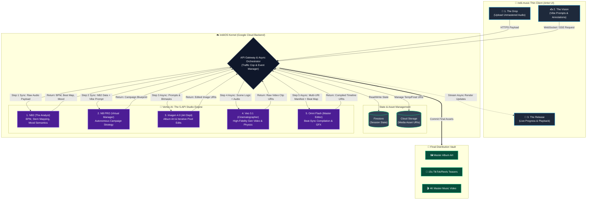

# 📱 indii.music Architecture Blueprint

**Vision:** *A multi-million-dollar production studio in the palm of a solo artist's hand.*

## 🗺️ System Diagram

## 📋 How to Use This Blueprint With Your Team

### 1. For Your UI/Frontend Team (The Top Section)
You can tell them to completely ignore how AI works. Their only job is to build a beautiful, fluid interface that sends an audio file, a text string, or coordinates from a screen tap to the Gateway. They just need to elegantly display notifications when the backend says *"I'm done."* This guarantees the app never crashes an artist's phone.

### 2. For Your Backend Team (The Middle Section)
This is their bible. It shows that the **API Gateway** acts as a strict "Traffic Cop." Notice how the Gateway passes Cloud Storage URIs (links) to the 5 APIs instead of the massive video files themselves. This ensures your compute costs stay incredibly efficient and your pipeline never bottlenecks.

### 3. The 5-API Waterfall
The chart clearly visualizes the necessity of all 5 endpoints:
* **NB2** listens and analyzes the track.
* **NB PRO** plans the strategy.
* **Imagen 4.0** and **Veo 3.1** shoot the raw materials (Art & Cinematography).
* **Omni Flash** handles the final beat-sync edit.

### 💡 A Few Bonus Tips for your Engineering Team
Since you are relying on Google Cloud for this perfectly decoupled architecture, here are a few specific tools your team should look at to implement this diagram perfectly:
* **The "Traffic Cop" Orchestrator:** Your backend team should look into **Google Cloud Workflows**. It is specifically designed for multi-step "waterfall" API calls and can natively handle the long wait times for asynchronous video generation (like Veo 3.1) without timing out or racking up compute costs while idling.
* **The Drop (Uploads):** Tell the frontend team to use **Signed URLs** for Google Cloud Storage. Instead of pushing an audio payload directly *through* the Gateway (which can hit size limits), have the Gateway give the mobile app a Signed URL to upload the raw audio directly to the GCS bucket.
* **The Release (Live Updates):** Because you are using **Firestore**, the mobile app can just use native Firestore Real-time Listeners (snapshot streams). Whenever the Gateway updates the session state in Firestore, the UI will automatically update loading bars on the artist's phone without your team needing to build and maintain complex custom WebSockets!
