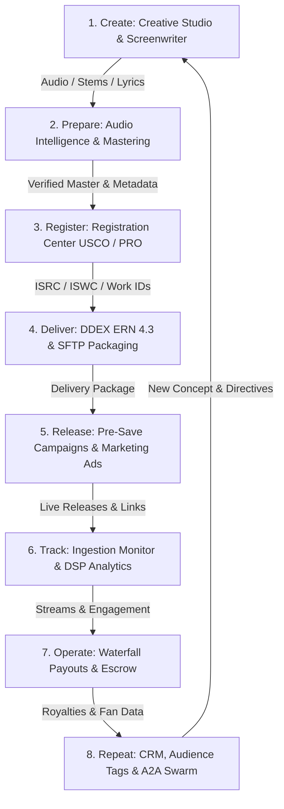

# indii.music — Current-State Architecture Specification

**Document Version:** 2.0.0  
**Repository Branch:** `main`  
**Verified Baseline:** Commit `40a36aeaf` / Release 1.80.1  
**Target Environment:** macOS / Windows / Linux (Electron) + Modern Web (Vite SPA) + Cloud Functions (Node 22 Gen 2)

---

## 1. Executive Topology & Monorepo Map

indii.music is organized as an npm workspace monorepo comprising eleven distinct packages and three supplementary runtime engines (A2A swarm definitions, Python execution scripts, and directives).

```
indii-music-founder/
├── packages/
│   ├── renderer/               # Main React application (indii Studio UI & client state)
│   ├── main/                   # Electron 41.1.1 main process (OS integration, native binaries, IPC)
│   ├── firebase/               # Cloud Functions (Node 22, Gen 2), Firestore/Storage rules, Daemons
│   ├── shared/                 # Shared TypeScript models, Zod schemas, DDEX ERN 4.3 XML builder
│   ├── landing/                # Public marketing & waitlist website (React 18 + Vite)
│   ├── sdk/                    # indii client TypeScript SDK
│   ├── video-compiler/         # Dedicated Remotion/FFmpeg video rendering pipeline
│   ├── render-worker/          # Background worker for headless video/asset processing
│   ├── admin-dashboard/        # Authenticated internal operator dashboard (firebase-admin)
│   ├── mcp-server-local/       # Local Model Context Protocol server exposing indii Studio capabilities
│   └── mcp-server-harness/     # MCP server harness for agent testing & tool execution
├── agents/                     # A2A Swarm Protocol agent definitions (20+ domain specialists)
├── execution/                  # Deterministic Python 3 execution scripts (distribution, waterfall, QC)
├── directives/                 # Layer 1 Natural Language Standard Operating Procedures (SOPs)
├── e2e/                        # Playwright E2E integration test suites (60+ specs)
└── docs/                       # Architectural specifications, ADRs, security runbooks, checklists
```

### Monorepo Workspaces & Roles

| Package / Workspace | Runtime / Engine | Port (Dev) | Deployment / Artifact Target |
|---|---|---|---|
| `packages/renderer` | React 18.3.1, Vite 6.4.1, Zustand 5, Tailwind 4 | `4242` (Electron dev) / `4243` (Web dev) | Firebase Hosting (`hosting:app` &rarr; `indii-music-studio`) / Electron renderer |
| `packages/main` | Electron 41.1.1 Main Process, Node.js | N/A | Packaged Desktop App (`dist-electron/` via `electron-builder`) |
| `packages/firebase` | Firebase Cloud Functions Gen 2 (Node 22) | Local Emulator | Google Cloud Functions (`us-central1`) & Firebase Hosting rewrites |
| `packages/shared` | TypeScript (ES2022 Bundled Library) | N/A | Shared internal dependency across all packages |
| `packages/landing` | React 18.3.1, Vite 6.4.1, Tailwind | `3000` | Firebase Hosting (`hosting:landing` &rarr; `indii-music-founder`) |
| `packages/video-compiler` | Node.js, FFmpeg, Canvas | N/A | Bundled with Main & Worker for offline and headless rendering |
| `packages/render-worker` | Node.js Worker Process | N/A | Cloud Run / Background compute instance |
| `packages/admin-dashboard` | React, Node.js, Express, Firebase Admin | `5173` | Internal GCP Cloud Run authenticated console |
| `packages/mcp-server-local` | Node.js (MCP Protocol Stdio) | N/A | Desktop CLI & Agent tooling integration |

---

## 2. Runtime Boundaries and Inter-Process Communication (IPC)

### 2.1 The Remote Execution Pipeline (Phone &harr; Studio)

The system enforces a multi-hop, strictly authorized bridge between mobile devices and desktop hardware:

```
┌─────────────────┐       HTTPS       ┌────────────────────────┐      Firestore      ┌────────────────────────┐
│  Mobile Device  │ ────────────────> │   Firebase Functions   │ ──────────────────> │   Firestore Database   │
│  (/remote Web)  │                   │ (claim/publish callables│                    │ (remote-relay-commands)│
└─────────────────┘                   └────────────────────────┘                     └───────────┬────────────┘
         ▲                                                                                       │
         │ Snapshot Listener                                                                     │ onSnapshot
         └───────────────────────────────────────────────────────────────────────────────┐       ▼
                                                                                         ┌───────────────────────┐
                                                                                         │   useRemoteCommand-   │
                                                                                         │   Listener / Core     │
                                                                                         │  (packages/renderer)  │
                                                                                         └───────────┬───────────┘
                                                                                                     │
                                                                                 Electron IPC        ▼
                                                                                 (validateSender)┌───────────────────────┐
                                                                                 ──────────────> │    packages/main      │
                                                                                                 │ (FFmpeg, Python, Safe)│
                                                                                                 └───────────────────────┘
```

#### Detailed Execution Sequence:
1. **Command Generation (Mobile):** The mobile user accesses `/remote` on the Web app. Writing a command creates a document in `users/{uid}/remote-relay-commands/{commandId}` with `status: 'pending'`, `executionTarget: 'studio'`, and validated parameters. Firestore Security Rules enforce that users can only create pending commands in their own subcollection (`isOwner(userId)`).
2. **Presence & Heartbeat (Studio):** Electron Studio mounts `StudioExecutorCore` via `useRemoteCommandListener`. Every 5,000ms, the Core invokes `publishPresence()`, which exchanges an OS Keychain credential (`studio-executor-enrollment-v1`) for a short-lived token via `issueStudioExecutorLease` and calls the `publishStudioPresence` Gen 2 Cloud Function. The function updates `users/{uid}/remote-relay/state` with a server-authoritative timestamp.
3. **Atomic Claiming:** The Studio listener detects pending commands. Before execution, it invokes the Cloud Function `claimStudioCommand({ commandId, studioInstanceId, leaseToken, deviceId })`. A Firestore transaction verifies lease validity and flips status from `pending` to `processing`. Web browsers cannot execute this step because they lack OS keychain hardware credentials (`window.electronAPI.credentials`).
4. **Local Dispatch:** Once claimed, `StudioExecutorCore` hands the task to `rendererExecutionAdapter`. If the command is:
   - `chat`: Routed to `AgentService` with FIFO queueing. If the desktop agent is currently busy, the command is placed in a bounded queue and the phone receives an honest `⏳ Queued` notice.
   - `computer_task`: Validates desktop Electron presence, calls `computerExecutionService` through Electron IPC (`computer:click`, `computer:type`, etc.).
   - `video_render`: Loads local project persistence, renders via `LocalVideoProjectRenderer` and `ElectronRenderService`.
   - `wake`: Focuses the Electron window and brings it out of the system tray (`window.electronAPI.window.show()`).
5. **Response & Completion:** The Studio publishes responses via `publishStudioResponse` Cloud Function into `users/{uid}/remote-relay-responses/`. The mobile client observes the response subcollection in real time. Upon completion, `completeStudioCommand` sets `status: 'completed'`.

### 2.2 Electron Main &harr; Renderer Boundary

The desktop boundary is guarded by strict Chromium process isolation and defensive IPC handlers:

- **WebPreferences Configuration (`packages/main/src/main.ts`):**
  - `contextIsolation: true`
  - `sandbox: true`
  - `nodeIntegration: false`
  - `webviewTag: false`
  - `webSecurity: true` (enforced via hard production assert; development allows local CORS for Vite dev server)
  - `backgroundThrottling: false` (ensures remote relay and audio queues do not sleep when window is minimized to the system tray)
  - `setContentProtection(true)` (prevents external window screen capture on macOS/Windows)
- **IPC Validation Layer (`packages/main/src/utils/ipc-security.ts`):**
  - `registerTrustedRendererWebContents`: Whitelists only the exact WebContents instance spawned by the main process.
  - `validateSender(event)`: Executed on every IPC channel. Verifies `event.senderFrame.url`, checks file-protocol containment within `app.getAppPath()`, and confirms `trustedRendererWebContentsIds.has(event.sender.id)`.
  - All handler payloads are parsed and sanitized via Zod schemas (`packages/main/src/utils/validation.ts`) before being passed to underlying services.

### 2.3 Filesystem & Native Binary Boundaries

- **Filesystem Access Control (`packages/main/src/security/AccessControlService.ts`):**
  - All disk access outside pre-authorized roots is denied by default.
  - Allowed roots: `app.getPath('userData')`, `os.tmpdir()`, `app.getPath('documents')/indii`, and `~/indii`.
  - Files outside allowed roots can only be accessed if the artist explicitly selected them through native OS file pickers (`electronAPI.dialog.selectFile()`), which dynamically adds the canonicalized `fs.realpathSync(path)` to `authorizedPaths`.
  - Symlink traversal and directory climbing (`..`) are strictly rejected.
- **FFmpeg / FFprobe Invocation (`packages/main/src/handlers/audio.ts`):**
  - Pre-compiled binaries (`ffmpeg-static`, `ffprobe-static`) are unpacked from the ASAR archive into `app.asar.unpacked`.
  - Every FFmpeg process is spawned with explicit execution timeouts (300,000ms for analysis, 600,000ms for mastering/transcoding) to prevent orphaned zombie processes.
- **Python Bridge (`packages/main/src/utils/python-bridge.ts`):**
  - Scripts reside in `execution/` and are packaged via `extraResources`.
  - Spawning verifies category and script name against regex `^[a-zA-Z0-9_-]+$`.
  - Execution runs under `AgentSupervisor`, which provides automatic retries, timeout enforcement, structured JSON parsing of final stdout lines, and redaction of sensitive command arguments (`--password`, `--key`, `--token`).

---

## 3. Data Architecture and Sources of Truth

| Domain | Source of Truth | Client Storage / Cache | Security & Authorization Mechanism |
|---|---|---|---|
| **Identity & Authentication** | Firebase Authentication (`users`) | IndexedDB / Firebase SDK memory | JWT token verification; `isOwner(userId)` rules |
| **User Profile & State** | Firestore (`users/{uid}`) | Zustand `profileSlice`, `authSlice` | Owner-only read/write in `firestore.rules` |
| **Workspace & Projects** | Firestore (`users/{uid}/workspace/{docId}`) | Zustand `fileSystemSlice` | Owner-scoped, bi-directional debounced sync |
| **Studio Presence & Relay** | Firestore (`users/{uid}/remote-relay/state`) | Memory (`StudioExecutorCore`) | Server-only write via Gen 2 Cloud Function leases |
| **Executor Credentials** | macOS Keychain / Windows Credential Vault | Electron `safeStorage` via IPC | Stored locally in OS secure vault; never exposed to renderer |
| **Subscriptions & Billing** | Stripe Live API & Webhooks | Firestore (`subscriptions/{uid}`) | Webhook signature verification; live LineItem pricing check |
| **Credit Balance** | Firestore (`user_credits/{uid}`) | Zustand `financeSlice` | Read-only to client; write via admin transactions in webhooks |
| **Audio Masters** | Google Cloud Storage (`gs://.../masters/`) | Local filesystem cache | Signed URLs; SHA-256 fingerprint deduplication |
| **DDEX Catalog** | Firestore (`catalog/{uid}/releases/{id}`) | Zustand `distributionSlice` | Validated ERN schemas; client-side rules check |

### 3.1 Firestore Security Rules Architecture (`packages/firebase/firestore.rules`)
The Firestore security rules file contains 2,801 lines of defensive rules:
1. **Strict Identity Isolation:** Helper function `isAuthenticated()` explicitly disallows anonymous authentication tokens for core business operations (`request.auth.token.firebase.sign_in_provider != 'anonymous'`).
2. **Authority Fields Immutability:** `authorityFieldsUnchanged()` verifies that updates cannot reassign `userId`, `ownerId`, `orgId`, `authorId`, or collaborator lists.
3. **Guest Lockdown:** `isGuest()` returns hardcoded `false`, completely closing historical unauthenticated demo write holes.
4. **Server-Owned Sensitive Collections:** `studioExecutors/{deviceId}`, `user_credits/{uid}`, `remote-relay-responses/{id}`, and `remote-relay/state` reject all direct client writes (`allow write: if false;`). They can only be mutated by verified backend Cloud Functions using the Firebase Admin SDK.

---

## 4. Product Lifecycle Data Flow

The indii.music business operating model executes across eight lifecycle stages:

```
create ──> prepare ──> register ──> deliver ──> release ──> track ──> operate ──> repeat
```



### 4.1 Lifecycle Stage Implementations

1. **Create:** Generative audio/image/video pipelines inside `packages/renderer/src/modules/creative/`. Employs Gemini 3 Pro preview models via backend Vertex AI routing. Prompt and asset history are tracked in project records.
2. **Prepare:** Technical audio analysis via FFmpeg (EBU R128 integrated loudness, true peak dBFS, codec validation) and semantic classification. Web clients upload canonical masters to GCS and poll server-side `engine-dsp` analysis receipts (`AudioAnalyzer.tsx:180-210`).
3. **Register:** Registration Center (`packages/renderer/src/modules/registration/`). Automates US Copyright Office (eCO) filings via `BrowserAgentService` on desktop (falls back to saved forms and portal guidance on web). Enqueues PRO registrations (ASCAP, BMI, SESAC, SoundExchange) via honest `manual_required` backend queues, preserving form snapshots.
4. **Deliver:** Canonical DDEX ERN 4.3 XML generation via `DDEXBuilder` (`packages/shared/src/distribution/ddexBuilder.ts`). Ingestion build and SFTP/Aspera delivery executed via `AgentSupervisor` calling `execution/distribution/ingestion_build.py`.
5. **Release:** Pre-save campaigns hosted at public route `/presave/:campaignId`. Captures fan contact details to `presaveCampaigns/{id}/leads` via Cloud Functions. Marketing campaign scheduling via `packages/renderer/src/modules/marketing/`.
6. **Track:** Aggregation of stream and revenue reports via BigQuery integration (`packages/firebase/src/analytics/bigqueryService.ts`). External DSP ingestion tracking via `processDDEXAck.ts`.
7. **Operate:** Financial accounting and split sheets in `packages/renderer/src/modules/finance/`. Automated revenue distribution executed via `execution/finance/waterfall_payout.py` with multi-tier recoupment calculation. Print-on-demand merch via Printful API.
8. **Repeat:** Fan relationship management (`packages/renderer/src/modules/crm/`), Boardroom meeting persistence, and collaborative multi-agent problem solving via the A2A Swarm Protocol (`agents/`).

---

## 5. Deployment and Build Topology

- **Desktop Application:** Packaged with `electron-vite build` and `electron-builder`. Targets: macOS (DMG, ZIP, Universal/arm64/x64), Windows (NSIS Installer), Linux (AppImage). Code-signing and notarization configured in `electron-builder.json`.
- **Cloud Infrastructure:** Firebase Hosting (two site targets: `landing` &rarr; `indii-music-founder`, `app` &rarr; `indii-music-studio`), Cloud Functions Gen 2 (`us-central1`), Cloud Storage buckets (canonical masters, user assets, DDEX bundles), and Google Cloud Armor / Arcjet bot protection.
- **Continuous Integration (`.github/workflows/deploy.yml`):** Runs on push to `main`. Sequences: Typecheck (`tsc -b` across all 9 workspaces) &rarr; Lints & Security Guardrails &rarr; Vitest Unit Suites &rarr; Playwright E2E &rarr; Landing Build &rarr; Studio Build &rarr; Firebase Production Deployment.
