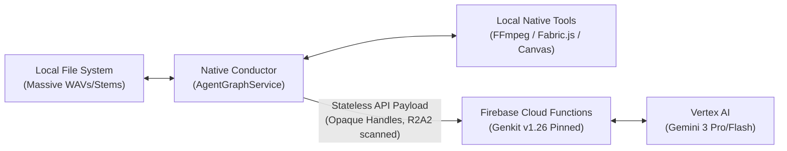

# Architectural Decision Record: Genkit vs. ADK Orchestration

This document outlines the core architectural paradigm of **indii** regarding multi-agent swarm orchestration. It establishes the technical justification for our current hybrid native stack and details why GCP's Agent Development Kit (ADK) is rejected.

## Context & Problem Statement

As **indii** coordinates a complex swarm of decentralized AI agents (Creative, Road, Brand, Marketing, Finance, Legal), we must address how cognitive reasoning loops are routed, where state is managed, and where heavy assets (music tracks, stems, video frames) are processed.

Google recently introduced the **Middleware Architecture for Genkit** alongside its **Agent Development Kit (ADK)** for GCP's Agent Platform. We evaluated whether we should migrate our custom orchestration loops to ADK.

## Decision: Client-Led Native DAG + Stateless Genkit Serverless

We stand firmly on our custom **100% native Node.js/TypeScript orchestration framework** (`AgentGraphService.ts`) running inside the local desktop Electron client, using **Firebase Cloud Functions (Gen 2) with pinned Genkit v1.26** as stateless model/tool adapters.

## Architectural Trade-Offs

| Evaluation Metric | Client-Led Native + Genkit (Current Stack) | Server-Managed GCP ADK (GCP Swarm Platform) |
| :--- | :--- | :--- |
| **Asset Location & Processing** | **10/10 (Local Native)** Local assets (WAV files, stems, video tracks) are processed directly by native binaries (FFmpeg, Essentia, Remotion) via local Electron shell commands with **zero network latency**. | **1/10 (Cloud Bound)** Requires uploading/downloading gigabytes of raw music assets to persistent cloud VM containers for every agent loop action, causing extreme latency. |
| **Infrastructure Costs** | **10/10 (Scales to Zero)** Client machines bear the cost of local orchestrations. Serverless cloud model invocations scale to absolute zero. No idle billing overhead. | **2/10 (Idle VM Billing)** Requires continuous running container clusters (GCP Agent Platform) per user connection, making independent artist software financially unviable. |
| **Human-In-The-Loop (HITL) Gateways** | **10/10 (Instant Client-Side)** HITL prompts, canvas overlays, and approval flows run instantly on the local renderer with zero polling overhead. | **4/10 (Polling/Webhook Heavy)** Requires complex webhook routers to bridge cloud swarm runtimes with local desktop interfaces. |
| **Custom Security Sandboxing** | **10/10 (Zero-Trust Local)** Our custom R2A2 input scanner (`InputSanitizer.ts`) and Secrets Broker mapping live locally, preventing API keys or PII from leaving the user's local trust boundary. | **6/10 (Cloud Trusted)** Secrets must reside in GCP secret vaults with cloud-wide trust configurations. |

## Flow Architecture

A complete map of our execution pipeline can be viewed in [genkit-vs-adk-flowchart.md](file:///Volumes/X%20SSD%202025/Users/narrowchannel/Desktop/indii-music-founder/docs/flowcharts/genkit-vs-adk-flowchart.md).

## Guidelines for Future Swarm Development

All developer agents working on the **indii** codebase must adhere to the following principles:

1. **Keep Orchestration Client-Side:** Do not attempt to move the main loop or coordination graph (`AgentGraphService.ts`) to cloud functions or GCP instances. Local client execution is our core competitive advantage for music creators.
2. **Stateless Cloud Tools:** Cloud functions should remain stateless. They must take input parameters, perform prompt/generative logic via pinned Genkit, and return results. They should not track agent memory or conversational state across calls.
3. **Local Tooling First:** If a task involves manipulating media files, writing scripts, compiling code, or editing raw audio/video structures, implement it as a native Electron sidecar command.
4. **Strict Pinned Versions:** Keep `@genkit-ai/firebase` and `@genkit-ai/google-cloud` pinned to `1.26.0` to preserve our optimized execution profiles.
5. **Honor Security Rules:** All updates to the local state, file retrieval, or memory-bank indexing must honor our custom R2A2 threat mitigation layers and client-side encryption bounds.

## Summary

By maintaining our **Client-Led Native DAG + Stateless Genkit Serverless** pattern, we successfully bypass the performance limits and severe container costs of persistent cloud environments (ADK), providing our users with a robust, zero-latency, and highly affordable music production suite.
