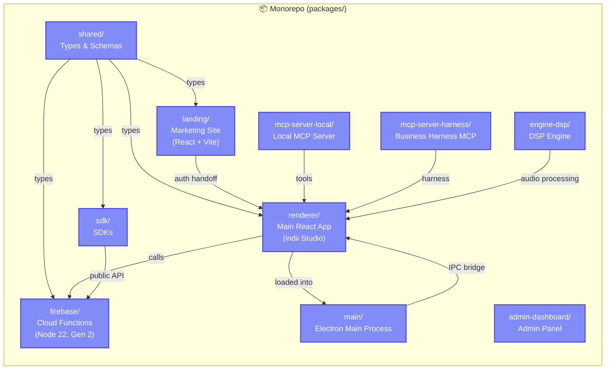

# Monorepo Topology

This diagram maps the structural boundaries of the `indii-music-founder` NPM workspaces monorepo. It explicitly defines how the 10 internal packages depend on each other, showcasing the shared type layer, the IPC bridges in Electron, and the functional boundaries separating the web client from the backend and local dev tooling.

## Transition Breakdown

1. **`shared/` to All Consumers**: The `shared` package acts as the absolute source of truth for TypeScript interfaces, Zod schemas, and data models. It is imported by `renderer`, `firebase`, `landing`, and `sdk` to ensure strictly typed boundaries across client and server.
2. **`renderer/` inside `main/`**: The Electron `main` package acts as a host shell. In production, it loads the compiled `dist` directory of the `renderer` package. In development, it connects to the Vite dev server running the renderer on port 4242.
3. **`main/` to `renderer/` (IPC)**: The Electron `main` process exposes native OS capabilities (filesystem access, native menus, credential vaults) to the React `renderer` via context-bridged IPC handlers.
4. **`renderer/` to `firebase/`**: The React client uses Firebase SDKs to communicate directly with Cloud Functions defined in the `firebase` package, executing backend administrative logic securely.
5. **`landing/` to `renderer/`**: The lightweight Vite marketing site (`landing`) acts as the top of the funnel. Upon successful authentication or signup, it hands the session state directly to the heavy web application (`renderer`).
6. **`mcp-server-*` to `renderer/`**: The local MCP servers provide Model Context Protocol tools and deterministic Business Harness compilation to the AI agents operating within the `renderer` context.
7. **`engine-dsp/` to `renderer/`**: The DSP engine provides C++ or Rust-based audio processing routines wrapped for the `renderer` to use in heavy media processing scenarios.
