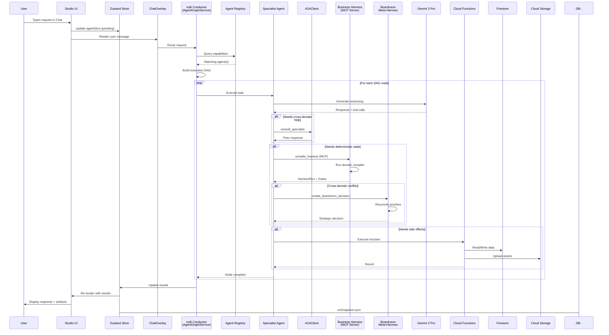

# Swarm Delegation Loop

This flowchart tracks what happens when a user asks the AI to accomplish a multi-step task. It traces the lifecycle from the UI keystroke, through the Conductor's capability mapping, into the decentralized A2A swarm, and finally down to deterministic Cloud Function executions and state syncs.

## Transition Breakdown

1. **User Input to Conductor**: The user types a command. The UI updates the Zustand `agentSlice` to show a pending state and sends the prompt payload to the Conductor (`AgentGraphService`).
2. **Capability Matching**: The Conductor queries the `capability_registry.json` to map the semantic intent of the prompt to the specific domains of the seated agents. It constructs a Directed Acyclic Graph (DAG) for sequential or parallel execution.
3. **Agent LLM Inference**: For each node in the DAG, the designated Specialist Agent sends its system prompt and history to the Gemini 3 Pro endpoint, receiving a structured JSON response and tool calls.
4. **Peer-to-Peer Consultation (A2A)**: If the agent encounters a domain outside its expertise (e.g., Finance needs Legal's approval), it issues a `consult_specialist` tool call via the `A2AClient`, pausing its own execution until the peer returns a verdict.
5. **Deterministic Harness Compilation**: If the action modifies sensitive state (e.g., committing to a tour budget), the agent uses the `indii-harness` MCP server to compile a `HarnessRun`. This forces the LLM's probabilistic output into a strictly validated, human-gated payload.
6. **Boardroom Reconciler**: If the `HarnessRun` creates a cross-domain conflict (e.g., Marketing wants to spend $500, but Finance strictly enforces a $300 cap), the agent triggers a `create_boardroom_decision` in the Meta-Harness to resolve the priority conflict.
7. **Side Effects & Sync**: Standard side effects are executed via Cloud Functions, reading/writing to Firestore and Cloud Storage. The completion cascades back up the DAG to the Conductor.
8. **Final UI Render**: The Conductor pushes the aggregated results to the Zustand store. React re-renders the chat overlay, and Firestore's `onSnapshot` listeners automatically sync any underlying database changes back to the UI.
