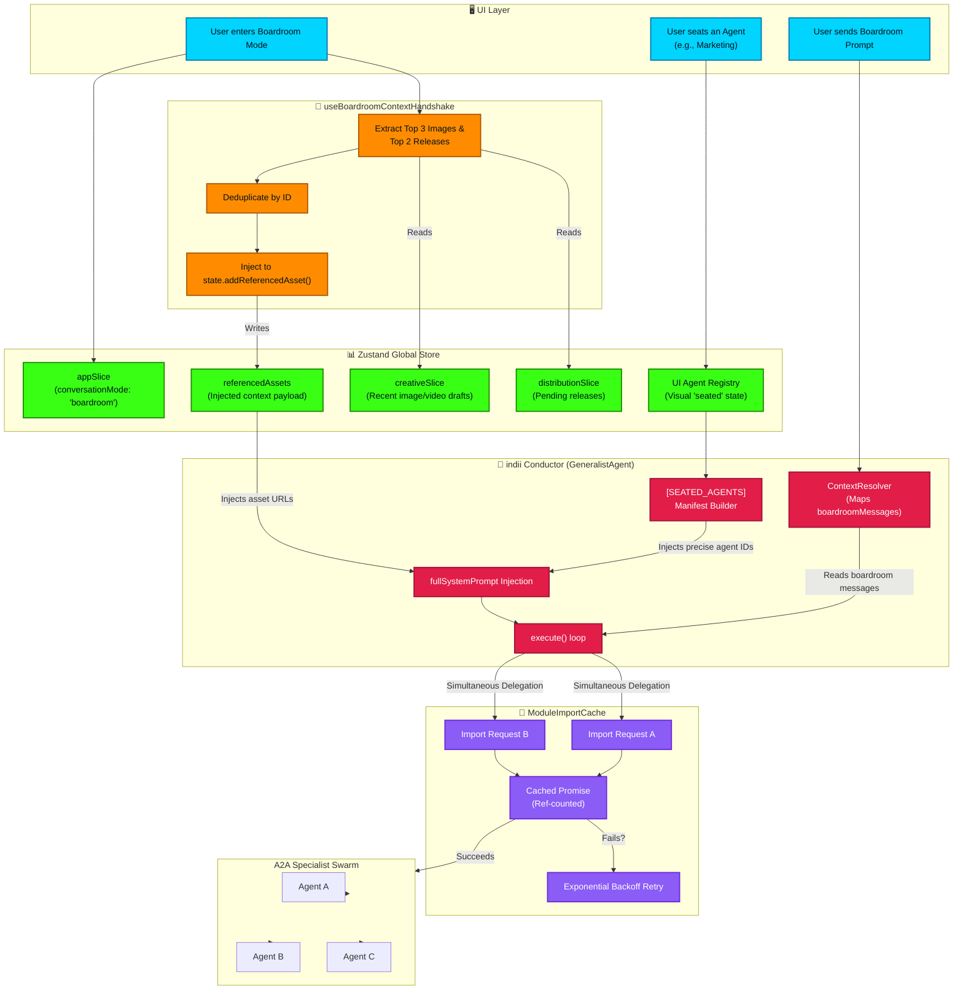

# Boardroom Context Orchestration

This flowchart illustrates the intricate context synchronization that occurs when users interact with the Boardroom HQ. It maps how the Conductor is made aware of the exact UI state, how external module state (like Creative Studio drafts) is automatically injected into the agent's memory via the `useBoardroomContextHandshake` hook, and how race conditions during concurrent multi-agent delegations are mitigated by the `ModuleImportCache`.

## Transition Breakdown

1. **Boardroom Handshake Trigger**: When the user enters Boardroom mode, the `useBoardroomContextHandshake` hook fires. It reads the latest state from the `creativeSlice` and `distributionSlice`.
2. **Context Deduplication**: The hook extracts up to 3 recent images and 2 pending releases, deduplicates them against the current `referencedAssets` by ID, and injects them back into the state via `addReferencedAsset()`. This ensures agents are immediately aware of the user's recent actions in other modules without manual briefing.
3. **Seated Agents Manifest**: As the user seats agents in the UI, the `UI Agent Registry` updates. When a prompt is sent, the Conductor (`GeneralistAgent`) builds a strict `[SEATED_AGENTS]` manifest mapping the natural language names to exact system IDs.
4. **Context Injection**: The `ContextResolver` ensures the Conductor reads from the shared `boardroomMessages` history. The Conductor explicitly injects both the `[SEATED_AGENTS]` manifest and the `referencedAssets` into its `fullSystemPrompt` before calling the LLM.
5. **Concurrent Delegation**: If the LLM output requires delegating tasks to 3 or more agents simultaneously, the execution triggers dynamic Vite module imports.
6. **Race Condition Mitigation**: Instead of causing a `ChunkLoadError` race condition, the `ModuleImportCache` intercepts these concurrent imports. It returns a single, ref-counted cached Promise for identical chunks, preventing Vite from panicking. If a genuine chunk load failure occurs, the cache applies an exponential backoff retry.
7. **Backend LLM Call (added 2026-06-20)**: After `fullSystemPrompt` injection, the Conductor's `execute()` loop streams the completion from the backend via `FirebaseIntelligenceService.callBackendGenerateContentStream()`, which `POST`s to the **`generateContentStream`** Cloud Function (`https://us-central1-<project>.cloudfunctions.net/generateContentStream`) with a Firebase ID token (`Authorization: Bearer`) and an App Check token (`x-firebase-appcheck`). A `401` here surfaces in chat as `Error: Unauthorized: Missing App Check token`. Note this function shares `index.ts`'s module graph, so a cold-start crash anywhere in that graph (e.g. the `@indii/shared` workspace-import regression) takes the Conductor down even though the client flow above is healthy. See `security-csp-appcheck-integration.md` and ERROR_LEDGER 2026-06-20.
