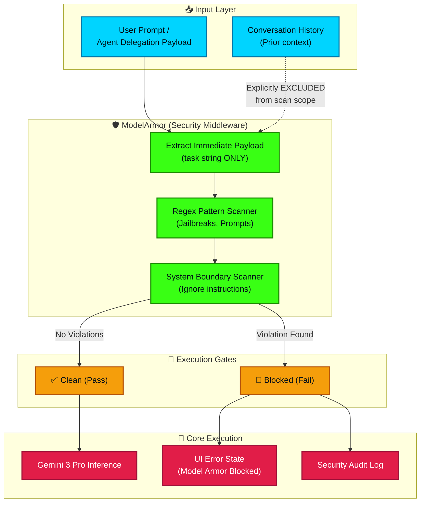

# Model Armor Security Pipeline

This flowchart outlines the Model Armor execution path. It visualizes how the system intercepts and sanitizes user prompts *before* they reach the generative AI models. Crucially, it highlights the architectural fix that isolates the evaluation to the immediate prompt payload rather than concatenating the entire conversation history, thereby eliminating false-positive trigger loops on routine agent delegations.

## Transition Breakdown

1. **Input Interception**: Every prompt submitted by the user or generated internally via an agent delegation payload is intercepted by the `ModelArmor` middleware before any API call is made.
2. **Scope Extraction (The Fix)**: `ModelArmor` explicitly extracts *only* the immediate `task` string payload. It completely isolates and excludes the `Conversation History` from the scan. *This prevents false positives where benign prompts were blocked because previous agent responses or system identity locks contained patterns matching "ignore previous instructions" or "jailbreak".*
3. **Regex & System Boundary Scans**: The isolated task string is run through a strict battery of RegEx pattern matchers. This checks for known jailbreak vectors, system boundary circumvention attempts, and prompt injection techniques.
4. **Execution Gate Evaluation**: 
    - **Clean Path**: If the scan yields no violations, the prompt passes the gate, attaches its unmodified conversation history, and proceeds securely to the Gemini 3 Pro inference engine.
    - **Blocked Path**: If a violation is found, execution immediately halts. The system throws a specific error to the UI indicating `[Blocked by Model Armor]` along with the flagged regex pattern, and logs the attempt for security auditing.
