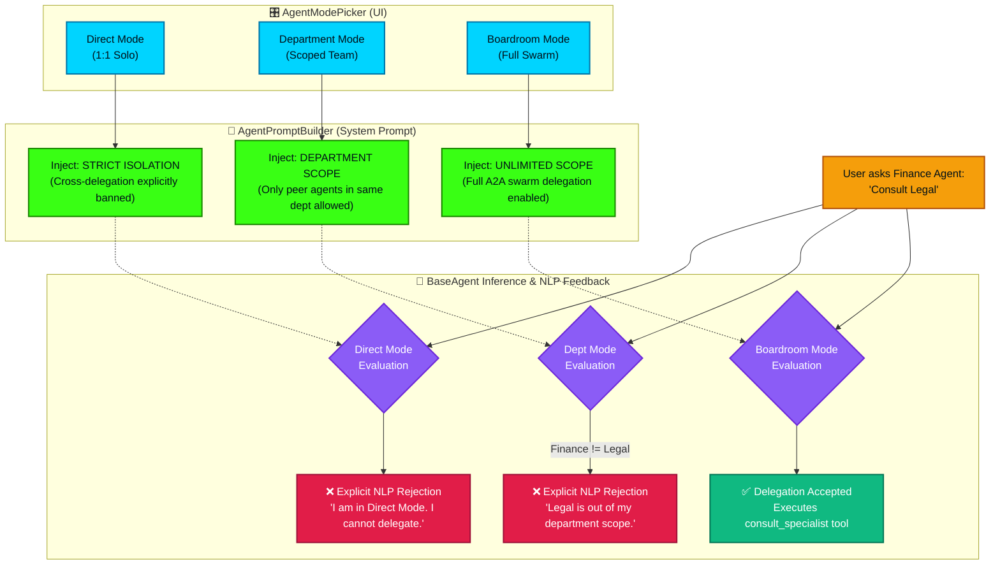

# Omni Mode Routing & Delegation Boundaries

This flowchart visualizes the strict boundaries enforced by the AgentModePicker (Omni Mode). It demonstrates how switching between Direct Mode, Department Mode, and Boardroom Mode fundamentally alters the `delegationScopeSection` injected into the LLM system prompt, effectively blocking cross-department hallucinations and ensuring precise error communication.

## Transition Breakdown

1. **Mode Selection**: The user interacts with the `AgentModePicker` to select the conversational context: Direct, Department, or Boardroom.
2. **Boundary Injection**: When the `BaseAgent` compiles its system prompt via `AgentPromptBuilder`, it dynamically injects a strict `delegationScopeSection` based on the selected mode. 
    - *Direct Mode* explicitly forbids the LLM from attempting cross-delegation, eliminating hallucinations where the agent says "I'll do that" but takes no action.
    - *Department Mode* provides a whitelist of peer agents within the same functional silo.
    - *Boardroom Mode* removes the restrictions, injecting the full `[SEATED_AGENTS]` manifest for universal swarm execution.
3. **Out-of-Scope Execution Evaluation**: When a user makes an invalid request (e.g., asking a Finance agent to consult Legal while in Direct Mode), the LLM reads its strict injected boundaries.
4. **NLP Rejection & Feedback**: Instead of silently failing or hallucinating a capability it doesn't possess, the agent explicitly rejects the request in its Natural Language Processing (NLP) response, clearly communicating the mode constraint to the user (e.g., "I am currently in Direct Mode and cannot consult the Legal department. Please switch to Boardroom mode").
5. **Valid Execution**: If the mode permits the action (Boardroom), the agent executes the `consult_specialist` tool and the standard Swarm Delegation loop commences.
