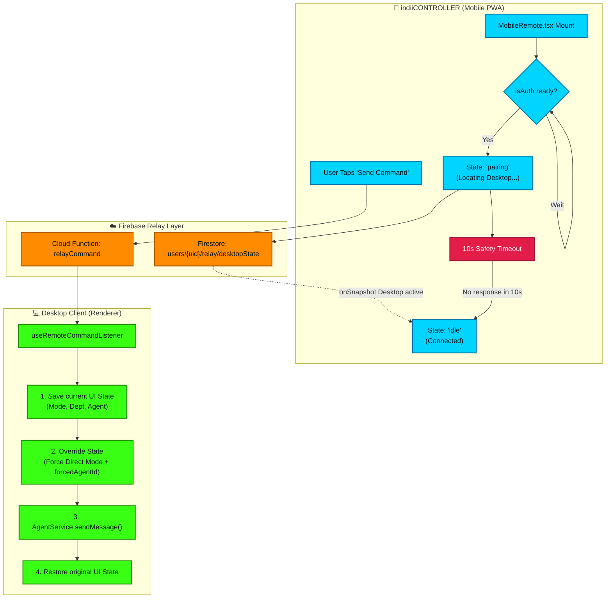

# Mobile Remote Relay Architecture (indiiCONTROLLER)

This flowchart maps the bidirectional WebSocket relay that powers indiiCONTROLLER. It traces how commands from the mobile PWA are routed through Cloud Functions, safely overriding the desktop's native UI state to execute remote tasks, while protecting against infinite connection spinners through robust timeout fallbacks.

## Transition Breakdown

1. **Mobile Mount & Auth Verification**: The PWA mounts the `MobileRemote` component. A `useEffect` hook waits on `remoteRelayService.isAuthenticated()` before attempting to connect. This prevents null references when Firebase Auth hasn't fully initialized.
2. **Pairing & Fallback Timeout**: The mobile UI enters a `'pairing'` state (showing a spinner) and attaches an `onSnapshot` listener to the desktop state document in Firestore. Concurrently, a 10-second safety timeout begins. If the desktop document doesn't respond within 10s (desktop asleep/closed), the state gracefully falls back to `'idle'` instead of trapping the user in an infinite loading spinner.
3. **Command Dispatch**: Once connected, the user taps a command button on their phone. The payload hits the `relayCommand` Cloud Function.
4. **Desktop Listener**: The desktop app's `useRemoteCommandListener` receives the relayed command.
5. **State Override Pattern**: Because the desktop UI might currently be in a completely different mode (e.g., Boardroom Mode viewing the Distribution Department), executing the mobile command natively would drop the `forcedAgentId` parameters and execute in the wrong context. To solve this, the listener executes a rigid pattern:
    - **Save**: Captures the current `conversationMode`, `selectedDept`, and `activeAgentProvider`.
    - **Override**: Temporarily forces Zustand into `conversationMode: 'direct'` and `activeAgentProvider: 'native'` (bypassing visual UI limitations).
    - **Execute**: Dispatches the payload through `AgentService.sendMessage()`, guaranteeing correct LLM routing based on the mobile intent.
    - **Restore**: Synchronously reverts the UI state back to what the user was looking at on their desktop monitor before the command finished executing.
