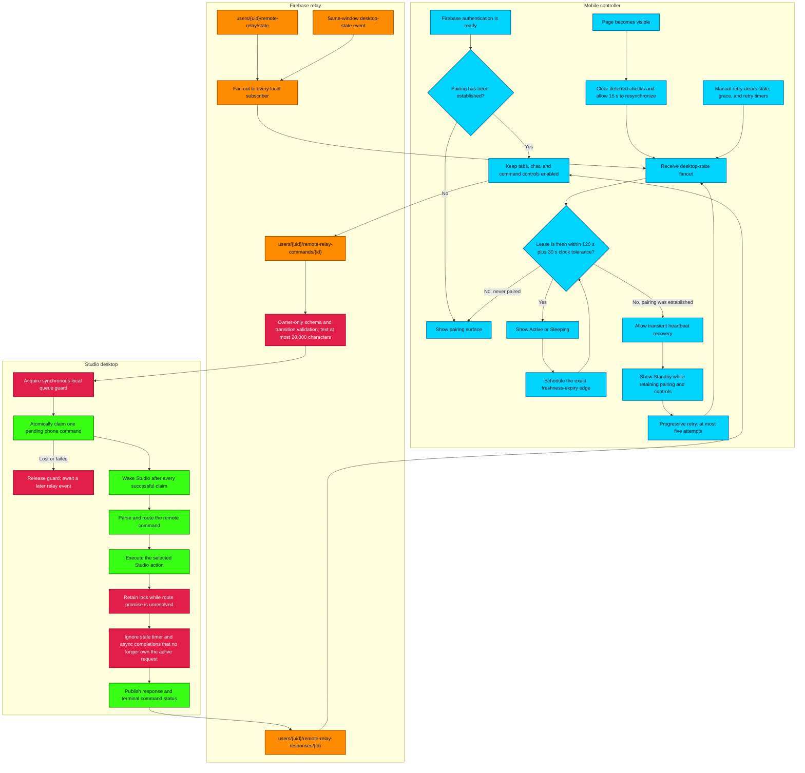

# Mobile Remote Relay Architecture (indiiCONTROLLER)

This flowchart documents the production state machine between the paired mobile controller, the Firebase relay, and Studio. Pairing is durable once established; desktop presence is a separate, time-bounded lease that may move the controller into Standby without disabling its controls.

## Transition Breakdown

1. **Authentication and pairing are distinct.** Authentication permits relay access, but the controller only considers itself paired after it has observed a valid Studio state. A later stale or missing heartbeat changes connection status, not the established pairing.
2. **Presence is a bounded lease.** Desktop state is fresh for 120 seconds plus 30 seconds of clock-skew tolerance. The phone schedules the exact remaining freshness interval instead of polling on an arbitrary cadence.
3. **Standby is recoverable.** When an established lease expires, the controller enters Standby after a transient grace period. Progressive retries stop after five attempts without reverting the controller to an unpaired screen or disabling chat and command controls.
4. **Mobile wake-up gets a settle window.** On `visibilitychange`, deferred checks are cancelled and presence evaluation waits 15 seconds for Firestore and the network to resynchronize. Manual retry clears every competing stale, grace, and retry timer before evaluating again.
5. **Local state has true subscriber fanout.** A same-window desktop-state event is delivered to every active `onDesktopState` subscriber, matching Firestore snapshot behavior instead of replacing an earlier callback.
6. **Relay writes are narrow and owner-bound.** Firestore rules validate the command and settings schemas, reject oversized or polluted payloads, and allow cancellation to change status only. The desktop uses a lease-backed transaction so only one Studio can claim a pending command.
7. **Every successful phone claim wakes Studio.** Wake-up occurs before parsing and action routing, including commands recovered from backlog scans, so sleep does not silently strand valid work.
8. **Async completion preserves ownership.** Generation timers, cancellation, and media playback capture request identity. A completion updates UI state only while it still owns the active operation, preventing older work from erasing or overwriting a newer command.
9. **Queue ownership lasts until real settlement.** The local guard is released on every pre-execution exit, but a claimed route retains it until its execution promise settles. Watchdog timers are command-scoped diagnostics and cannot unlock unresolved or later work.
