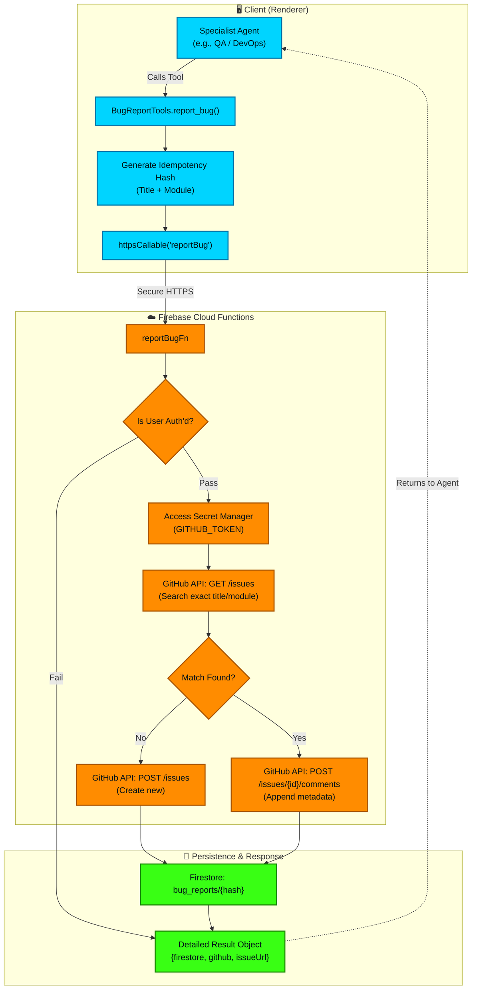

# Bug Reporter Pipeline

This flowchart outlines the newly secured `BugReportTools` pipeline. Following the resolution of ISSUE-031, this architecture completely abstracts the GitHub API token away from the client bundle, shifts execution to a Firebase Cloud Function, and enforces idempotency via content hashing to prevent duplicate issue spam during rapid agent iterations.

## Transition Breakdown

1. **Agent Tool Invocation**: An agent detects a bug or decides to file an issue and calls `report_bug()`.
2. **Idempotency Hashing**: The client generates a SHA256 content hash using the issue title, module, and error type. This hash becomes the primary key for idempotency.
3. **Secure Function Call**: The client invokes the `reportBug` Cloud Function via `httpsCallable`. The client bundle *never* contains the GitHub API token.
4. **Backend Authorization & Secrets**: The Cloud Function verifies the user's Firebase Auth token. Upon success, it pulls the sensitive `GITHUB_TOKEN` from Google Cloud Secret Manager.
5. **Search-Before-Create**: The function queries the GitHub Issues API (`GET /issues`) searching for an open issue with the exact same title and module label authored by the app.
6. **Deduplication Logic**: 
    - If a duplicate is found, the system *appends* a new comment with the latest error metadata rather than opening a redundant issue.
    - If no duplicate exists, it creates a pristine new issue.
7. **Firestore Persistence & Response**: The action is recorded in Firestore under `bug_reports/{hash}`. A detailed JSON object is returned to the agent explicitly defining the success/failure state of both the GitHub POST and the Firestore write, eliminating silent failure blind spots.
