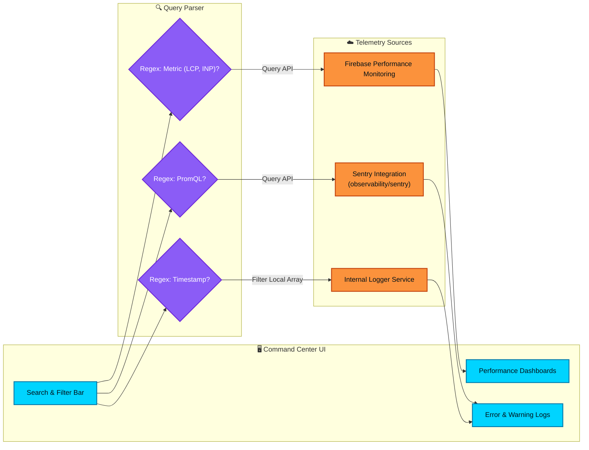

# Observability Matrix

This diagram maps the Command Center's Observability dashboard, detailing how the user (or the DevOps agent) searches, filters, and investigates system metrics. Following the resolution of ISSUE-041, the matrix now includes advanced query routing via PromQL patterns and specific metric value matching.

## Transition Breakdown

1. **Search Input**: The user inputs a query string into the newly added search bar in the Observability dashboard.
2. **Query Parsing**: The input is evaluated against several RegEx patterns to determine the user's intent:
    - *Timestamp Matching*: Standard ISO datetime formats.
    - *Metric Matching*: Keywords like `LCP`, `INP`, `CLS`, `FCP`, `TTFB`.
    - *PromQL*: Advanced queries using Prometheus-style syntax (supported via the Sentry/Firebase API proxies).
3. **Data Routing**:
    - Timestamps primarily filter the local/in-memory `LoggerService` outputs.
    - Core Web Vitals queries are routed to Firebase Performance Monitoring to fetch aggregated trace data.
    - Complex analytical queries or error hashes trigger the Sentry integration.
4. **Dashboard Re-render**: The returned telemetry data is piped back into the visual dashboards and error log components, allowing the user (or DevOps agent) to drill down into specific system degradation events.
