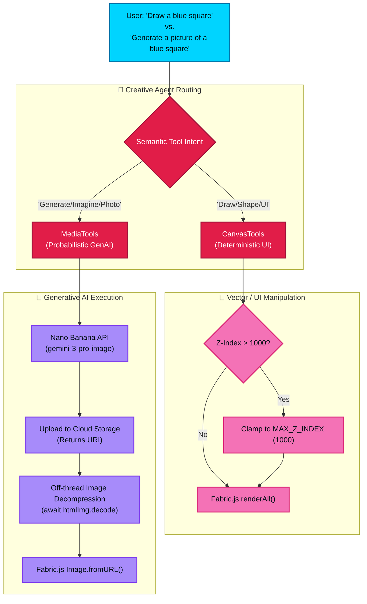

# Creative Production Pipeline

This flowchart outlines the dual-track nature of the Creative Studio. It clearly delineates the difference between deterministic UI manipulations (vector shapes via `CanvasTools`) and probabilistic generative media requests (via `MediaTools`), while highlighting the off-thread decompression optimizations (ISSUE-026) and strict Z-Index bounding constraints (ISSUE-035).

## Transition Breakdown

1. **Semantic Routing (ISSUE-036)**: The Creative Agent receives a prompt. Due to strictly clarified system descriptions, it parses deterministic requests (e.g., adding text, changing UI background color, drawing vector rectangles) to `CanvasTools`, and creative imaginative requests to `MediaTools`.
2. **Deterministic Track (CanvasTools)**: 
    - The tool payload dictates a shape operation.
    - **Z-Index Safeguard (ISSUE-035)**: Before drawing, the parameters are checked against a strict `MAX_Z_INDEX` (1000). If the LLM hallucinates `z: 999999` (which would permanently lock the user out of the UI), it is safely clamped.
    - Fabric.js executes the deterministic DOM/Canvas manipulation.
3. **Probabilistic Track (MediaTools)**:
    - The generative prompt is dispatched to the Nano Banana API (utilizing `gemini-3-pro-image`).
    - The resulting raw image buffer is uploaded to Firebase Cloud Storage, which returns a secure URI.
    - **Performance Optimization (ISSUE-026)**: Instead of locking the main UI thread while Fabric.js decompresses the base64/URI image data synchronously, the pipeline uses an off-thread `await htmlImg.decode()` helper.
    - Once decompressed in the background, the pre-computed raster data is injected into the Fabric.js canvas without causing UI stutter or jank.
