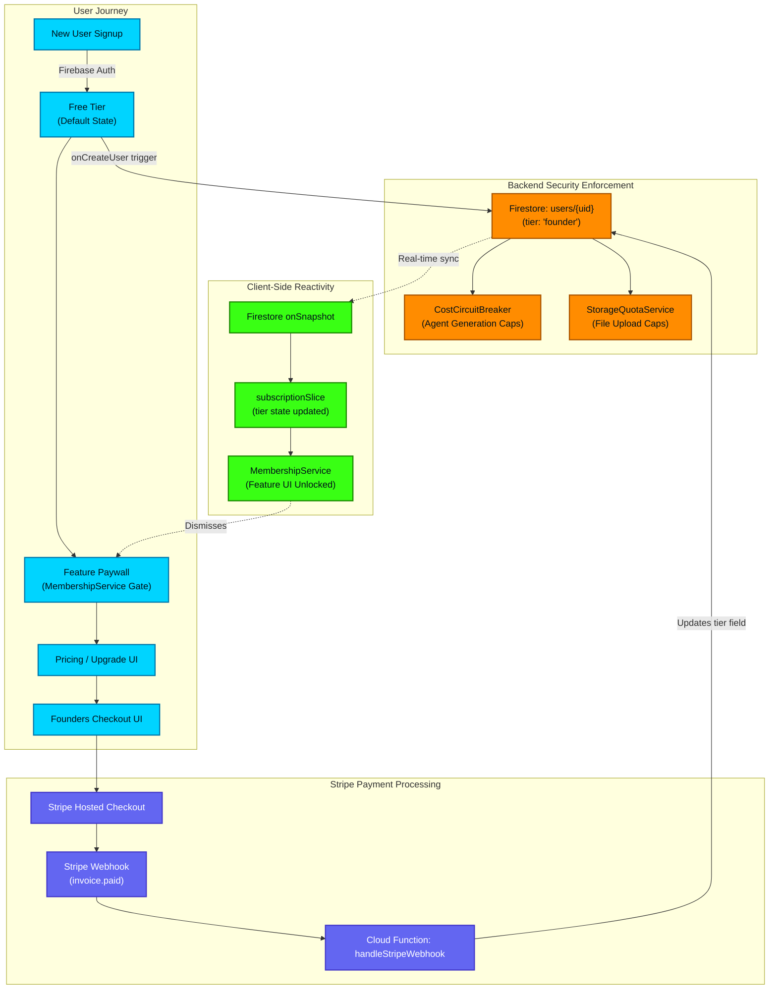

# Billing, Subscription & Tier Enforcement

This flowchart visualizes the lifecycle of user access control. It tracks the flow of a user converting from the Free Tier, successfully completing a Stripe checkout, and the subsequent webhooks and synchronization events that eventually grant them access to the "Founders" tier features.

## Transition Breakdown

1. **Free Tier Initialization**: A new user signs up via Firebase Auth. The `onCreateUser` Cloud Function trigger builds their initial `users/{uid}` document, explicitly setting their `tier` to `free`.
2. **Paywall Interception**: The user attempts an action (e.g., unlimited AI generation, heavy video rendering). The client-side `MembershipService` or backend `CostCircuitBreaker` intercepts the request and presents the Paywall UI.
3. **Checkout Handoff**: The user navigates to the Founders Checkout UI and is handed off to a secure Stripe Hosted Checkout session.
4. **Webhook Synchronization**: Upon successful credit card charge, Stripe fires an `invoice.paid` webhook to the dedicated `handleStripeWebhook` Cloud Function. This function securely updates the user's `tier` field in Firestore to `founder` and applies the relevant `subscriptionId`.
5. **Backend Quota Adjustments**: The newly upgraded `users/{uid}` document automatically grants the user higher ceilings in the `CostCircuitBreaker` (agent inference budget) and `StorageQuotaService` (cloud asset storage).
6. **Real-time Client Sync**: Because the client maintains an active `onSnapshot` listener on their user document, the tier upgrade propagates instantly to the Zustand `subscriptionSlice`. The `MembershipService` detects the state change and automatically dismisses the paywall modal, granting immediate, seamless access to the platform without requiring a hard refresh.
