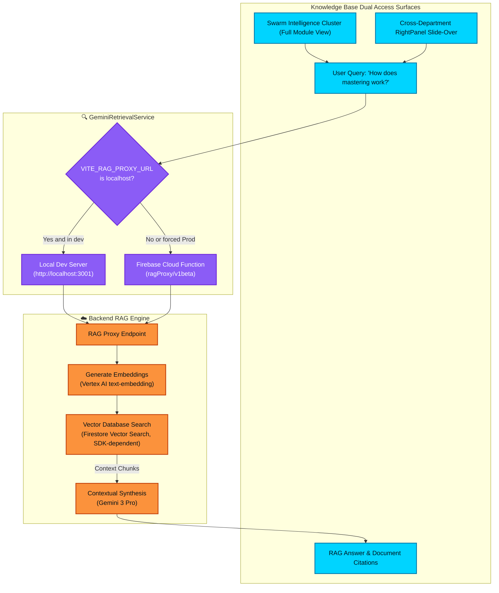

# Knowledge Base RAG Architecture

This flowchart tracks how natural language queries within the Knowledge Base system are parsed, vectorized, and retrieved against the document corpus. Elevated to the top-level **"Swarm Intelligence & Automations"** cluster alongside Boardroom and Agent Canvas, and accessible via a persistent **RightPanel slide-over** across all departments, it details the routing logic and backend retrieval protections (ISSUE-039) preventing clients from querying dead localhost proxy endpoints.

## Step-by-Step Transition Breakdown

1. **Dual Entry Access Surfaces:** The Knowledge Base is accessible via two native surfaces:
   - **Swarm Intelligence Cluster:** A dedicated full-page module elevated into the top-level "Swarm Intelligence & Automations" sidebar group alongside Boardroom and Agent Canvas.
   - **RightPanel Slide-Over:** A persistent slide-over drawer accessible from any department (Creative, Distribution, Finance, Marketing) enabling instant context lookups without navigating away from the active workflow.
2. **Query Initiation:** The user submits a question or query into the search bar from either surface.
3. **Environment Protection (ISSUE-039):** The `GeminiRetrievalService` evaluates the current environment configuration. The service explicitly detects localhost URLs and automatically routes to the production Cloud Function endpoint (`ragProxy/v1beta`) when the client is not actively running in local development mode.
4. **Endpoint Routing:** The query payload is securely dispatched to the active RAG Proxy endpoint.
5. **Vectorization:** The backend uses Vertex AI text-embedding models to convert the user's natural language query into a high-dimensional vector.
6. **Similarity Search:** The query vector is compared against pre-computed document embeddings stored in the Vector Database (Firestore Vector Search). The system retrieves the top *K* most semantically relevant text chunks.
7. **Synthesis & Citation:** The retrieved contextual chunks are bundled with the query and sent to Gemini 3 Pro, which synthesizes a factual, cited response returned to the active UI surface (full view or slide-over).
