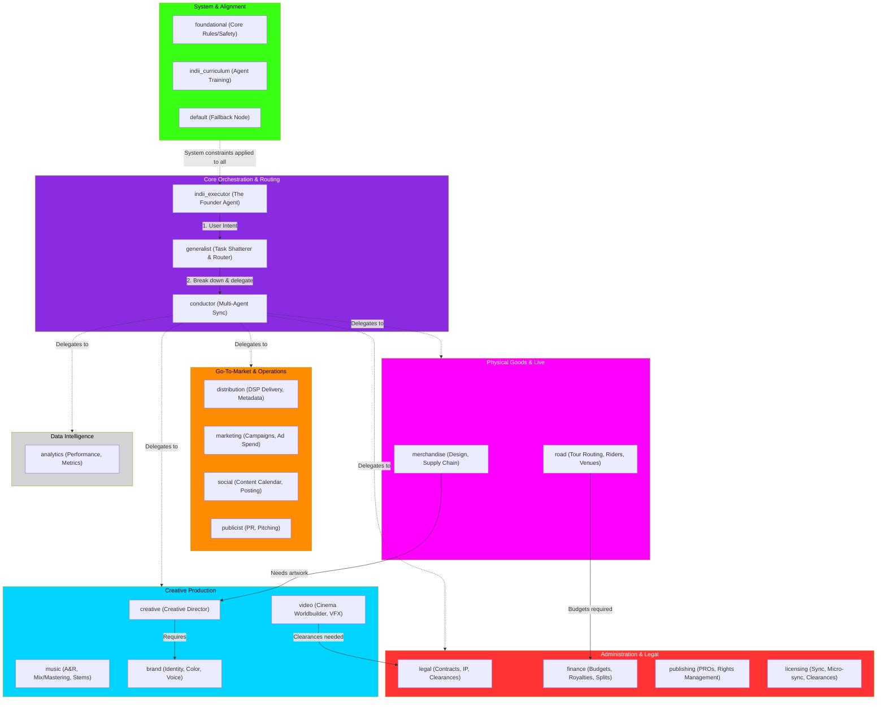

# 21-Agent Swarm Hierarchy & Delegation Flow

This flowchart maps the massive 21-Agent Swarm that powers the indii platform. It details the hierarchy from the `indii_executor` down to specialized domain departments, demonstrating how complex prompts are shattered into parallel sub-tasks and delegated to the precise specialist.

## Department Breakdown & Responsibilities

1. **Core Orchestration:**
   - `indii_executor`: The absolute root of the system, acting as the user's direct proxy.
   - `generalist`: Handles intent classification. It decides if a prompt is a simple chat or a massive campaign.
   - `conductor`: The swarm synchronizer. If a task requires 5 different agents, the conductor coordinates the parallel executions and consolidates the responses.

2. **System & Alignment:**
   - `foundational`: Injects the absolute rules of the platform (safety, tone, boundaries).
   - `indii_curriculum`: The onboarding agent that learns the user's specific catalog and preferences.
   - `default`: The fallback catch-all if an intent cannot be confidently classified.

3. **Administration & Legal:**
   - `legal`: Scans for plagiarism, clears samples, generates agreements.
   - `finance`: Manages the ledger, calculates split royalties, restricts budgets.
   - `publishing`: Registers works with PROs, manages mechanicals.
   - `licensing`: Negotiates and clears sync placements (TV/Film/Games).

4. **Creative Production:**
   - `creative`: The overarching director that ensures the final product matches the `brand`.
   - `music`: Analyzes sonic signatures, handles audio processing logic.
   - `video`: Directly interacts with the Neural Cortex and generative video models.
   - `brand`: Holds the "Brand Kit" (fonts, colors, tone of voice) as gospel.

5. **Go-To-Market (GTM):**
   - `distribution`: Triggers the Proprietary Ingestion Pipeline (XML/DSR).
   - `marketing`: Builds ad campaigns and spends against the `finance` budget.
   - `social`: Drafts TikTok/IG content aligning with the `brand` voice.
   - `publicist`: Pitches DSP playlists and blogs.

6. **Physical & Live:**
   - `merchandise`: Designs physical goods and integrates with print-on-demand chains.
   - `road`: Handles tour logistics, venue booking, and artist riders.

7. **Data Intelligence:**
   - `analytics`: Reads BigQuery and DSP stats to inform the `marketing` and `road` agents.
