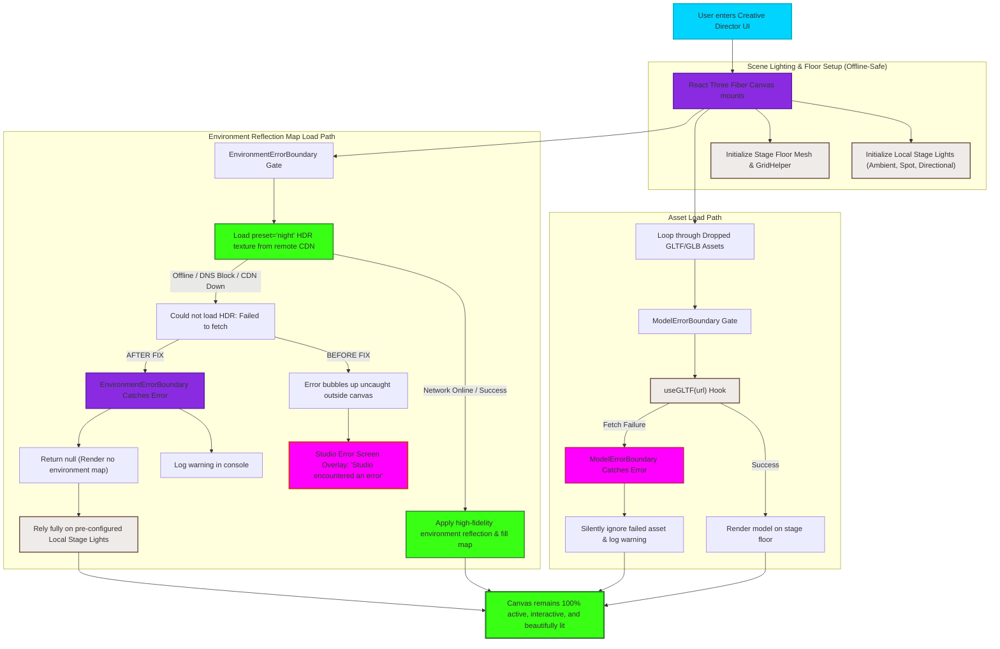

# 3D Stage Builder Error Fallback Flowchart

This flowchart outlines the robust loading sequence and error boundary fallback system implemented inside the Creative Director's 3D Stage Builder canvas. It maps how asset loading (GLTF models) and environment mapping (remote HDR texture fetches) are securely isolated to prevent network blockages or file corruptions from crashing the entire user interface.

---

## The Flowchart Diagram

---

## Detailed Step-by-Step Transition Breakdown

1. **User Activation:** The user accesses the `Creative Director` UI module, triggers the `3D Stage Builder` view, mounting the React component.
2. **Offline-Safe Canvas Mounting:**
   - The `@react-three/fiber` `<Canvas>` is initialized.
   - The `Stage Floor Mesh` and the `GridHelper` reference are drawn instantly.
   - **Local Stage Lighting** is activated: an `ambientLight` (intensity 0.2), a `spotLight` (intensity 2.0), and two `directionalLight` arrays (intensity 0.5) provide offline-safe, high-quality, baseline illumination for the stage set.
3. **Dropped Asset Pipeline:**
   - Any dropped `.glb` or `.gltf` 3D files are processed inside `SceneBuilder.tsx`.
   - Each model is isolated under a React `ModelErrorBoundary` container.
   - If the `useGLTF` loading hook encounters a file parsing error or load issue, `ModelErrorBoundary` catches it immediately, silently preventing a canvas crash, and logs the warning.
4. **Environment Mapping Pipeline:**
   - The `<Environment preset="night" />` component is loaded inside the Canvas tree.
   - The loader attempts to fetch the HDR map `dikhololo_night_1k.hdr` from the default `drei-assets` remote CDN.
5. **The Error & Fallback Resolution:**
   - **Before the Fix:** If the CDN request failed (due to network disconnection, restricted corporate firewalls, or offline developer testing), the fetch error went uncaught within the canvas reconciler. It bubbled all the way to the top-level app `ErrorBoundary`, crashing the entire screen and showing the "Something went wrong. Studio encountered an error" overlay.
   - **After the Fix:** `<Environment>` is wrapped inside the `EnvironmentErrorBoundary` component. A network failure will throw a caught warning instead of a crash. The boundary catches the rejection, logs a warning message, and renders `null` to bypass remote reflections.
6. **Graceful Degrade Victory:** The stage builder remains 100% active, interactive, and well-lit by the primary local stage lights, providing a premium, offline-resilient user experience.
