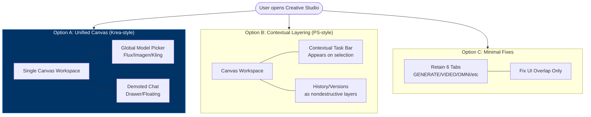

# IA Consolidation Architecture (Macro)

**Transition Breakdown:**
- **Start -> Options:** Represents the architectural split. Only one path will be chosen for implementation.
- **Option A Flow:** Centralizes the experience on the canvas, removing the 6 top tabs and replacing them with a mode/model dropdown.
- **Option B Flow:** Focuses on layer-based history and contextual UI that appears upon selection, merging the disjointed history panels.
- **Option C Flow:** Smallest code footprint, keeping the current tab structure but fixing the CSS overlap bugs and preventing multiple floating panels.
