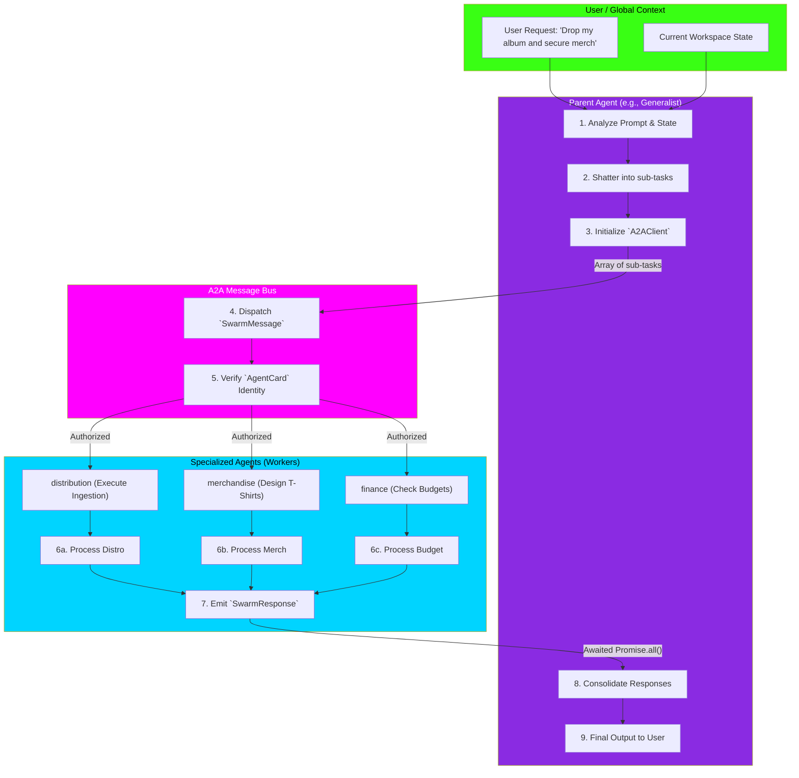

# Agent-to-Agent (A2A) Swarm Protocol Flowchart

This flowchart maps the highly specific communication protocol that allows the 21 isolated agents to delegate tasks, pass context, and synchronize responses without polluting the global state. This protocol operates *within* agent execution; high-level graph orchestration (task planning) is handled by the **indii Conductor** (AgentGraphService) shown in `entire-app-architecture.md`.

## Transition Breakdown

1. **Analysis & Shattering:** When a complex user request arrives (e.g., "Release my album and make some t-shirts"), a high-level agent (like `Generalist`) analyzes it. Recognizing it spans multiple domains, it shatters the request into isolated, atomic sub-tasks.
2. **A2AClient Initialization:** The Parent Agent initializes the `A2AClient`, which acts as the decentralized P2P router.
3. **Dispatch & Auth:** The `A2AClient` dispatches `SwarmMessage`s to the required specialists (`distribution`, `merchandise`, `finance`). Before execution, the system checks each agent's `AgentCard` to ensure they have the authority to execute the task.
4. **Parallel Execution:** The specialized agents operate in pure isolation. `finance` checks the ledger, `distribution` triggers the XML pipeline, and `merchandise` generates design prompts. They do not wait on each other unless explicitly instructed to (e.g., via `Conductor`).
5. **Return & Consolidation:** Once finished, each agent emits a `SwarmResponse` back through the message bus. The Parent Agent (`Generalist`) awaits the `Promise.all()` resolution of all tasks.
6. **Final Output:** The Parent Agent reviews the combined output, formats it into a cohesive narrative, and delivers the single, unified response back to the user interface.
