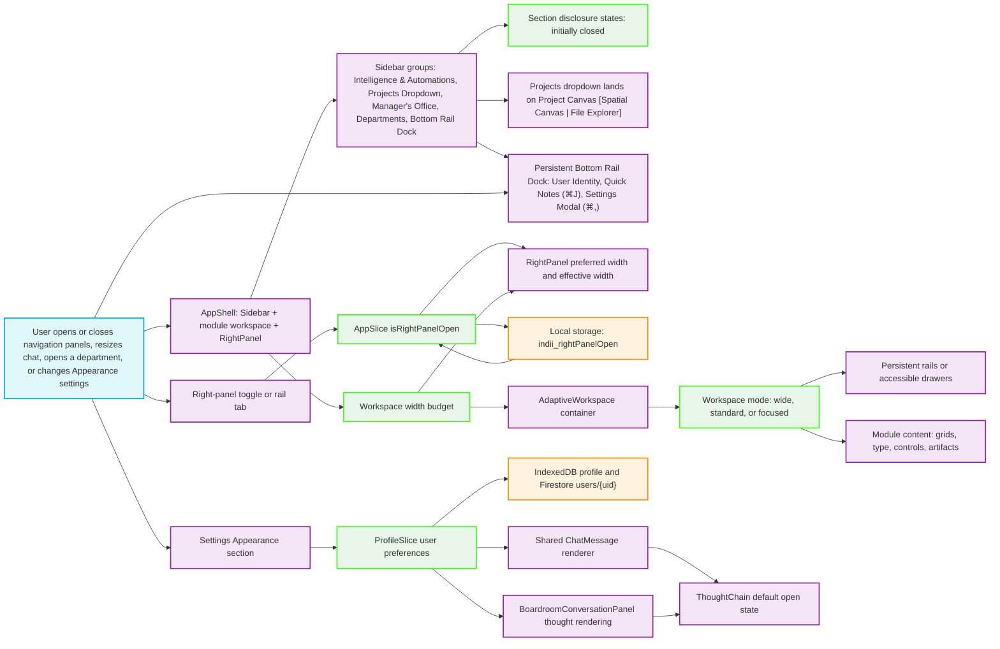

# Adaptive Workspace and Chat Preferences Flowchart

This map describes how the global Studio shell protects usable module space, preserves the user's navigation-panel choices, adapts department dashboards to their actual container width, and applies the Cognitive Logic preference to every compatible chat message.

## Step-by-Step Transition Breakdown

1. The Sidebar mounts the elevated Swarm Intelligence & Automations cluster (Boardroom, Agent Canvas, Workflow Builder, Knowledge Base), the Projects dropdown (which lands directly on Project Canvas with a `[ Spatial Canvas | File Explorer ]` header switcher), Manager's Office, and Departments with section disclosures closed. The legacy Tools catch-all accordion in the sidebar has been retired; Settings is now accessed via the persistent Sidebar Bottom Rail / Footer Dock (`Cmd+,` floating overlay modal) and Notes via the Global Quick-Capture Drawer (`Cmd+J` or bottom dock trigger) plus native `NoteBlock` elements on Project Canvas.
2. The right-panel toggle updates `AppSlice.isRightPanelOpen` and writes the same boolean to `indii_rightPanelOpen`. On the next app launch, `createAppSlice` restores that value, so the user’s last open or closed choice remains stable.
3. The right rail remains visible whether the content panel is open or closed. Selecting a rail tab persists `true`, opens that tab when needed, and switches the content in place when already open. Ordinary module navigation does not write the visibility preference, so it cannot override the user’s choice.
4. `AppShell` calculates the space shared by the global Sidebar, module workspace, and RightPanel. The RightPanel retains the user’s preferred width but uses an effective width that cannot collapse the module below a readable budget.
5. `AdaptiveWorkspace` measures its own width, rather than consulting the browser viewport, then selects wide, standard, or focused mode. Secondary rails become drawers before the main workspace is squeezed.
6. Modules—including the customizable Dashboard—use the selected mode and container queries to reflow grids, spacing, titles, KPIs, controls, and artifacts from one to three columns according to their actual workspace width. No whole-page CSS transform is used.
7. Appearance settings update the existing user-profile preference object. `ProfileSlice` persists it locally and merges it to the user’s Firestore document.
8. `ChatMessage` uses the stored Cognitive Logic preference only when a thought card mounts, so manual expansion or collapse remains under the user’s immediate control. Boardroom’s custom renderer receives the same behavior when it has thought data.

The gate between the width budget and persistent rails is the important protection: a secondary panel must yield before a department’s center content becomes an unreadable sliver.
