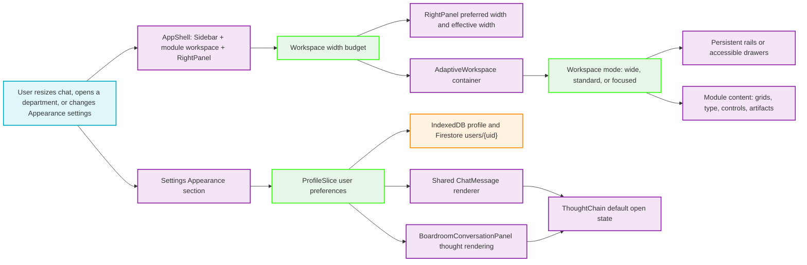

# Adaptive Workspace and Chat Preferences Flowchart

This map describes how the global Studio shell protects usable module space, how a department dashboard adapts to its actual container width, and how the Cognitive Logic preference reaches every compatible chat message.

## Step-by-Step Transition Breakdown

1. `AppShell` calculates the space shared by the global Sidebar, module workspace, and RightPanel. The RightPanel retains the user’s preferred width but uses an effective width that cannot collapse the module below a readable budget.
2. `AdaptiveWorkspace` measures its own width, rather than consulting the browser viewport, then selects wide, standard, or focused mode. Secondary rails become drawers before the main workspace is squeezed.
3. Modules use the selected mode and named container queries to reflow grids, spacing, titles, KPIs, controls, and artifacts. No whole-page CSS transform is used.
4. Appearance settings update the existing user-profile preference object. `ProfileSlice` persists it locally and merges it to the user’s Firestore document.
5. `ChatMessage` uses the stored Cognitive Logic preference only when a thought card mounts, so manual expansion or collapse remains under the user’s immediate control. Boardroom’s custom renderer receives the same behavior when it has thought data.

The gate between the width budget and persistent rails is the important protection: a secondary panel must yield before a department’s center content becomes an unreadable sliver.
