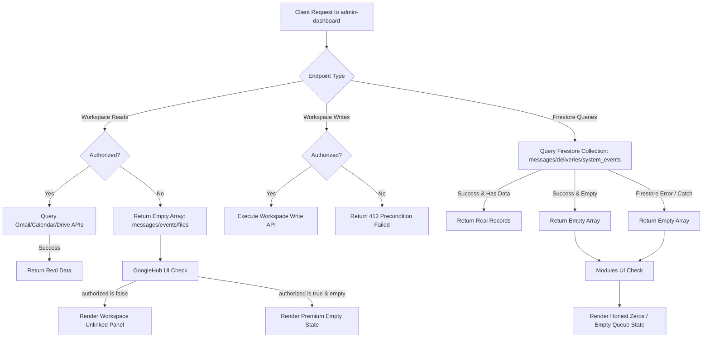

# Admin Dashboard Mock Data Elimination Flowchart

## Description
This diagram details the new clean routing paths for the `admin-dashboard` system after the removal of all mock database fallbacks.
1. **Workspace Reads/Writes**: Ensure unlinked state doesn't leak mock data, returning empty arrays and a `412` HTTP status for write attempts. The `GoogleHub` frontend checks this status and prevents tabs from rendering empty templates, replacing them with a unified "Link Workspace Account" helper.
2. **Firestore Collections**: All messaging logs, direct deliveries, and system logs are retrieved directly from Firestore. Any query errors or empty datasets gracefully fallback to empty structures, letting the UI render honest zero states rather than placeholders.
