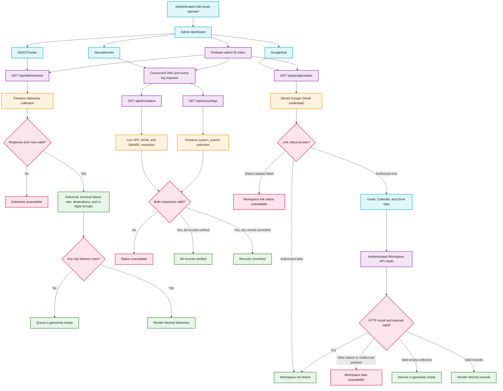

# Admin Dashboard Truthful State Flow

This diagram documents how the DDEX, Nexus, and Google Workspace operator panels derive their visible state from authenticated backend evidence. Empty, disconnected, unavailable, and verified are separate outcomes; transport, authorization, and schema failures never become optimistic status or empty data.

## Transition breakdown

1. Each panel sends the operator's Firebase ID token to an admin endpoint protected by the server's `requireAdminAuth` boundary. A `401` or `403` becomes an actionable authentication error instead of an empty dataset.
2. `DDEXTracker` accepts only valid delivery rows, using the Firestore document ID when a duplicated `releaseId` field is absent. Its delivery count, terminal failure rate, distinct destinations, and in-flight ERN formats are derived from the returned queue in one pass.
3. A successful empty delivery response renders the queue-empty message. A failed or malformed response clears stale rows and renders unavailable, so an outage cannot impersonate a quiet queue.
4. `NexusMonitor` starts the independent DNS and log reads concurrently with `Promise.allSettled`. A rejected request, non-success status, or invalid body clears stale state and produces the red unavailable state.
5. Nexus is green only when SPF, DKIM, and DMARC each explicitly read `verified`. Any successful but unverified result is amber; loading and backend failure have distinct states.
6. `GoogleHub` first proves whether a Workspace credential is present. A failed status request leaves the link state unknown, while an explicit `authorized: false` result alone renders the connection prompt.
7. Once linked, Gmail, Calendar, and Drive responses are structurally parsed. A `412` means authorization disappeared and returns to the connection prompt; other failures or malformed payloads render data unavailable. Only a successful, valid empty array may render an empty inbox, calendar, or Drive.
8. OAuth initiation accepts only an HTTPS redirect URL. Write operations also interpret `412` as a lost link and never preserve a false connected state after credential loss.
