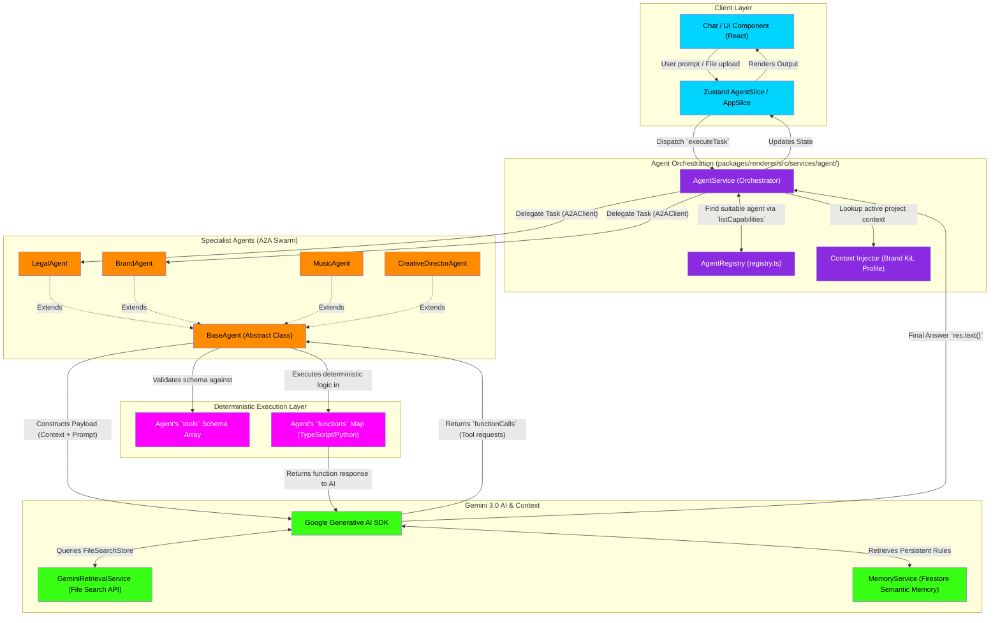

# Agent Swarm & Intelligence Protocol Flowchart

This deep-dive flowchart maps the low-level technical execution of the indii Agent System. It details how the central Orchestrator (`AgentService`) routes tasks to specialists (`BaseAgent` subclasses), how agents use the native Gemini File Search API for RAG, and how deterministic tools are executed.

## Transition Breakdown

1. **User Action:** The user submits a prompt or file in the UI, which updates the `Zustand` store. The store triggers `executeTask` on the `AgentService`.
2. **Context Injection:** `AgentService` reads the active workspace state (e.g., current Brand Kit, User Tier, Organization) and attaches this system context to the payload.
3. **Agent Routing:** `AgentService` queries the `AgentRegistry` to discover which specialized agent handles the intent (e.g., legal analysis goes to `LegalAgent`).
4. **Swarm Handoff:** The task is delegated to the specialist class extending `BaseAgent`. 
5. **AI Evaluation & RAG:** `BaseAgent` sends the prompt to the `Google Generative AI SDK` (Gemini 3.0 Pro). If context is needed, the model natively queries the `GeminiRetrievalService` (File Search API) or long-term facts from the `MemoryService`.
6. **Deterministic Tool Execution:** Instead of hallucinating complex math or system actions, Gemini returns a `functionCall`. `BaseAgent` intercepts this, verifies the function exists in its `tools` schema, and natively executes the actual TypeScript/Python logic stored in its `functions` map.
7. **Resolution:** The deterministic output is fed back to the AI for final reasoning, and the `res.text()` is dispatched back to the UI store.
