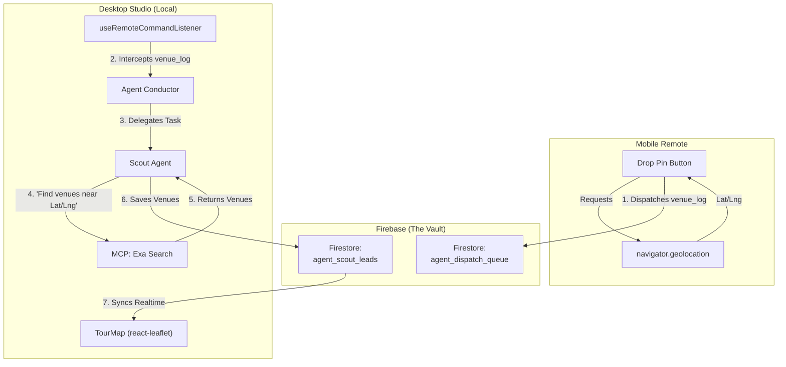

# Agent Venue Research (Macro)

This flowchart illustrates the end-to-end process of dropping a pin on the Mobile Remote, having an autonomous agent research venues in that area using web search, and rendering the results on an interactive map in the Desktop Studio.

## Transition Breakdown
1. **Drop Pin:** The user taps "Drop Pin" on their mobile device. The app gets exact GPS coordinates and sends them to the `agent_dispatch_queue`.
2. **Desktop Intercept:** The Desktop Executor silently picks up the coordinate payload.
3. **Agent Delegation:** The task is routed to the `Scout Agent` (or Generalist acting as Scout).
4. **Agent Research:** The agent formulates a web search via the `mcp_exa` tool to find "live music venues, clubs, and bars near [Latitude, Longitude]".
5. **Data Storage:** The agent structures the returned data and saves it into the `agent_scout_leads` collection in Firestore.
6. **Visualization:** The `TourMap` component (upgraded with an interactive `react-leaflet` map) automatically syncs with Firestore and renders the newly researched venues as clickable pins.
