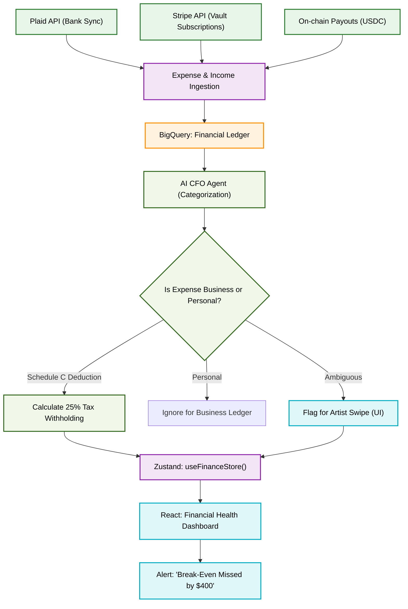

# Automated Business Manager (AI CFO) Flowchart

This flowchart maps the `indii` AI CFO architecture. It details how the system aggregates multi-channel revenue (touring, sync, Web3, streaming) alongside expenses to provide real-time break-even analysis and automated tax withholding.

## Transition Breakdown
1. **Data Ingestion:** The `IngestionService` securely pulls read-only transaction data via Plaid (credit cards), Stripe (D2F Vault), and on-chain RPCs (Web3 royalties). All data is normalized and stored in a unified BigQuery ledger.
2. **AI Categorization:** An LLM-powered Agent CFO continuously scans new BigQuery rows. It uses heuristic logic and NLP to classify expenses (e.g., automatically tagging a "Guitar Center" purchase as an Equipment Deduction).
3. **Human-in-the-Loop:** If the AI is unsure about a transaction (e.g., an ambiguous "Amazon" purchase), it flags it in the Zustand store. The React UI displays a Tinder-like "Swipe" interface for the artist to manually classify it as Business or Personal.
4. **Calculations & UI:** For all net income, the system calculates a 25-30% estimated tax withholding. The final numbers are pushed to the UI, rendering the massive "Runway & Break-Even" chart and triggering toasts if the artist is dipping below profitability.
