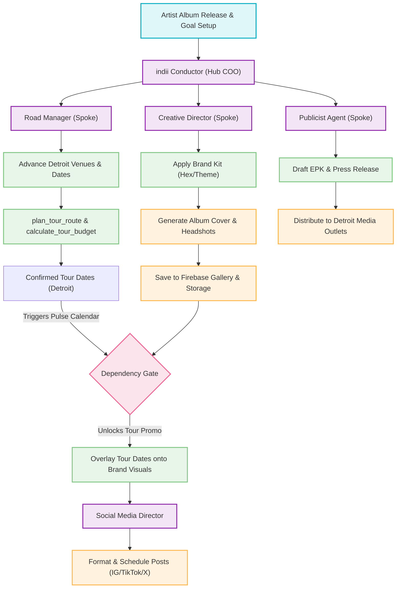

# Album Release & Detroit Tour Swarm Timeline Flowchart

This high-level flowchart depicts the macro-timeline of an independent music artist's album rollout, Detroit fall tour scheduling, and localization marketing campaigns. It visually maps the key agent roles, parallel work streams, and the critical dependency gate that holds back localized promotional materials until specific tour dates are locked in by the Road Manager.

---

## Mermaid Diagram

---

## Step-by-Step Transition Breakdown

1. **Artist Initiation:** The independent artist registers an album release and launches the project. The **indii Conductor** (the hub COO intelligence) absorbs the artist's brand metadata, career stage, and strategic directions.
2. **Specialist Swarm Activation:** The Conductor dynamically seats three primary department spokes in the Boardroom to begin parallel operations:
   - **Creative Director:** Coordinates design aesthetics and visual themes.
   - **Road Manager:** Focuses on real-world travel, routing, and booking logistics.
   - **Publicist:** Directs high-level narrative strategy and outlines media target campaigns.
3. **The Dependency Problem (Blocked Assets):** While general promotions (such as the album cover art and headshots) are unblocked and can immediately be generated via the **Creative Director** (using the *Brand Kit* and the real *Gemini Imagen API*), tour flyers and localized social promotions *cannot* be made until specific performance dates are finalized.
4. **Logistics Optimization & Verification:** The **Road Manager** queries Detroit venues, checks local distance and routing parameters via `plan_tour_route` and `get_distance_matrix`, and creates a verified travel budget via `calculate_tour_budget`.
5. **The Pulse Dependency Resolution:** Once the venues are advanced and the Detroit performance dates are locked, the **Pulse Calendar** background process captures the updated state and resolves the blocked gate in `task-queue.json`.
6. **Campaign Material Rollout:** The completed dates and localized data are passed automatically back to the **Creative Director** to overlay onto pre-approved visual templates.
7. **Multi-Channel Distribution:** The final promotional assets are delivered to:
   - The **Social Media Director** to format and schedule posts for IG, TikTok, and X.
   - The **Publicist** to synthesize into a local press release and Electronic Press Kit (EPK) for Detroit media distribution.
