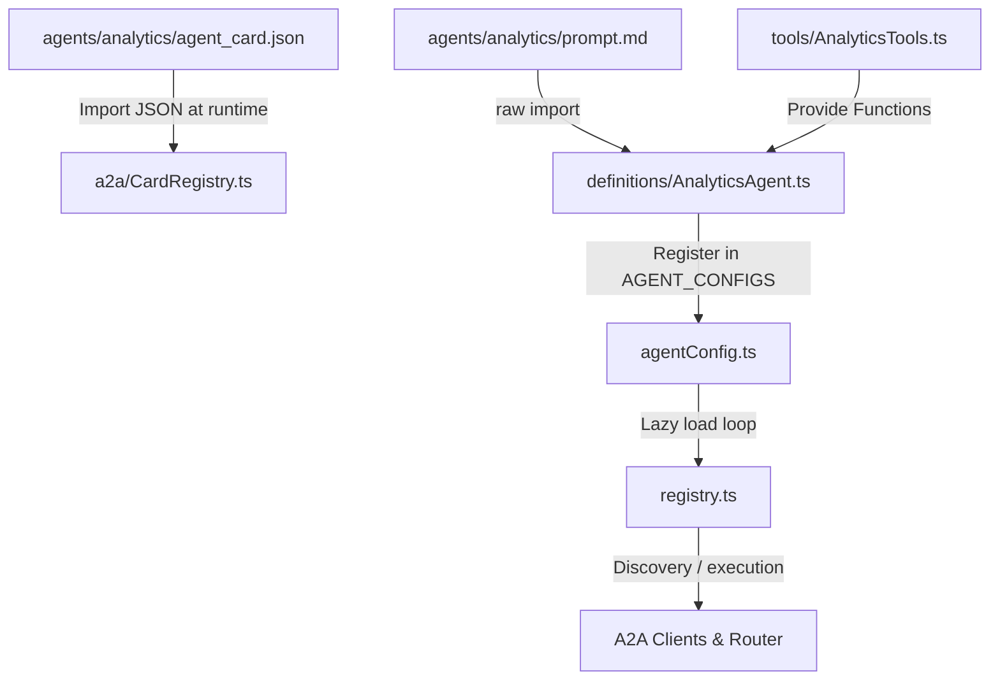

# Analytics Agent Elevation Macro Flowchart

This diagram details the runtime initialization and wiring strategy of the Analytics Agent under the Agent Folder Elevation Program.

## Step-by-Step Transition Breakdown

- **agent_card.json**: Holds the truthful A2A identity, including risk tier, capabilities, input/output schemas, and cost models. This is imported directly into `CardRegistry.ts` so that it remains the single source of truth at runtime.
- **prompt.md**: Read as a raw string import by Vite inside `AnalyticsAgent.ts`. The prompt represents the production system instructions.
- **AnalyticsTools.ts**: Contains the deterministic TypeScript logic for analytics capabilities (e.g. release velocity benchmarking, anomaly detection, cohort retention, and viral potential score) to replace retired Python mocks.
- **AnalyticsAgent.ts**: Pairs the raw prompt with the declared tools and exports an `AgentConfig` for the agent registry.
- **agentConfig.ts**: Registers `AnalyticsAgent` inside `AGENT_CONFIGS` so the registry registers it uniformly like other first-class department agents.
- **registry.ts**: Cleans up the previous hardcoded inline registration block, enabling the agent to load dynamically via the config-based lazy-loader.

