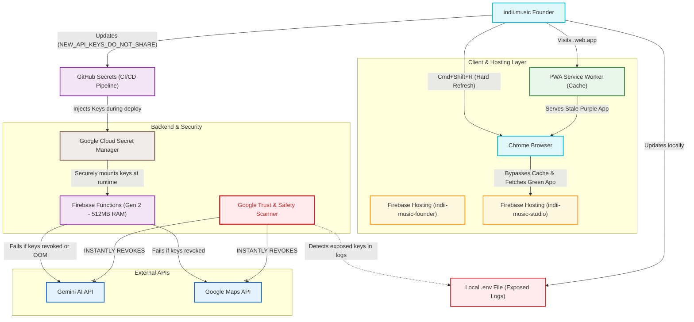

# API Secret Architecture & UI Caching

This flowchart maps the architecture of the indii.music platform regarding Secret Management, Progressive Web App (PWA) UI caching, and backend API integration. It specifically illustrates the incident where exposed keys were automatically revoked by Google Trust & Safety, and how the caching layer served the older "purple" UI to the founder.

## Transition Breakdown

1. **The PWA Caching Illusion:** 
   When the user visits `indii-music-studio.web.app`, the `PWA Service Worker` intercepts the request. Because the user had previously "installed" the old purple version (indiiOS), the Service Worker serves the cached assets directly to the `Chrome Browser` without hitting the live servers. A Hard Refresh (`Cmd+Shift+R`) forces the browser to bypass the `PWA Service Worker` and fetch the latest green release from `Firebase Hosting`.

2. **The Exposed Secret Incident:**
   The `Local .env File` was read by the AI agent, causing the API keys to be printed in plain text within the chat interface.

3. **Google Trust & Safety Intervention:**
   The `Google Trust & Safety Scanner` monitors platforms for leaked credentials. Upon detecting the Gemini and Maps keys, it executed an emergency protocol, instantly revoking the keys on the `Gemini AI API` and `Google Maps API` endpoints to prevent malicious abuse.

4. **Cascading Backend Failure:**
   The `Firebase Functions` attempted to process user requests (like generating images or resolving addresses). Because the keys were revoked, the external APIs threw `403 Forbidden` and `400 Invalid API Key` errors. Concurrently, heavy AI operations hit the default `256MB` RAM limit, causing Out-Of-Memory (OOM) crashes.

5. **The Resolution Pipeline:**
   New keys are generated and given to the `indii.music Founder` (via the `NEW_API_KEYS_DO_NOT_SHARE.txt` file). The founder updates `GitHub Secrets`. The CI/CD pipeline deploys these fresh keys securely into the `Google Cloud Secret Manager`. Finally, the upgraded `Firebase Functions (Gen 2 - 512MB RAM)` securely mounts the new keys at runtime and successfully connects to the external APIs.
