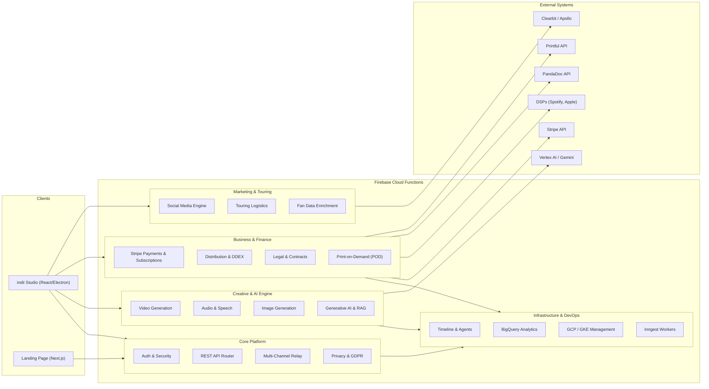

# Backend API Endpoints & Module Relationships

This document maps out the comprehensive ecosystem of indii.music Cloud Functions (Firebase/Node.js), categorizing the backend API endpoints and outlining module relationships.

## Module Architecture & Data Flow

The following Mermaid flowchart visualizes the high-level domains of the Cloud Functions architecture and the flow of data from clients through the various service areas to third-party integrations (like Vertex AI, Stripe, PandaDoc, etc.).

## Complete API Endpoint Map

## Complete API Endpoint Map (auto-synced 2026-08-18)

**Client-reachable endpoints: 116** (onCall/onRequest exported from the deploy surface). **Internal triggers: 23** (scheduled/storage/Firestore/Cloud Tasks — not client-callable).

### Core Platform & Security
- `claimStudioCommand`, `completeStudioCommand`, `createHandoffCode`, `createPurgeIntent`, `emailExchangeToken`, `emailRefreshToken`, `emailRevokeToken`, `generateTelegramLinkCode`, `getCapabilitySnapshot`, `getOrganizationAccessMatrix`, `getTelegramLinkStatus`, `issueStudioExecutorLease`, `logAuditEvent`, `manageSemanticMemory`, `mintElectronAppCheckToken`, `persistFraudAlert`, `provisionVerifiedFreeEntitlement`, `publishStudioPresence`, `publishStudioResponse`, `purgeTrashItems`, `queueRightsRegistration`, `recordInstrumentUsage`, `recordPersonaResponseMeasurement`, `redeemHandoffCode`, `registerAiContextCache`, `releaseStudioPresence`, `reportBugFn`, `sendEmail`, `setGodMode`, `telegramWebhook`, `updateOrganizationMemberAccess`

### Creative & AI Engine
- `agentStreamHealth`, `agentStreamResponse`, `alignSessionMaster`, `applyAudioRecipe`, `approveSessionEditPlan`, `cancelVideoJob`, `cancelVideoSession`, `createKnowledgeUpload`, `createSocialHandoffDraft`, `createVideoSession`, `deleteKnowledgeDocument`, `fetchStorageAssetForCanvas`, `finalizeKnowledgeUpload`, `generateAudioV3`, `generateImageV3`, `generateOmniRemixV3`, `generateSessionEditPlan`, `generateVideoV3`, `getMediaDuration`, `getVideoRenderReceipt`, `queryKnowledgeBase`, `retrySessionProxyJob`, `verifyMasterAudio`

### Business & Finance
- `auditReleaseArtworkForDelivery`, `calculateRoyaltyAllocations`, `createStripeAccount`, `createStripeConnectAccount`, `createStripePaymentLinks`, `createTransfer`, `generateReleaseDownloadUrl`, `ingestEarningsReport`, `initiateSplitEscrow`, `pandadocWebhook`, `processAudioIngestion`, `releaseEscrow`, `requestTaxFormUpload`, `requestTaxForms`, `sendForDigitalSignature`, `setRecoupmentBalance`, `signEscrow`, `submitTaxForm`, `verifyMechanicalLicense`

### Marketing, Touring & Fans
- `createPreSaveCampaign`, `getInstagramMediaCommentsCallable`, `getPreSaveCampaign`, `listPreSaveCampaigns`, `marketingGetCampaignMetrics`, `presaveRegister`, `refreshSocialToken`, `replyInstagramCommentCallable`, `sendInstagramMessageCallable`, `shopifyWebhook`, `smartLinkRedirect`

### Infrastructure, Data & Orchestration
- `analyticsExchangeToken`, `analyticsFinalizeInstagramConnection`, `analyticsGetConnectionStatus`, `analyticsRefreshToken`, `analyticsRevokeToken`, `auditInstagramConnectionCallable`, `enforceOperationCost`, `enrichFanData`, `executeBigQueryQuery`, `generateContentStream`, `generateSpeech`, `getBigQueryTableSchema`, `getGKEClusterStatus`, `getOperationCostHistory`, `getOperationCostStatus`, `healthCheck`, `healthCheckWest1`, `inngestApi`, `listBigQueryDatasets`, `listGCEInstances`, `listGKEClusters`, `mcpEndpoint`, `ragProxy`, `renderVideo`, `requestAccountDeletion`, `restartGCEInstance`, `scaleGKENodePool`, `syncPlatformStats`, `triggerLongFormVideoJob`, `triggerVideoJob`, `voidAgentStreamCostReservation`, `voidVideoCostReservation`

### Internal-only triggers (not client-callable)
- `agentLoopCron`, `batchEventsScheduled`, `cleanupExpiredVideoSessions`, `cleanupExpiredVideoTemps`, `cleanupOrphanedVideos`, `deliverScheduledPosts`, `expireStaleOperationCostReservations`, `finalizeVideoSessionUpload`, `flagVideosForArchival`, `flushConversionEvents`, `indexKnowledgeDocumentWorker`, `onMilestoneScheduled`, `pollDeliveryStatus`, `pollTimelineMilestones`, `processDDEXAck`, `processISWCMapping`, `processRelayCommand`, `pulseTick`, `settleVideoSessionCost`, `streamEventOnCreate`, `trackStorageQuotas`, `videoJobFirestoreOrchestrator`, `workflowOrchestrator`

