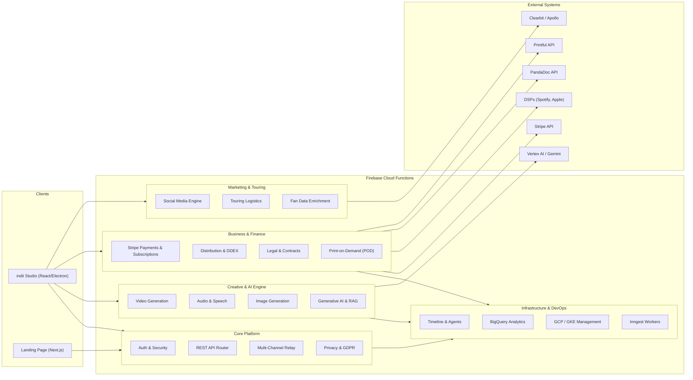

# Backend API Endpoints & Module Relationships

This document maps out the comprehensive ecosystem of indii.music Cloud Functions (Firebase/Node.js), categorizing the backend API endpoints and outlining module relationships.

## Module Architecture & Data Flow

The following Mermaid flowchart visualizes the high-level domains of the Cloud Functions architecture and the flow of data from clients through the various service areas to third-party integrations (like Vertex AI, Stripe, PandaDoc, etc.).

## Step-by-Step Transition Breakdown

1. **Client callable / HTTP request lifecycle** — every client-reachable endpoint runs on a Gen 2 Cloud Function in `us-central1`:
   1. The request arrives at the function URL; App Check enforcement applies where configured, and the caller's ID token is resolved into an authenticated `uid`.
   2. Inputs are validated (shape guards / schema checks) — failures return typed `HttpsError` codes (`invalid-argument`, `unauthenticated`, `permission-denied`, `failed-precondition`, `unavailable`) instead of silent fallbacks.
   3. Cost-gated operations (creative generation, video, streaming) reserve budget through `enforceOperationCost` before executing; entitlements/tier checks gate the call.
   4. The service layer executes against external providers (Vertex AI / Gemini, Stripe, PandaDoc, DSP/DDEX, social platforms, BigQuery, Printful, GCP).
   5. Durable artifacts are written (Storage objects + Firestore receipts with idempotent job IDs), and usage is recorded to the `usage` ledger (`image` / `video` / `chat_tokens`) via `recordUsage`.
   6. The response returns; failures fail loud (logged + typed error), never fabricated success.

2. **Internal trigger lifecycle** — the 24 internal triggers fire on state changes rather than client calls:
   1. Firestore triggers (`onDocumentCreated/Updated/Deleted` — e.g. `sendWebhookOnEvent`, `videoJobFirestoreOrchestrator`) react to document transitions and write idempotent receipts (event IDs / job IDs) so replays do not double-process.
   2. Scheduled triggers (`retentionDaemon` 72h, `processWebhookQueue` 30s, `pulseTick` 1m, `agentLoopCron`) run composite-index-backed queries (`status` + timestamp ranges) and batch-process due work.
   3. Storage triggers (`onObjectFinalized` — e.g. `verifyMasterAudio`) validate content hashes and metadata before downstream consumers trust the object.
   4. External webhooks (`stripeWebhook`, `pandadocWebhook`, `shopifyWebhook`, `telegramWebhook`) verify provider signatures (Stripe signature / HMAC) before mutating state; failures retry with backoff and dead-letter.

3. **Observability** — every transition writes its ledger (usage, `costLedger`, `webhook_queue`, `agent_traces`) and logs failures via `console.error` so monitors and session reports surface real errors.

## Complete API Endpoint Map (auto-synced 2026-08-18)

**Client-reachable endpoints: 171** (onCall/onRequest exported from the deploy surface). **Internal triggers: 24** (scheduled/storage/Firestore/Cloud Tasks — not client-callable). Total deployed: **195** — verified against `gcloud functions list` (all in `us-central1`).

### Core Platform & Security
- `claimStudioCommand`, `completeStudioCommand`, `createHandoffCode`, `createPurgeIntent`, `emailExchangeToken`, `emailRefreshToken`, `emailRevokeToken`, `generateTelegramLinkCode`, `getCapabilitySnapshot`, `getOrganizationAccessMatrix`, `getTelegramLinkStatus`, `issueStudioExecutorLease`, `logAuditEvent`, `manageSemanticMemory`, `mintElectronAppCheckToken`, `persistFraudAlert`, `provisionVerifiedFreeEntitlement`, `publishStudioPresence`, `publishStudioResponse`, `purgeTrashItems`, `queueRightsRegistration`, `recordInstrumentUsage`, `recordPersonaResponseMeasurement`, `redeemHandoffCode`, `registerAiContextCache`, `releaseStudioPresence`, `reportBugFn`, `sendEmail`, `setGodMode`, `telegramWebhook`, `updateOrganizationMemberAccess`

### Creative & AI Engine
- `agentStreamHealth`, `agentStreamResponse`, `alignSessionMaster`, `analyzeAudio`, `applyAudioRecipe`, `approveSessionEditPlan`, `cancelVideoJob`, `cancelVideoSession`, `createKnowledgeUpload`, `createSocialHandoffDraft`, `createVideoSession`, `deleteKnowledgeDocument`, `editImage`, `fetchStorageAssetForCanvas`, `finalizeKnowledgeUpload`, `findPlaces`, `generateAudioV3`, `generateImageV3`, `generateItinerary`, `generateOmniRemixV3`, `generateSessionEditPlan`, `generateVideoV3`, `getMediaDuration`, `getStemDownloadUrl`, `getVideoRenderReceipt`, `queryKnowledgeBase`, `retrySessionProxyJob`, `verifyMasterAudio`

### Business & Finance
- `activateFounderPass`, `assignDistributionIdentifier`, `auditReleaseArtworkForDelivery`, `calculateRoyaltyAllocations`, `cancelSubscription`, `createCheckoutSession`, `createDistribution`, `createMarketplaceCheckout`, `createMicroTransaction`, `createOneTimeCheckout`, `createSftpIngestionRecord`, `createStripeAccount`, `createStripeConnectAccount`, `createStripePaymentLinks`, `createTrack`, `createTransfer`, `deleteTrack`, `exportSplitSheet`, `generateInvoice`, `generateReleaseDownloadUrl`, `getCustomerPortal`, `getDistribution`, `getSubscription`, `getTrack`, `ingestEarningsReport`, `initiateSplitEscrow`, `listTracks`, `pandadocCreateDocument`, `pandadocGetDocumentStatus`, `pandadocGetSigningLink`, `pandadocListTemplates`, `pandadocSendDocument`, `pandadocWebhook`, `pod_printfulCalculatePrice`, `pod_printfulCancelOrder`, `pod_printfulCreateOrder`, `pod_printfulGenerateMockup`, `pod_printfulGetOrder`, `pod_printfulGetProduct`, `pod_printfulGetProducts`, `pod_printfulGetShippingRates`, `processAudioIngestion`, `queryAnalytics`, `recordDistributionAuditEvent`, `recordDistributionIdentifier`, `releaseEscrow`, `requestDistributionTakedown`, `requestTaxFormUpload`, `requestTaxForms`, `resumeSubscription`, `sendForDigitalSignature`, `setRecoupmentBalance`, `signEscrow`, `stripeWebhook`, `submitDistribution`, `submitTaxForm`, `trackUsage`, `updateSftpIngestionRecord`, `updateTrack`, `verifyMechanicalLicense`

### Marketing, Touring & Fans
- `checkLogistics`, `createInfluencerBounty`, `createPreSaveCampaign`, `dispatchSocialPost`, `executeCampaign`, `getInstagramMediaCommentsCallable`, `getPreSaveCampaign`, `listPreSaveCampaigns`, `marketingGetCampaignMetrics`, `presaveRegister`, `refreshSocialToken`, `replyInstagramCommentCallable`, `sendInstagramMessageCallable`, `shopifyWebhook`, `smartLinkRedirect`

### Infrastructure, Data & Orchestration
- `analyticsExchangeToken`, `analyticsFinalizeInstagramConnection`, `analyticsGetConnectionStatus`, `analyticsRefreshToken`, `analyticsRevokeToken`, `auditInstagramConnectionCallable`, `enforceOperationCost`, `enrichFanData`, `executeBigQueryQuery`, `exportUserData`, `generateContentStream`, `generateSpeech`, `getBigQueryTableSchema`, `getGKEClusterStatus`, `getOperationCostHistory`, `getOperationCostStatus`, `getProfile`, `getUsageStats`, `health`, `healthCheck`, `healthCheckWest1`, `inngestApi`, `listBigQueryDatasets`, `listGCEInstances`, `listGKEClusters`, `mcpEndpoint`, `ragProxy`, `renderVideo`, `requestAccountDeletion`, `restartGCEInstance`, `scaleGKENodePool`, `syncPlatformStats`, `triggerLongFormVideoJob`, `triggerVideoJob`, `voidAgentStreamCostReservation`, `voidVideoCostReservation`

### Internal-only triggers (not client-callable)
- `agentLoopCron`, `batchEventsScheduled`, `cleanupExpiredVideoSessions`, `cleanupExpiredVideoTemps`, `cleanupOrphanedVideos`, `deliverScheduledPosts`, `executeVideoJob`, `expireStaleOperationCostReservations`, `finalizeVideoSessionUpload`, `flagVideosForArchival`, `flushConversionEvents`, `indexKnowledgeDocumentWorker`, `onAgentTaskUpdate`, `onMilestoneScheduled`, `pollDeliveryStatus`, `pollTimelineMilestones`, `processDDEXAck`, `processISWCMappingV2`, `processRelayCommand`, `pulseTick`, `settleVideoSessionCost`, `streamEventOnCreate`, `trackStorageQuotas`, `videoJobFirestoreOrchestrator`, `workflowOrchestrator`

