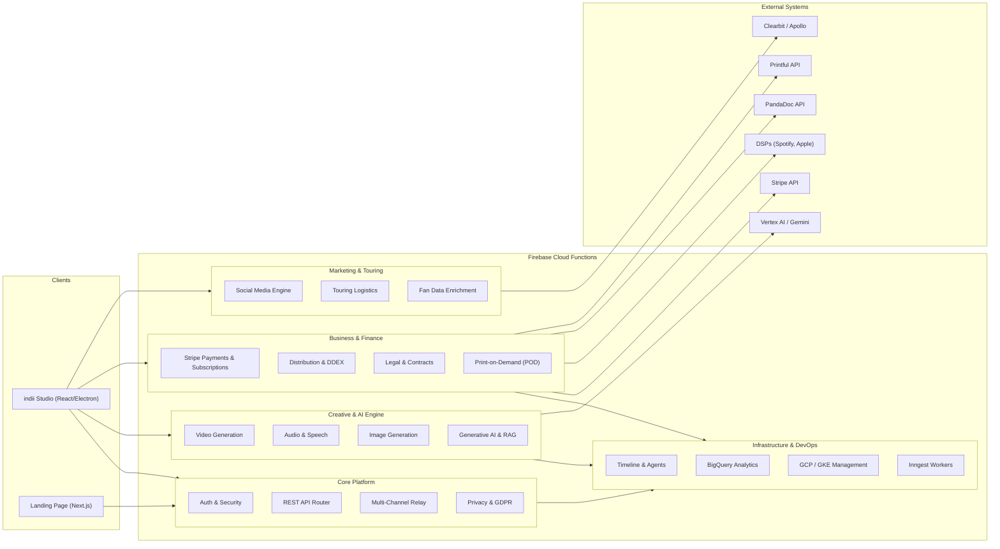

# Backend API Endpoints & Module Relationships

This document maps out the comprehensive ecosystem of indii.music Cloud Functions (Firebase/Node.js), categorizing the backend API endpoints and outlining module relationships.

## Module Architecture & Data Flow

The following Mermaid flowchart visualizes the high-level domains of the Cloud Functions architecture and the flow of data from clients through the various service areas to third-party integrations (like Vertex AI, Stripe, PandaDoc, etc.).

## Complete API Endpoint Map

Below is a detailed inventory of every exposed Firebase Cloud Function, mapped by its primary domain.

### Core Platform & Security
- **Auth & Handoff**: `createHandoffCode`, `redeemHandoffCode`
- **Security & Admin**: `setGodMode`, `persistFraudAlert`, `logAuditEvent`
- **Privacy (GDPR)**: `exportUserData`, `requestAccountDeletion`
- **Relay & Multi-Channel**: `processRelayCommand`, `telegramWebhook`, `generateTelegramLinkCode`, `getTelegramLinkStatus`
- **REST API Router**: `getTrack`, `createTrack`, `queryAnalytics`, `updateTrack`, `deleteTrack`, `listTracks`, `createDistribution`, `getDistribution`, `submitDistribution`, `getProfile`, `health`

### Creative & AI Engine
- **Video Generation**: `triggerVideoJob`, `executeVideoJob`, `triggerLongFormVideoJob`, `renderVideo`, `generateVideoV3`
- **Image Generation**: `editImage`, `generateImageV3`
- **Audio & Speech**: `analyzeAudio`, `generateSpeech`, `generateAudioV3`
- **Omni Generation**: `generateOmniRemixV3`
- **Generative AI / RAG**: `generateContentStream`, `ragProxy`
- **Streaming / SSE**: `agentStreamResponse`, `agentStreamHealth`

### Business & Finance
- **Subscriptions & Billing**: `getSubscription`, `createCheckoutSession`, `createOneTimeCheckout`, `generateInvoice`, `cancelSubscription`, `resumeSubscription`, `getCustomerPortal`, `getUsageStats`, `trackUsage`, `stripeWebhook`, `activateFounderPass`, `createMicroTransaction`, `enforceOperationCost`
- **Stripe Connect & Escrow**: `createStripeAccount`, `createStripeConnectAccount`, `createTransfer`, `initiateSplitEscrow`, `signEscrow`, `requestTaxForms`, `createStripePaymentLinks`
- **Distribution (DDEX/SFTP)**: `pollDeliveryStatus`, `processDDEXAck`, `assignDistributionIdentifier`, `recordDistributionIdentifier`, `recordDistributionAuditEvent`, `requestDistributionTakedown`, `createSftpIngestionRecord`, `updateSftpIngestionRecord`
- **Legal & Publishing**: `exportSplitSheet`, `sendForDigitalSignature`, `verifyMechanicalLicense`, `processISWCMappingV2`
- **PandaDoc Integration**: `pandadocListTemplates`, `pandadocCreateDocument`, `pandadocSendDocument`, `pandadocGetDocumentStatus`, `pandadocGetSigningLink`, `pandadocWebhook`

### Marketing, Touring & Fans
- **Social Media**: `deliverScheduledPosts`, `dispatchSocialPost`
- **Marketing**: `executeCampaign`, `createInfluencerBounty`
- **Touring Logistics**: `generateItinerary`, `checkLogistics`, `findPlaces`, `calculateFuelLogistics`
- **Fan Data Enrichment**: `enrichFanData`
- **Print on Demand (Printful)**: `pod_printfulGetProducts`, `pod_printfulGetProduct`, `pod_printfulCalculatePrice`, `pod_printfulGetShippingRates`, `pod_printfulCreateOrder`, `pod_printfulGetOrder`, `pod_printfulCancelOrder`, `pod_printfulGenerateMockup`

### Infrastructure, Data & Orchestration
- **Timeline Orchestrator**: `pollTimelineMilestones`, `pulseTick`, `onMilestoneScheduled`, `workflowOrchestrator`
- **BigQuery Analytics**: `executeBigQueryQuery`, `getBigQueryTableSchema`, `listBigQueryDatasets`
- **DevOps (GKE/GCE)**: `listGKEClusters`, `getGKEClusterStatus`, `scaleGKENodePool`, `listGCEInstances`, `restartGCEInstance`
- **Storage Maintenance**: `cleanupOrphanedVideos`, `trackStorageQuotas`, `flagVideosForArchival`
- **Email & Platform Tokens**: `emailExchangeToken`, `emailRefreshToken`, `emailRevokeToken`, `sendEmail`, `analyticsExchangeToken`, `analyticsRefreshToken`, `analyticsRevokeToken`
- **Background Workers**: `inngestApi`
- **App Releases**: `generateReleaseDownloadUrl`
- **Health Checks**: `healthCheck`, `healthCheckWest1`
- **Bug Reporting**: `reportBugFn`
- **MCP Server**: Exports defined via `mcp/index.ts`

## Transition Breakdown

1. **Client Request**: The frontend initiates a request to the backend using an HTTPS callable function.
2. **REST API Router**: For REST-specific paths (like `getTrack`, `createTrack`), the HTTP request routes through the Express API router wrapper.
3. **Domain Execution**: The request is routed to the specific domain bucket (e.g., Creative Engine, Business Engine) where specialized Cloud Functions process the business logic.
4. **External Services**: If third-party interaction is required, the function triggers outbound requests to external APIs such as Stripe, Vertex AI, DDEX endpoints, or Clearbit.
5. **Orchestration & Background**: For long-running operations or scheduled items (e.g., video rendering, timeline tasks), the request is queued onto Inngest or triggers BigQuery execution loops to process asynchronously.
