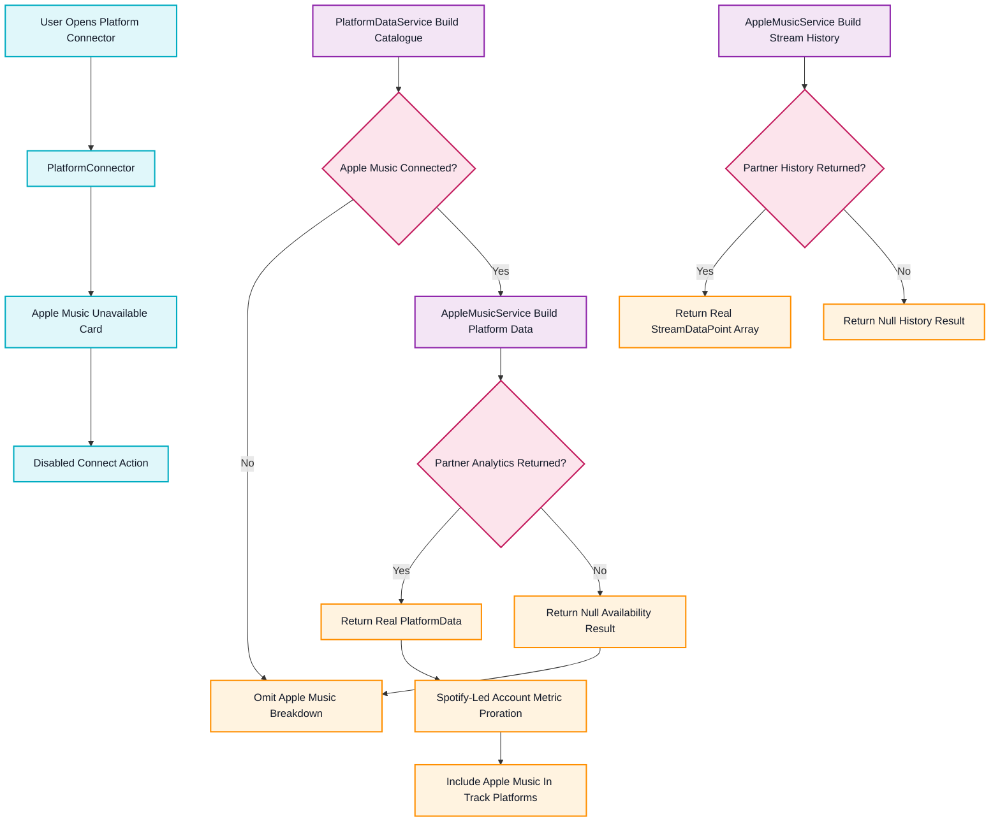

# Apple Music Analytics Availability

This flowchart maps how Apple Music analytics now fail closed until a secured Apple Music for Artists backend can provide real partner metrics.

## Transition Breakdown

1. `PlatformConnector` renders Apple Music as unavailable and disables the connect button until a secured Apple Music for Artists backend exists.
2. `PlatformDataService` still asks Apple Music for platform data when the connection status says Apple Music is available, but treats a `null` response as an honest unavailable state.
3. `AppleMusicService.buildPlatformData()` returns partner analytics unchanged when `fetchPartnerAnalytics()` provides real `PlatformData`.
4. If no partner analytics are returned, `AppleMusicService.buildPlatformData()` returns `null` instead of deriving streams from library size or any other client-side estimate.
5. `PlatformDataService` omits Apple Music from track platform breakdowns when the service returns `null`, keeping aggregate totals free of fabricated Apple Music numbers.
6. When real partner `PlatformData` exists, `PlatformDataService` keeps the existing Spotify-led account-metric proration path and labels the per-track values as synthetic account-metric estimates.
7. `AppleMusicService.buildStreamHistory()` returns real partner history unchanged when available; otherwise it returns `null` instead of generating zero-filled historical data.
