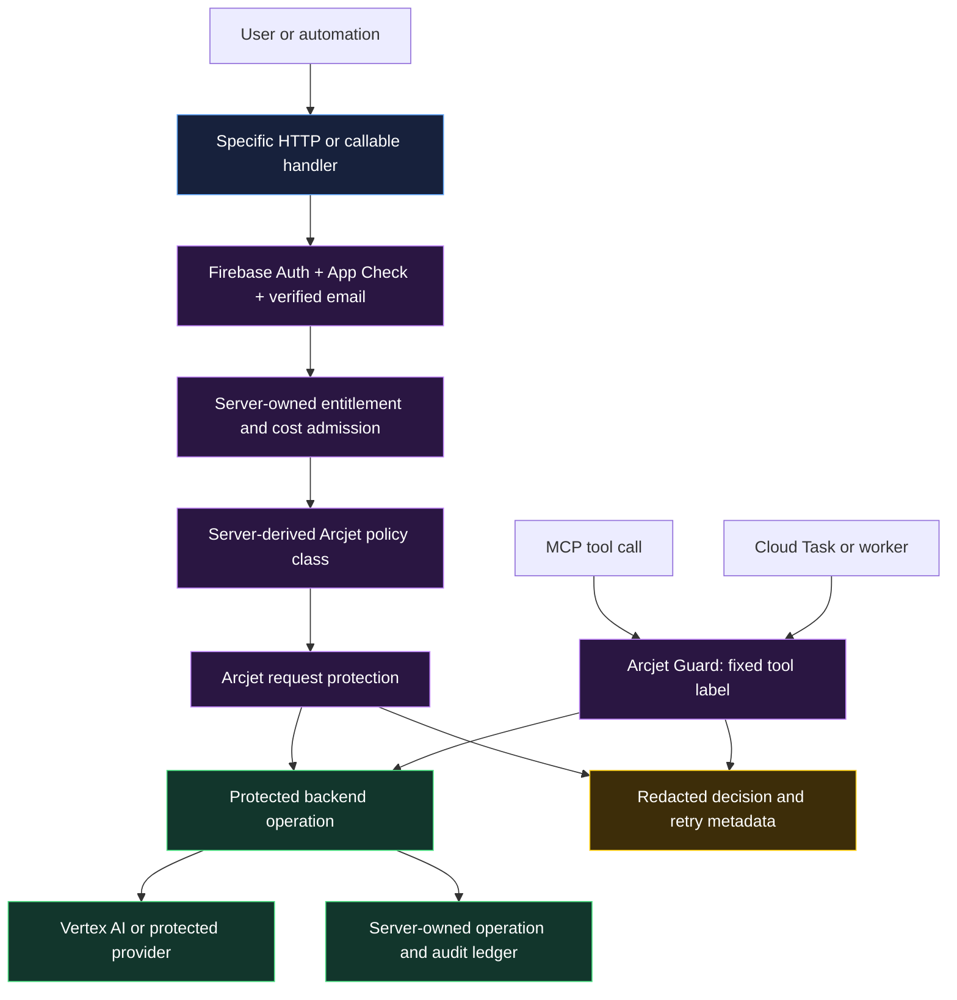

# Arcjet protection runtime

Arcjet is a server-only abuse-control layer. It never grants access, chooses a
subscription tier, stores a secret in a browser, or replaces App Check,
ownership, idempotency, provider quotas, and server-side cost admission.

## Runtime invariants

1. Firebase Functions mounts `ARCJET_KEY` only through the `secrets` option on
   the handlers that call request protection. The secret is never a client
   variable, Firestore value, source literal, or log field.
2. An authenticated route derives its Arcjet class from a backend-verified
   entitlement and trusted Firebase custom admin claim. The client cannot
   select Free, paid, Founder, admin, or BYO-API treatment.
3. Founder access stays product-unlimited, but retains a distinct automation
   ceiling. Arcjet does not override provider quotas or cost admission.
4. Missing configuration and decision errors fail closed with a structured
   `503`. Rate limits return `429` with `Retry-After`; policy denials return
   `403`. Logs correlate only Arcjet decision IDs with generated operation
   IDs, never prompts, raw headers, secrets, or master-asset locations.
5. The unauthenticated `/health` liveness read is the sole request-protection
   degradation exception: it may return normally while Arcjet is unavailable,
   and emits a redacted warning. It performs no data access or state mutation.
6. MCP tools, queue workers, and other non-HTTP operations require
   `@arcjet/guard` with a fixed per-operation label after the deployed Node
   runtime is proven compatible; HTTP request protection is not a substitute.
