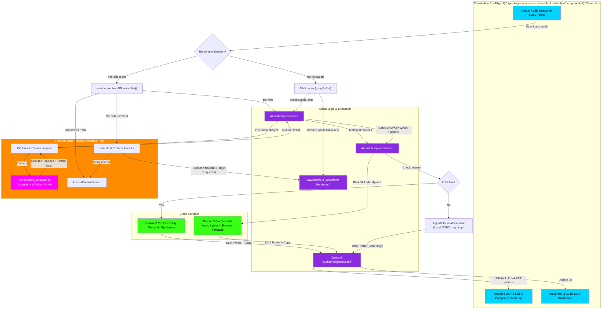

# Music & Audio DNA Intelligence Flowchart

This flowchart maps the technical execution path for the hybrid, local-first audio intelligence suite in indii. Absorbed from the legacy standalone Tools drawer into the **Distribution Department** under the upgraded **Pre-Flight Audio & Acoustic QC** tab (`packages/renderer/src/modules/distribution/components/QCPanel.tsx`), it details how lossless master audio files are processed natively under the Premium Electron desktop tier (using local Python extraction and ONNX/YAMNet classification) versus the standard Web browser fallback tier, providing acoustic DSP analysis, waveform rendering, and streaming platform LUFS compliance metering.

## Step-by-Step Transition Breakdown

1. **Pre-Flight QC Intake & Environment Detection:** When an artist drops a master track into the **Pre-Flight Audio & Acoustic QC** panel within the **Distribution Department** (`packages/renderer/src/modules/distribution/components/QCPanel.tsx`), the application verifies format validity (lossless `.wav` or `.flac`) and detects whether execution is running inside the **Electron Desktop environment** (Premium tier) or a **standard Web browser** (Lite tier).
2. **Premium Electron Native Pipeline:**
    - **Native Dialog:** The app calls `window.electronAPI.selectFile()`, spawning the OS file dialog in the Main process. The path is authorized via **AccessControlService**.
    - **Secure Streaming Preview:** The waveform viewer loads `safe-file://${filePath}`. The custom protocol handler streams chunks of the lossless audio directly from disk, avoiding memory spikes in the Chromium renderer.
    - **Local Acoustic DSP & ONNX Classification:** The file path is passed to the native `audio:analyze` IPC handler, which executes the background Python worker script (`audio_analysis.py`). This script extracts technical markers (BPM, musical key, scale, dynamic range, integrated LUFS, loudness targets) and performs YAMNet ONNX audio classification locally on the user's CPU/GPU.
    - **Hybrid Online Synthesis:** If online, the local metrics and confidence scores are sent to **Gemini 3 Pro** via a fast, text-only prompt to synthesize editorial pitch copy, sonic tags, and target generation prompts, saving latency and network costs.
    - **Offline Graceful Degradation:** If offline, the app maps the local ONNX classification scores directly to the DDEX database schema using `degradeToLocalSemantic()`, keeping the entire pipeline fully operational without cloud dependency.
3. **Web Browser Fallback Pipeline:**
    - The browser decodes the audio file to an AudioBuffer via the standard Web Audio API.
    - **Basic Analysis Fallback:** It runs lightweight mathematical heuristics in Javascript (zero-crossings) to estimate BPM, key, and energy.
    - **Base64 Cloud Analysis:** To bypass browser CORS blocks on the Files API, the raw audio file is converted to a Base64 string and sent as inline data to **Gemini 3 Pro** to "listen" and generate semantic tags.
4. **State Sync & Pre-Flight Compliance:** The consolidated DNA profile, waveform metadata, and acoustic metrics update the **Zustand `audioIntelligenceSlice`**. The **QCPanel** renders the interactive **Waveform & Audio DNA Dashboard** alongside **Acoustic DSP & LUFS Compliance Metering** (evaluating against Spotify -14 LUFS and Apple Music -16 LUFS standards) before distributor package bundling.
