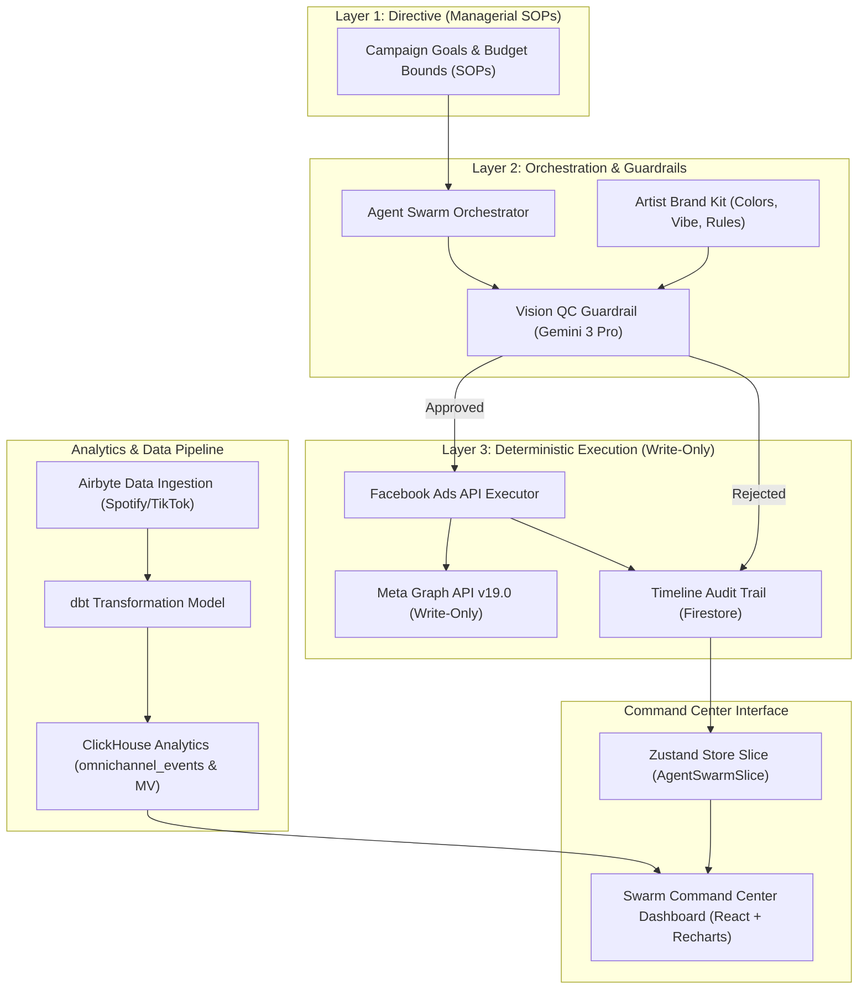

# Macro Architecture: Autonomous Marketing Agents & Growth Intelligence Engine

## Step-by-Step Transition Breakdown

1. **Layer 1 to Layer 2**: Campaign goals and budget limits flow from SOP definitions into the Agent Swarm Orchestrator.
2. **Layer 2 Internal**: Agent Swarm triggers Vision QC evaluation using Gemini 3 Pro, comparing visuals against the Artist Brand Kit.
3. **Layer 2 to Layer 3**: Approved campaigns route to Facebook Ads API Executor; rejected campaigns log audit events in Firestore.
4. **Layer 3 External**: FB Executor issues write-only Meta Graph API calls and updates timeline audit trails.
5. **Analytics Ingestion**: Airbyte pulls external metrics into dbt, transforming data for ClickHouse OLAP queries.
6. **UI Hydration**: ClickHouse performance metrics and Firestore audit logs hydrate Zustand state for the Recharts dashboard.
