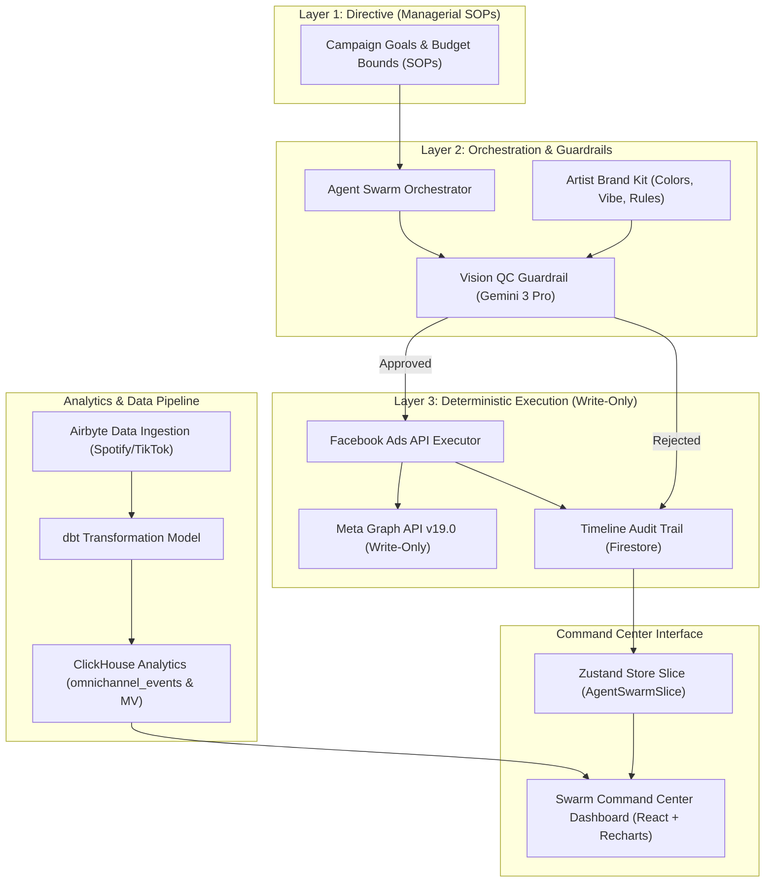

# Macro Architecture: Autonomous Marketing Agents & Growth Intelligence Engine

## System Overview & Flow Description

1. **Directive & Orchestration (Layers 1 & 2):** Campaign parameters flow into the Agent Swarm. Before publishing any ad creative, the `VisionQC` tool executes a Gemini 3 Pro image/prompt evaluation against the artist's Brand Kit to prevent entropy and off-brand visuals.
2. **Deterministic Execution (Layer 3):** Once approved by Vision QC, `facebookAdsExecutor` performs write-only calls to the Meta Graph API (asset upload, creative concept creation with dynamic `pageId` resolution) and logs immutable execution records to Firestore (`timelineExecutionLogs`).
3. **Data Warehouse & Pipeline:** Airbyte ingests external performance data from Spotify and TikTok into ClickHouse (`omnichannel_events`). dbt normalizes raw stream history via pure `SELECT` models with column assertions (`schema.yml`), and a ClickHouse materialized view (`daily_ad_performance_mv`) delivers instant aggregates.
4. **Command Center UI:** The `AgentSwarmDashboard` renders ROAS metrics and live agent action streams directly from Zustand state (`AgentSwarmSlice`).
