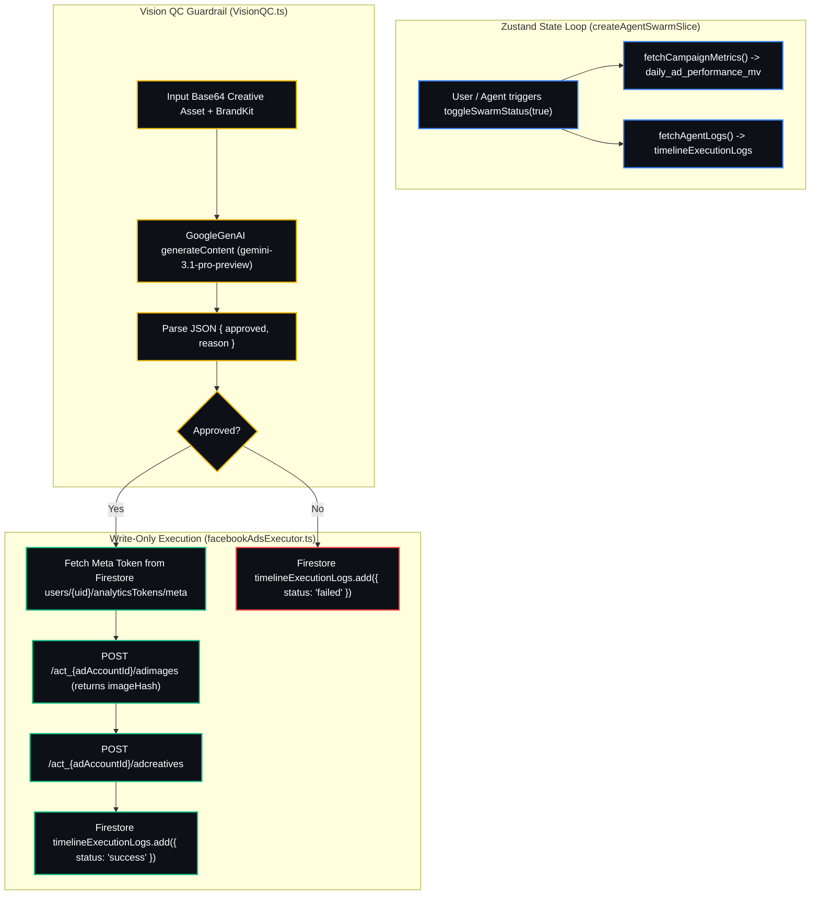

# Technical Micro Flowchart: Autonomous Marketing Agents Execution & State Loop

## State Transitions & Data Flow Detail

1. **State Initialization:** `AgentSwarmSlice` initializes `isSwarmActive: true`. The `AgentSwarmDashboard` triggers `fetchAgentLogs()` and `fetchCampaignMetrics()` on mount to hydrate state via Zustand shallow selectors.
2. **Quality Control Evaluation:** Base64 ad visual payloads pass through `runCreativeVisionCheck()`. Gemini 3 Pro evaluates visual traits against the artist's `BrandKit` (colors, vibe, forbidden elements) and returns a structured decision.
3. **Deterministic Execution:** Approved creatives trigger `pushAdCreative()`. The function fetches the user's encrypted Meta access token, posts the asset to `/adimages`, creates the concept via `/adcreatives`, and logs an immutable audit trail entry into Firestore `timelineExecutionLogs`.
