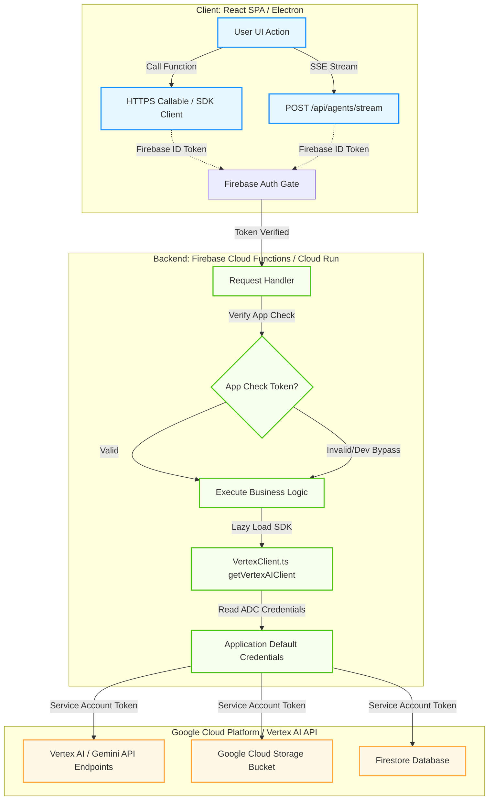

# Backend-Only Security Boundary & API Dataflow Architecture

This flowchart maps the request routing, authentication gates, and execution environments that guarantee zero Google API keys are loaded or exposed on the client.

## Detailed Transition Breakdown

1. **Request Initiation (Client):** The client (React SPA or Electron shell) initiates an AI or storage operation. Instead of making raw Google REST API requests directly, it calls server-side Firebase HTTPS Callable functions or sends POST requests to stream endpoints.
2. **Authentication Gate:** The client request includes the user's Firebase ID token. The backend verifies the token to establish user identity.
3. **App Check Validation:** The request passes through Firebase App Check to verify that it originates from an authentic client application rather than an automated script or unauthorized third-party site.
4. **Lazy Initialization of Vertex Client:** The backend handler lazily initializes the `GoogleGenAI` client using Application Default Credentials (ADC). No API keys are passed or stored in configuration files.
5. **GCP Service Execution:** The authenticated service account requests resources from Vertex AI, Cloud Storage, or Firestore on behalf of the user, returning the results securely back to the client.
