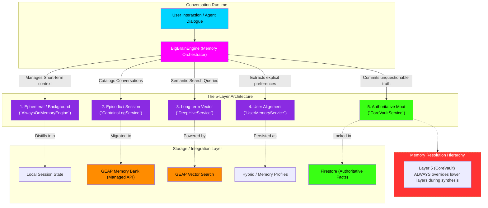

# BigBrain Memory Engine Architecture Flowchart

This flowchart maps the `BigBrainEngine`, the sophisticated 5-layer persistent state and memory architecture that powers the Gemini Enterprise Agent Platform (GEAP) integration. It illustrates how ephemeral conversation state is distilled into long-term, authoritative facts.

## Transition Breakdown

1. **Orchestration:** Every interaction runs through the `BigBrainEngine`. Rather than forcing an agent to query multiple databases, the engine aggregates memory from 5 distinct layers to build the `memoryContext` injected into the agent's prompt.
2. **Layer 1 (Always-On):** Handles the immediate, ephemeral context of the current background tasks and active window states.
3. **Layer 2 (Captain's Log):** Handles episodic memory. Instead of a raw transcript, the system catalogs summaries of past sessions. This is migrated to Google's managed GEAP Memory Bank API for automatic curation.
4. **Layer 3 (Deep Hive):** Handles long-term semantic knowledge. When a user asks a complex question that relates to something discussed weeks ago, the `DeepHiveService` uses GEAP's Vector Search to pull the highly relevant chunks back into context.
5. **Layer 4 (User Alignment):** Explicitly tracks user preferences, risk tolerance, and creative style constraints. It combines implicit auto-extraction with explicit user-defined memory profiles.
6. **Layer 5 (Core Vault):** The most critical layer. This stores authoritative facts—financial numbers, legal obligations, and confirmed metadata. The `CoreVaultService` is strictly deterministic, backed by Firestore, and its contents **always** override conflicting memories surfaced by the semantic or episodic layers.
