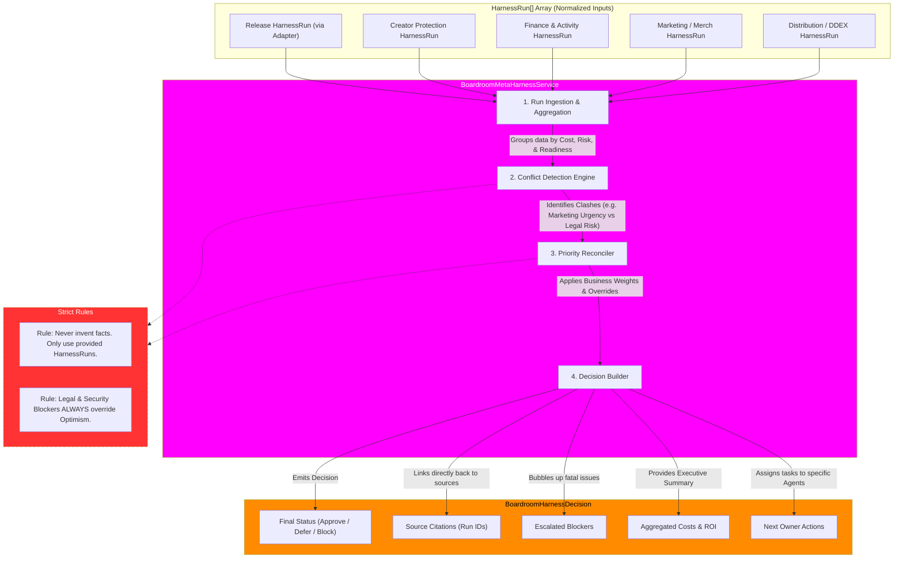

# Boardroom Meta-Harness Decision Engine Flowchart

This flowchart maps the `BoardroomMetaHarnessService`, which acts as the cross-domain reconciliation layer. It does not ingest raw user data; instead, it ingests an array of normalized `HarnessRun` objects to emit a final, multi-disciplinary business decision.

## Transition Breakdown

1. **Ingestion & Aggregation:** The Meta-Harness accepts a flat array of `HarnessRun` objects. Because every domain uses the exact same schema (even older systems like Release which use a Wave 1 adapter), the Boardroom doesn't need domain-specific parsing logic.
2. **Conflict Detection:** The engine looks for conflicting signals across the runs. For example:
   - *Marketing* says "Greenlight the campaign, momentum is high."
   - *Legal* says "Missing collaborator split sheets, high risk."
   - *Finance* says "Insufficient budget for the proposed Merch drop."
3. **Priority Reconciliation:** The Reconciler applies strict business logic to resolve conflicts. As defined by the architecture, **Legal, Security, and Finance blockers always override Marketing or Creative optimism**. The system will not allow an illegal or unfunded action to pass, regardless of how ready the assets are.
4. **Decision Building:** The Meta-Harness constructs a final `BoardroomHarnessDecision`. It does not execute actions. It acts as an executive summary for the user and the Conductor Agent.
5. **Traceability (Citations):** A core rule of the Boardroom is that it *cannot invent facts*. Every claim, cost, or blocker in the final decision must contain a hard citation (the `runId`) linking back to the specific Domain Harness that generated it.
