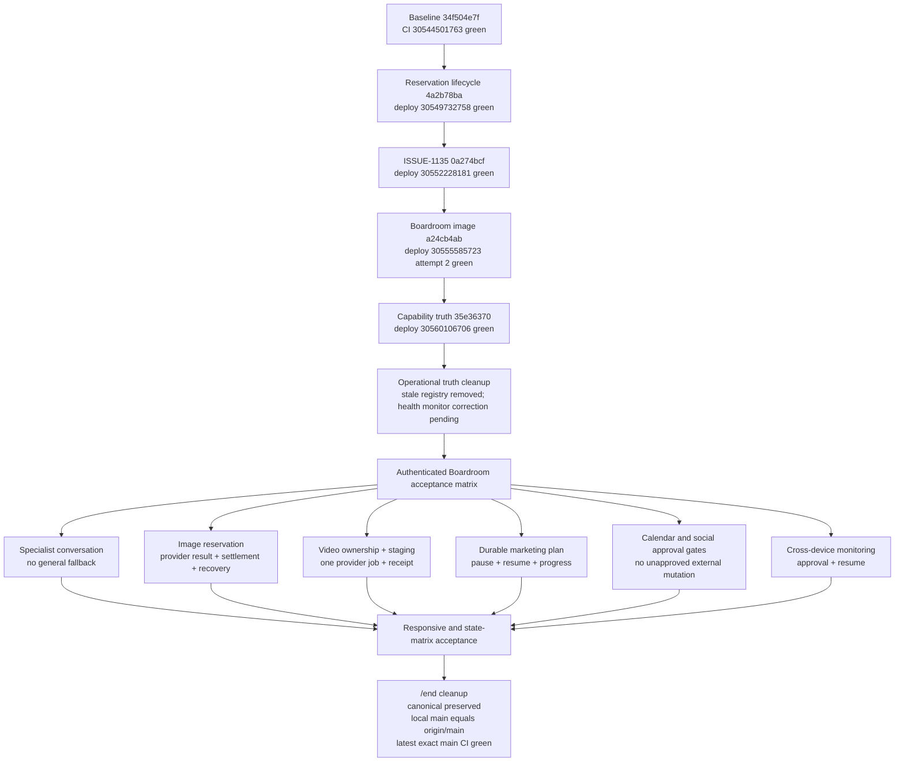

# Boardroom Release Completion Sequence

**Purpose:** Define the dependency-safe path from the green Gen2 baseline to a
truthful, production-evidenced Boardroom release without overwriting concurrent
work or treating unit tests as live acceptance proof.

## Step-by-Step Transition Breakdown

1. **Green baseline to reservation lifecycle — complete:** The reservation
   contract landed as `4a2b78ba41138ca8a90ef5002a5d2e3f3e421cec`
   from a green exact-main baseline without generated declarations or unrelated
   workflow files. Typed capacity errors, specialist fail-closed routing, and
   Gen2 callable/stream contracts were preserved.
2. **Reservation lifecycle to its gate — complete:** Owner/type/status claims,
   pre-provider voids, settlement before the terminal completion frame,
   cancellation propagation, typed 429 behavior, and bounded stale-claim
   reconciliation are covered. Both required Firestore indexes are `READY`;
   exact deployment run `30549732758` is green.
3. **Reservation gate to ISSUE-1135 — complete:** The independent
   creative-gateway fix landed only after the reservation release was green.
   Explicit
   `dont_allow` survives every frame/reference path and reaches the Veo worker
   unchanged; exact deployment run `30552228181` is green.
4. **ISSUE-1135 gate to Boardroom image reliability — complete:** The preserved
   image patch was rebuilt on the exact new main SHA. It removes synthetic founder/admin
   receipts, fail closed when durable reservation creation fails, and preserve
   an authoritative completed or typed-failed image result when only the
   post-tool summary is throttled. Never retry the provider or fall back to a
   general model. Exact deployment run `30555585723` attempt 2 is green.
5. **Image gate to capability truth — complete:** The deployed contract was
   audited before stale capability work was used. A fresh server-attested
   session, entitlement, connector, and live-health contract was defined.
   Unknown state does not advertise a capability as available. Exact deployment
   run `30560106706` is green.
6. **Capability truth to operational cleanup — active:** Repository and live
   function inventories, remove or repair the stale failed function through
   the official deployment path, correct the misleading health workflow, and
   update issue states only to the level proven by exact CI, deployment, logs,
   and authenticated checks. The stale function registry shell is removed; the
   corrected health monitor and final ledger reconciliation are the active
   publication gate.
7. **Operational cleanup to authenticated acceptance:** Exercise the real
   Boardroom with genuine credentials. Record available, degraded, or blocked
   for specialist chat, image, video, long-running plans, approved calendar
   actions, approved social publishing, and cross-device continuation. Planned
   code and mocked tests do not count as production proof.
8. **Acceptance to UI completion:** Complete the 80–200% zoom, Electron window,
   secondary-window, responsive-container, and state matrix. Extend the shared
   workspace contract to the remaining creative surfaces, then finish the
   authorized asset/job, quote/recovery, handoff, timeline, node, and evaluation
   work without weakening billing, rights, or ownership boundaries.
9. **UI completion to `/end`:** Remove only release-owned temporary artifacts,
   leave user-owned canonical workflow files untouched, make all ledgers and
   handoffs truthful, require local main to equal `origin/main`, and finish on
   the latest exact main-branch CI and deployment run with no attributable
   failure.

## Release Invariants

- Only the release coordinator pushes `HEAD:main`; no force-push or task branch
  is part of the integration path.
- Every incoming commit is audited in the clean detached integration worktree
  and receives an exact-main CI gate before a dependent commit lands.
- Synthetic receipts, general-model fallback, client-authoritative capability
  claims, and fabricated production evidence are forbidden.
- Paid production generation, real calendar events, and live social posts
  require explicit founder authorization at execution time.
- Original uploads, unrelated cloud assets, concurrent worktrees, and the
  canonical user-owned workflow edits remain preserved.
