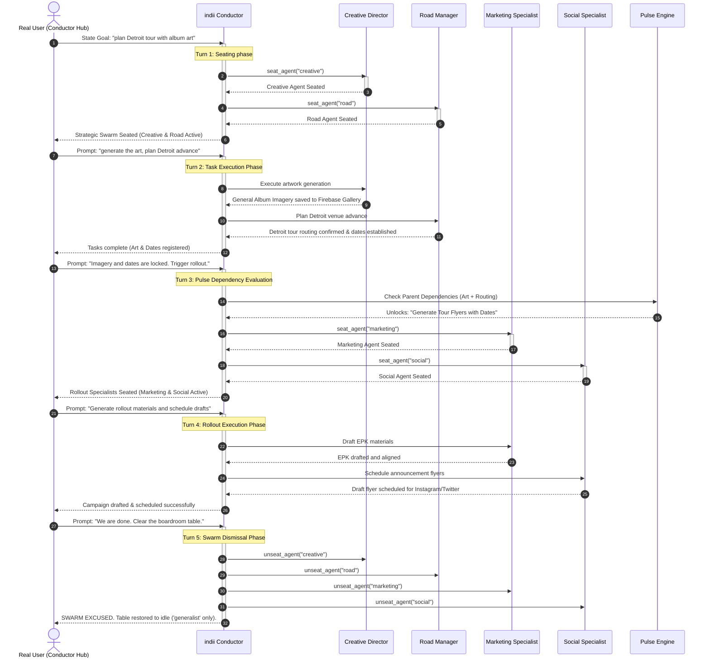

# Boardroom Strategic Goal Seating Swarm Flowchart

This flowchart documents the definitive state transitions, dynamic agent seating patterns, and task dependency checks that govern the strategic launch swarm.

## Architectural Elements Verified

1. **Boardroom Seating Bounds**: The Conductor dynamically updates `activeAgents` in the state slice. Seating workers instead of heads is correctly checked by scope bounds.
2. **Pulse Task Dependency Checklist**: Downstream nodes evaluate completion bits on upstream resources (Firebase Gallery assets and Confirmed Tour Dates JSON fields) before unlocking tool calls.
3. **Stateless AI Routing Logic**: Multi-turn tool execution maintains context stability via the backward message lookback strategy during play runs.
