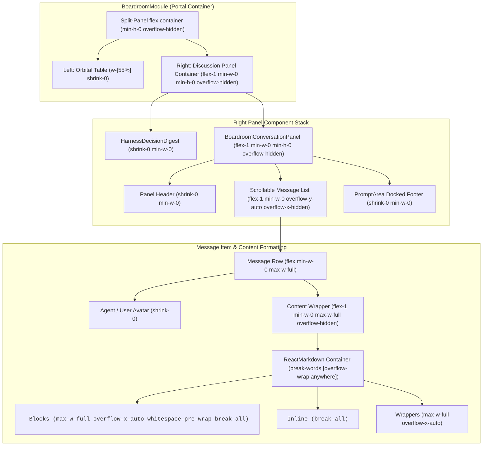

# Boardroom Responsive Overflow & Layout Containment Architecture

## Architectural Root Cause & Fix Explanation

### Root Cause
In CSS Flexbox layout, the default `min-width` of a flex item (`flex-1`) is `auto`. When messages inside `BoardroomConversationPanel` contained wide formatted output (long file paths, code blocks, tables, or un-broken strings), the child content's intrinsic `scrollWidth` forced `flex-1` elements to expand horizontally. Since the left panel held a fixed `55%` width (`shrink-0`), the right panel expanded past the right edge of the viewport and never contracted back.

### Solution
1. **Flex Item Constraints (`min-w-0 min-h-0 overflow-hidden`)**: Applied explicit `min-w-0` and `overflow-hidden` constraints to all flex parents in `BoardroomModule`, `BoardroomConversationPanel`, and message rows.
2. **Text & Content Word Breaking**: Added `break-words`, `[overflow-wrap:anywhere]`, and `break-all` styling to the message container and text nodes.
3. **Markdown Block Overflow Handlers**: Added custom ReactMarkdown component handlers for `<pre>`, `<code>`, `<table>`, `
`, `<a>`, and `` to enforce `max-w-full`, `overflow-x-auto`, and text-wrapping so wide code snippets or tables scroll internally rather than blowing out panel dimensions.
