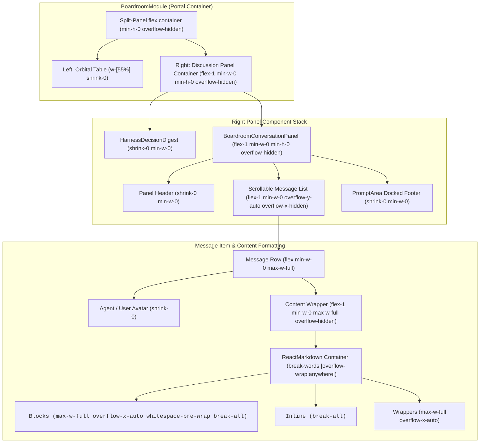

# Boardroom Responsive Overflow & Layout Containment Architecture

## Step-by-Step Transition Breakdown

1. **BoardroomModule Layout**: The split-panel flex container locks the left orbital table at 55% width and delegates the remaining space to the discussion panel with strict `min-w-0 min-h-0 overflow-hidden` bounds.
2. **Right Panel Hierarchy**: The right panel stacks the decision digest, conversation header, scrollable message feed, and docked prompt footer with `shrink-0` and `flex-1` bounds.
3. **Message List Containment**: The scrollable list enforces `overflow-y-auto overflow-x-hidden` so vertical scrolling occurs cleanly without horizontal blowout.
4. **Message Formatting & Overflow Control**: Markdown text nodes use `break-words` and `[overflow-wrap:anywhere]`, while code blocks and tables use internal `overflow-x-auto` wrappers.
