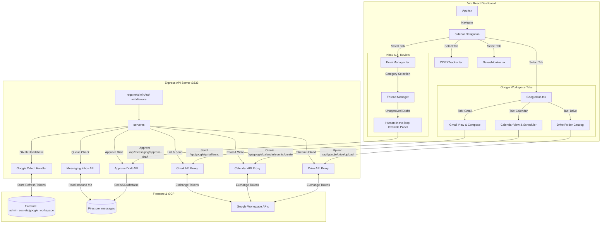

# Business Center Hub Architecture & State Flow

This flowchart illustrates the technical execution flow, Zuztand/React components state management, and Firestore sync protocols in the `admin-dashboard` Business Center Hub.

## State & Transition Breakdown

### 1. Google OAuth Flow & Authentication

1. **Initial Mount**: `GoogleHub` checks client authorization status via `/api/google/oauth/status`.
2. **Authorize Request**: If disconnected, client initiates `/api/google/oauth/url` to redirect the user to Google Workspace Authorization consent screen.
3. **Redirection & Callback**: Upon consent, Google redirects to `/api/google/oauth/callback` containing the OAuth auth code. The Express server exchanges this code for access/refresh tokens and stores them securely in the Firestore `admin_secrets/google_workspace` collection.

### 2. Gmail / Calendar / Drive Proxies

- **Token Injection**: For every request, the Express server retrieves credentials from Firestore, initializes an OAuth2 client, sets the credentials, and makes a authenticated SDK call to Google Workspace APIs.
- **No Client Secrets**: Client-side React components never handle Google refresh/access tokens, preventing key exposure.

### 3. Human-in-the-loop AI Email Review

1. **Inbound Email / Automation**: Inbound email triggers a webhook or background process that drafts a response using the Legal/Marketing AI agents.
2. **Draft Persistence**: The draft response is written to the `messages` collection in Firestore with flags `{ isAiDraft: true, approved: false }`.
3. **Dashboard Monitoring**: The `EmailManager` pulls recent threads. Any items with `isAiDraft: true` are routed to the **Human-in-the-loop Override Panel**.
4. **Manual Decision**:
   - **Approve**: Sends a `POST` request to `/api/messaging/approve-draft`. The server updates `isAiDraft: false` and queues the email for SMTP/Gmail API delivery.
   - **Edit/Regenerate**: Allows changing draft content before queuing.
