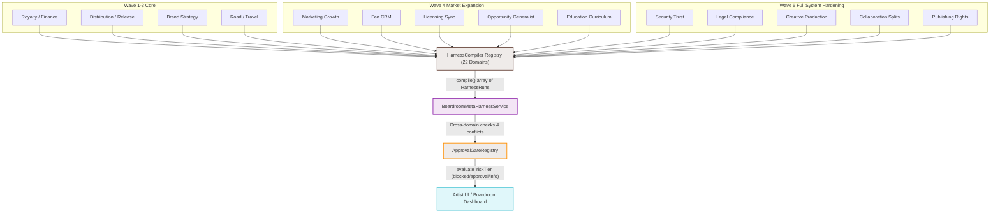

# Business Harness Full Architecture Flowchart

This diagram illustrates the full 22-domain Business Harness architecture compiled into a single unified boardroom flow. It shows the completion of all 5 waves from the `BUSINESS_HARNESS_FULL_SUCCESS_PLAN`, demonstrating how specialist compilers feed the core meta-harness.

## Transition Breakdown

1. **Execution by Specialist Domains (Waves 1-5)**
   Every one of the 22 business domains (Marketing, Finance, Legal, etc.) operates as a strictly-typed `HarnessCompiler`. When invoked, they inspect the current state of the application.
2. **Aggregation into HarnessRegistry**
   The `HarnessRegistry` loops through all registered compilers, yielding a massive array of normalized `HarnessRun` objects.
3. **Reconciliation by BoardroomMetaHarnessService**
   The core Boardroom service takes the array of disparate `HarnessRun` objects and cross-references them. It actively looks for conflicting forces (e.g. Finance marking a campaign as 'blocked' due to budget, even though Marketing marked it as 'ready').
4. **Enforcement via ApprovalGateRegistry**
   Irreversible actions are mapped against the Boardroom's consolidated report. If any domain produced a `blocked` or `approval` risk tier for a necessary action, the execution is halted.
5. **Presentation to the User (Dashboard)**
   The artist is presented with a clear, undeniable list of blocking issues across all business disciplines. They must manually sign off on or resolve each gate before the platform proceeds.
