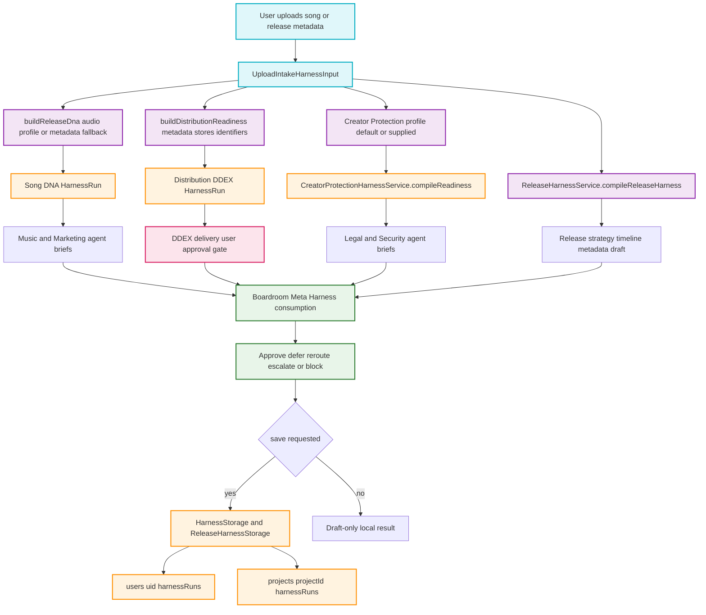

# Business Harness Upload Intake Flowchart

Purpose: maps the upload/intake execution path that turns a song and release metadata into deterministic harness outputs for Song DNA, DDEX readiness, Creator Protection, Release strategy, agent briefs, approval gates, and optional persistence.

## Transition Breakdown

1. The upload/intake caller passes `UploadIntakeHarnessInput` with `userId`, optional `projectId`, optional audio profile, release metadata, selected stores, and optional creator-protection profile.
2. `UploadIntakeHarnessService.compileUploadIntake` calls `buildReleaseDna`. If an audio intelligence profile is available, Song DNA uses the audio fingerprint, tempo, key, energy, mood, genre, and semantic metadata. Without audio analysis, it falls back to metadata with lower confidence.
3. The same input calls `buildDistributionReadiness`, which checks required DDEX metadata, territories, channels, DPID, identifiers such as ISRC, UPC, ISWC, catalog number, split totals, samples, and cover-song warnings.
4. Creator Protection either uses the supplied profile or creates a default profile with AI voice and likeness permission set to `not_authorized`. Work readiness includes identifiers and authorship evidence references where available.
5. The service creates three generic `HarnessRun` outputs: `song_dna`, `distribution_ddex`, and `creator_protection`. Each run includes scores, findings, recommendations, evidence references, agent briefs, assumptions, and approval gates.
6. The release harness compiles the release strategy, timeline, metadata draft, distribution readiness, artist operating model, and warnings. It remains the release-specific reference implementation.
7. The DDEX harness always emits a delivery approval gate. The gate allows preparation work but blocks external storefront delivery until the user explicitly approves.
8. Boardroom can consume the resulting runs and reconcile conflicts. For example, Distribution may be package-ready while Creator Protection or Legal requires review; Boardroom can block or defer execution rather than inventing facts.
9. If `save` is true, generic harness runs persist through `HarnessStorage` and release output persists through `ReleaseHarnessStorage`. Project-scoped runs write under `projects/{projectId}/harnessRuns`; otherwise they write under `users/{uid}/harnessRuns`.
10. If `save` is false, all outputs remain draft-only local results, suitable for previews, tests, and agent planning without external side effects.
